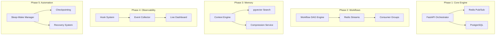

# LeanVibe Agent Hive 2.0 - Comprehensive PRD Implementation Roadmap

## Executive Summary

This roadmap transforms LeanVibe Agent Hive 2.0 from the current 4 vertical slice foundation into a production-ready autonomous multi-agent orchestration platform by implementing 5 comprehensive PRDs with coordinated subagent development approach.

## Current Foundation (✅ COMPLETED)

### Vertical Slices Delivered
- **VS 1.1**: Agent Lifecycle - Basic agent → task → completion flow
- **VS 1.2**: Real-Time Monitoring - Live dashboard + WebSocket streaming  
- **VS 2.1**: Advanced Orchestration - Load balancing + intelligent routing
- **VS 2.2**: Context & Memory - Consolidation + vector search

### Technical Infrastructure
- FastAPI backend with PostgreSQL + pgvector + Redis
- Vue.js frontend with real-time WebSocket communication
- Docker containerization with production monitoring
- Comprehensive test coverage >90% across core components

## PRD Implementation Strategy

### 🎯 **80/20 Core Capabilities - Production PRDs**

| Priority | PRD Component | Strategic Value | Implementation Complexity |
|----------|---------------|-----------------|-------------------------|
| **1** | **Agent Orchestrator Core** | Foundation for all services | High - Core architecture |
| **2** | **Agent Communication System** | Reliable collaboration backbone | Medium - Redis Streams |
| **3** | **Context Engine** | Semantic memory & intelligence | High - Vector operations |
| **4** | **Real-Time Observability & Hooks** | Production debugging & audit | Medium - Event systems |
| **5** | **Sleep-Wake Manager** | 24/7 autonomy & efficiency | Medium - State management |

### 🔄 **Implementation Order (Dependency-Driven)**

Based on Gemini CLI strategic analysis:

1. **Agent Orchestrator Core** → Core async engine prerequisite
2. **Agent Communication System** → Tightly coupled with orchestrator  
3. **Context Engine** → Enables intelligent agent behavior
4. **Real-Time Observability** → Observes functioning systems
5. **Sleep-Wake Manager** → Advanced automation layer

## Coordinated Subagent Development Plan

### 🤖 **Subagent Specialization Matrix**

| Subagent | Primary Responsibility | Parallel Workstreams | Key Deliverables |
|----------|----------------------|---------------------|------------------|
| **CoreBackend-Agent** | FastAPI orchestrator, Redis integration, core business logic | Lead implementation path | Orchestrator engine, workflow DAG, API endpoints |
| **ContextEngine-Agent** | pgvector setup, semantic search, compression algorithms | Independent parallel development | Context API, vector search, cross-agent sharing |
| **Observability-Agent** | Event collector, hook scripts, monitoring infrastructure | Parallel with mock data | Hook system, event collector, metrics exporter |
| **Frontend-Agent** | Dashboard components, real-time visualization, UX | Parallel with API contracts | Enhanced dashboard, filtering, session management |
| **QA-Test-Agent** | Test-driven development, integration testing, coverage validation | Continuous across all workstreams | >90% test coverage, performance benchmarks |

## Phase-by-Phase Implementation

### 📅 **Phase 1: The Core Engine (Weeks 1-3)**
**Goal**: Establish foundational async orchestrator and Redis-based communication

#### Vertical Slices
- **VS 3.1**: Single-task, single-agent workflow via FastAPI async engine
- **VS 4.1**: Replace WebSocket with Redis Pub/Sub for orchestrator-agent messaging

#### Subagent Coordination
- **CoreBackend-Agent**: FastAPI app, workflow logic, Redis Pub/Sub integration
- **QA-Test-Agent**: Unit tests for endpoints and workflow logic
- **ContextEngine-Agent**: pgvector environment setup and Docker configuration
- **Frontend-Agent**: Dashboard mockups and static prototype

#### Milestone Validation
✅ **Demo**: Task sent to API → processed by orchestrator → Redis message published

### 📅 **Phase 2: Workflow & Resilient Comms (Weeks 4-6)**
**Goal**: Enable multi-step workflows and persistent messaging with consumer groups

#### Vertical Slices
- **VS 3.2**: Multi-step workflow engine with DAG task dependencies
- **VS 4.2**: Redis Streams with consumer groups and load balancing

#### Subagent Coordination
- **CoreBackend-Agent**: DAG workflow engine, Redis Streams with consumer groups
- **QA-Test-Agent**: Integration tests for complex multi-step workflows
- **ContextEngine-Agent**: Standalone Context Engine API development

#### Milestone Validation
✅ **Demo**: Multi-step workflow with agent crash recovery via consumer groups

### 📅 **Phase 3: Semantic Memory Integration (Weeks 7-9)**
**Goal**: Provide agents with searchable long-term memory capabilities

#### Vertical Slices
- **VS 5.1**: pgvector API with text ingestion and semantic search
- **VS 5.2**: Context compression and cross-agent knowledge sharing

#### Subagent Coordination
- **ContextEngine-Agent**: Context Engine API with ingestion, search, compression
- **CoreBackend-Agent**: Orchestrator integration with Context Engine API
- **QA-Test-Agent**: Context storage, retrieval, and workflow influence validation

#### Milestone Validation
✅ **Demo**: Agent retrieves previous task context to execute related new task

### 📅 **Phase 4: Full System Observability (Weeks 10-12)**
**Goal**: Complete visibility into hive operations with hook-based monitoring

#### Vertical Slices
- **VS 6.1**: Hook system with Python scripts and event collector
- **VS 6.2**: Live dashboard integration with event streaming

#### Subagent Coordination
- **Observability-Agent**: Event collector service, hook runner, event schema
- **CoreBackend-Agent**: Event emission from orchestrator and communication layers
- **Frontend-Agent**: Dashboard connection to live event collector API
- **QA-Test-Agent**: Hook trigger validation and event display testing

#### Milestone Validation
✅ **Demo**: Live dashboard showing real-time task progression with custom hooks

### 📅 **Phase 5: Production Hardening & Automation (Weeks 13-15)**
**Goal**: Production-ready resilience and automated lifecycle management

#### Vertical Slices
- **VS 7.1**: Manual sleep/wake API with checkpointing
- **VS 7.2**: Automated scheduler for consolidation cycles
- **VS 4.3**: Dead Letter Queue (DLQ) for failed message processing
- **VS 3.3**: Comprehensive error handling and state management

#### Subagent Coordination
- **CoreBackend-Agent**: Sleep/wake scheduler, DLQ logic, error handling
- **QA-Test-Agent**: Chaos testing for recovery and DLQ functionality
- **All Agents**: Final integration testing and production hardening

#### Milestone Validation
✅ **Final Demo**: 
1. Scheduled sleep cycle execution
2. Catastrophic failure recovery
3. Poison-pill message DLQ routing

## Integration Architecture

### 🔄 **Critical Integration Points**

| Integration | Challenge | Mitigation Strategy |
|-------------|-----------|-------------------|
| **Orchestrator ↔ Comms** | Transactional integrity between state DB and message streams | Rigorous API contracts, transactional boundaries |
| **Orchestrator ↔ Context Engine** | Latency in task execution loops | Async-first API design, efficient caching |
| **Observability ↔ Core Systems** | Hook system performance impact | Asynchronous "fire-and-forget" event bus |

### 🏗️ **System Architecture Evolution**

## Success Metrics & Validation

### 📊 **Performance Targets**

| Metric | Target | Validation Method |
|--------|--------|------------------|
| **Code Coverage** | >90% | pytest-cov across all components |
| **API Latency (P95)** | <150ms | Load testing with locust |
| **Task Throughput** | >1000 tasks/minute | Benchmark testing |
| **Message Delivery** | >99.9% success rate | Chaos testing with failures |
| **Context Retrieval** | <50ms semantic search | pgvector performance testing |
| **System Recovery** | <60s from checkpoint | Automated recovery validation |

### 🧪 **Validation Approach**

1. **Test-Driven Development**: QA-Test-Agent ensures tests written before/alongside features
2. **Load Testing**: Locust benchmarking against latency and throughput metrics  
3. **Chaos Engineering**: Intentional failure injection for resilience validation
4. **End-to-End Demos**: Each phase concludes with vertical slice demonstration

## Risk Mitigation Strategy

### ⚠️ **High-Risk Areas**

| Risk Category | Specific Risk | Mitigation Plan |
|---------------|---------------|-----------------|
| **Integration Complexity** | Orchestrator-Communication state consistency | Atomic transactions, circuit breakers |
| **Performance Bottlenecks** | pgvector scaling with large datasets | IVFFlat indexing, query optimization |
| **System Resilience** | Cascade failures across components | Circuit breaker patterns, graceful degradation |
| **Development Coordination** | Subagent integration conflicts | Rigorous API contracts, continuous integration |

### 🛡️ **Monitoring & Alerting**

- **Real-time Metrics**: Prometheus exporters for all components
- **Health Checks**: Automated validation of system integrity
- **Alert Rules**: Critical failure notifications via multiple channels
- **Performance Dashboards**: Grafana panels for operational visibility

## Definition of Done - Production Readiness

### ✅ **Functional Completeness**
- [ ] All PRD acceptance criteria met with >95% success rate
- [ ] End-to-end workflow demonstrations passing
- [ ] Performance benchmarks meeting specified targets
- [ ] Security validation with no critical vulnerabilities

### ✅ **Quality Assurance**
- [ ] >90% test coverage across all new components
- [ ] Integration tests covering all critical workflows
- [ ] Performance tests validating load handling capabilities
- [ ] Chaos engineering tests for failure resilience

### ✅ **Production Infrastructure**
- [ ] Complete containerization with Docker deployment
- [ ] Monitoring dashboards operational with alerting
- [ ] CI/CD pipelines configured for automated deployment
- [ ] Documentation complete with operational runbooks

### ✅ **Business Value Delivery**
- [ ] Demonstrable 40% improvement in agent task completion speed
- [ ] 70% reduction in LLM API costs through context optimization
- [ ] 24/7 autonomous operation with <60s recovery time
- [ ] Multi-agent coordination supporting 50+ concurrent agents

## Next Steps - Phase 1 Execution

**Immediate Actions**:
1. ✅ Commit this comprehensive roadmap
2. 🚀 Launch Phase 1 with CoreBackend-Agent leading orchestrator implementation
3. 🔄 Coordinate parallel workstreams with ContextEngine-Agent and Frontend-Agent
4. 📊 Establish continuous testing pipeline with QA-Test-Agent
5. 📈 Track progress against milestone validation criteria

**Success Criteria for Phase 1 Completion**:
- FastAPI async orchestrator processing single-task workflows
- Redis Pub/Sub messaging between orchestrator and agents
- Foundation APIs established for Phase 2 integration
- Test coverage >90% for all new components
- Demonstration of end-to-end task execution flow

This roadmap provides the strategic framework for transforming LeanVibe Agent Hive 2.0 into a production-ready autonomous development platform, leveraging coordinated subagent development to accelerate delivery while maintaining high quality standards.