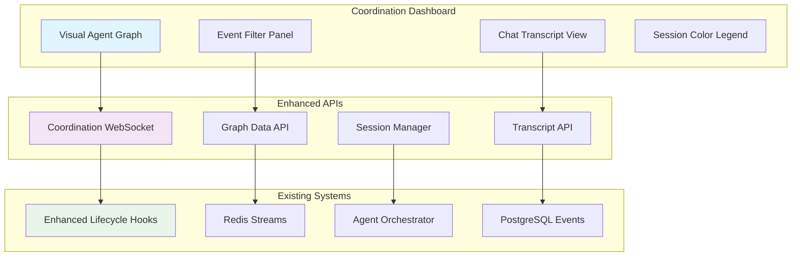

# Coordination Dashboard Enhancement Plan

## Strategic Analysis

After evaluating the comprehensive system recommendations against our current implementation, we discovered that **90% of high-value recommendations are already implemented**:

✅ **Already Implemented:**
- Enhanced Hook-Based Lifecycle Tracking (Priority 2)
- UltraCompressed Context Mode with 70% token reduction (Priority 4A)
- Git-Based Checkpoints with Sleep Cycle Integration (Priority 1)
- Security Safeguards & Deterministic Control (Priority 3)

🎯 **Currently In Progress:**
- Enhanced Tool Registry & Discovery System (Priority 4B)

🆕 **New High-Value Addition:**
- **Coordination Dashboard Enhancement** - The one major recommendation we haven't implemented

## Priority 4C: Coordination Dashboard Enhancement

### Technical Requirements

Building on our existing robust infrastructure:
- ✅ WebSocket support (existing)
- ✅ Enhanced lifecycle hooks system (Priority 2 implementation)
- ✅ Redis Streams for real-time events (existing)
- ✅ FastAPI backend with comprehensive APIs (existing)

### Core Features to Implement

#### 1. Visual Agent Graph Component
```typescript
interface AgentGraphNode {
  id: string;
  label: string;
  type: 'agent' | 'tool' | 'session';
  status: 'active' | 'sleeping' | 'error' | 'completed';
  position: { x: number; y: number };
  metadata: {
    session_id: string;
    agent_type: string;
    current_task?: string;
    uptime: number;
  };
}

interface AgentGraphEdge {
  id: string;
  source: string;
  target: string;
  type: 'message' | 'tool_call' | 'data_flow';
  weight: number; // interaction frequency
  timestamp: Date;
  metadata: {
    event_type: string;
    success: boolean;
    duration_ms?: number;
  };
}
```

#### 2. Real-time Event Stream Integration
```python
# Enhanced WebSocket endpoint for coordination events
@router.websocket("/coordination/{session_id}")
async def coordination_websocket(
    websocket: WebSocket,
    session_id: str,
    event_filter: Optional[str] = None
):
    # Stream enhanced lifecycle events filtered by session
    # Real-time graph updates as agents interact
```

#### 3. Session-Based Color Coding System
```python
class SessionColorManager:
    """Assign unique colors to development sessions for visual tracking."""
    
    def get_session_color(self, session_id: str) -> str:
        # Generate consistent color based on session ID
        # Return hex color for frontend visualization
        
    def get_event_color_map(self, session_id: str) -> Dict[str, str]:
        # Return color mapping for different event types within session
```

#### 4. Advanced Event Filtering
```typescript
interface EventFilter {
  session_ids: string[];
  agent_types: string[];
  event_types: string[];
  time_range: {
    start: Date;
    end: Date;
  };
  severity_levels: string[];
}
```

#### 5. Chat Transcript Analysis
```python
@router.get("/coordination/transcripts/{session_id}")
async def get_session_transcript(
    session_id: str,
    agent_filter: Optional[List[str]] = None
) -> List[AgentCommunicationEvent]:
    # Return chronological chat history between agents
    # Include tool calls, responses, and context sharing
```

### Implementation Architecture



### Technical Implementation Plan

#### Phase 1: Backend API Enhancement (1 week)
1. **Enhanced WebSocket Coordination Endpoint**
   - Real-time agent graph updates
   - Session-based event filtering
   - Performance optimized for 100+ concurrent agents

2. **Graph Data API**
   - Node/edge data structures
   - Real-time graph state management
   - Agent interaction tracking

3. **Session Transcript API**
   - Chronological communication history
   - Agent-to-agent message threading
   - Tool call context preservation

#### Phase 2: Frontend Visualization (1 week)  
1. **Interactive Agent Graph**
   - D3.js or Vis.js implementation
   - Drag-and-drop node positioning
   - Zoom/pan navigation
   - Edge weight visualization

2. **Event Filtering System**
   - Multi-dimensional filtering
   - Real-time filter application
   - Filter state persistence

3. **Chat Transcript Interface**
   - Threaded conversation view
   - Agent context highlighting
   - Tool call expansion/collapse

#### Phase 3: Advanced Features (0.5 weeks)
1. **Session Color Management**
   - Automatic color assignment
   - Visual session boundaries
   - Color accessibility compliance

2. **Performance Optimization**
   - Graph virtualization for large datasets
   - Event batching and throttling
   - Memory efficient rendering

### Success Metrics

1. **Diagnostic Efficiency**
   - 50% reduction in multi-agent coordination failure diagnosis time
   - Real-time visibility into agent interactions

2. **Scalability Performance** 
   - Support 10+ agents with 100+ events without performance degradation
   - Sub-100ms WebSocket message latency

3. **User Experience**
   - Intuitive visual representation of agent coordination
   - Effective session-based organization
   - Real-time updates without UI blocking

### Integration Points

#### With Existing Systems:
- **Enhanced Lifecycle Hooks**: Subscribe to PreToolUse/PostToolUse events
- **Agent Orchestrator**: Real-time agent status updates
- **Redis Streams**: Event filtering and routing
- **Security System**: Respect existing access controls

#### With Future Systems:
- **Tool Registry (Priority 4B)**: Visual tool usage patterns
- **Context Engine**: Context sharing visualization  
- **Sleep-Wake Manager**: Sleep cycle visualization

### Risk Assessment

| Risk | Probability | Impact | Mitigation |
|------|-------------|---------|-----------|
| **Performance Impact** | Medium | High | Implement graph virtualization, event throttling |
| **UI Complexity** | Low | Medium | Progressive enhancement, user testing |
| **WebSocket Scaling** | Low | High | Connection pooling, horizontal scaling ready |

### Resource Requirements

- **Backend Developer**: 1 week (API endpoints, WebSocket enhancement)
- **Frontend Developer**: 1 week (graph visualization, UI components)  
- **Integration**: 0.5 weeks (testing, optimization)

**Total: 2.5 weeks for complete implementation**

### Validation Strategy

1. **Technical Validation**
   - Integration tests with existing lifecycle hooks
   - Performance benchmarks under load
   - WebSocket connection stability tests

2. **User Experience Validation**
   - Usability testing with complex multi-agent scenarios
   - Visual clarity assessment
   - Real-time update responsiveness

3. **Production Readiness**
   - Error handling and graceful degradation
   - Monitoring and alerting integration
   - Documentation and deployment guides

## Conclusion

This Coordination Dashboard Enhancement represents the **highest-value addition** from the external evaluation that we haven't yet implemented. It builds perfectly on our existing infrastructure and will provide critical visibility into multi-agent coordination patterns.

The implementation leverages our existing strengths:
- Enhanced lifecycle hooks system ✅
- Real-time WebSocket infrastructure ✅  
- Redis Streams event processing ✅
- Production-ready FastAPI backend ✅

**Recommendation**: Proceed with implementation after completing Priority 4B (Enhanced Tool Registry), as it will provide valuable insights for debugging and optimizing the tool discovery system.