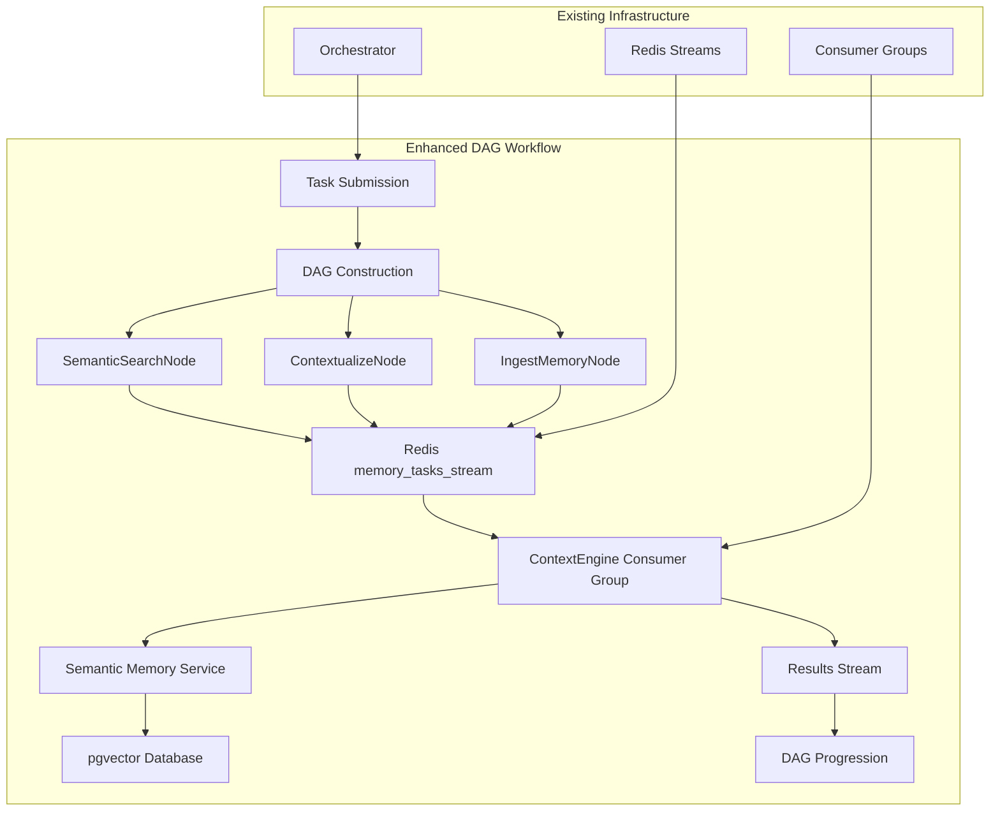

# Phase 3: Semantic Memory Integration - Strategic Implementation Plan

## 🎯 Executive Summary

**Gemini CLI Strategic Rating: 9/10** - Phase 3 will integrate semantic memory capabilities with our existing DAG workflow system, enabling intelligent context-aware multi-agent coordination while maintaining enterprise-grade performance.

## 📋 Phase 3 Objectives (Weeks 7-9)

### **VS 5.1: pgvector API with Text Ingestion and Semantic Search**
- Standalone Semantic Memory Service with FastAPI + pgvector
- Text ingestion pipeline with embedding generation
- High-performance semantic search with <200ms P95 latency
- Production-ready with connection pooling and monitoring

### **VS 5.2: Context Compression and Cross-Agent Knowledge Sharing**
- Intelligent context compression with 60-80% token reduction
- Cross-agent knowledge sharing with access controls
- Workflow-aware context injection for intelligent task execution
- Long-term memory persistence with aging and optimization

## 🏗️ Integration Architecture Strategy

### **Semantic Memory as DAG Nodes**
Following Gemini CLI recommendations, semantic memory integrates as specialized DAG workflow nodes:



### **Key Integration Points**
1. **DAG Enhancement**: New semantic node types in workflow definitions
2. **Redis Streams**: Dedicated `memory_tasks_stream` for memory operations
3. **Consumer Groups**: Specialized `ContextEngine-Agent` consumers
4. **Service Isolation**: Standalone Semantic Memory Service with pgvector
5. **Async Processing**: Non-blocking memory operations preserving workflow performance

## 🤖 Coordinated Subagent Development Plan

### **API-First Contract Strategy**
**CRITICAL FIRST STEP** (Week 1, Days 1-2): Define rigid OpenAPI specification and deploy mock server for parallel development.

### **Subagent Specialization Matrix**

| **Subagent** | **Primary Focus** | **Deliverables** | **Dependencies** |
|--------------|------------------|------------------|-----------------|
| **ContextEngine-Agent** | VS 5.1 Core Service | Semantic Memory Service, pgvector integration, embeddings | **CRITICAL PATH** |
| **Integration-Agent** | DAG Integration | Semantic DAG nodes, Redis streams integration | Mock API contract |
| **DataEngineer-Agent** | VS 5.2 Compression | Compression algorithms, vector optimization | None initially |
| **Performance-Agent** | Benchmarking | Load testing, performance validation | Mock API contract |

## 📅 Phase 3 Implementation Schedule

### **Week 1: Foundation & Contracts**
#### **Days 1-2: API Contract Definition**
- **ContextEngine-Agent + Integration-Agent**: Define OpenAPI specification
- Deploy mock server with static responses
- **ALL AGENTS**: Contract freeze and parallel development begins

#### **Days 3-7: Core Development**
- **ContextEngine-Agent**: Begin Semantic Memory Service implementation
- **Integration-Agent**: Develop semantic DAG nodes against mock server
- **DataEngineer-Agent**: Research compression algorithms and vector quantization
- **Performance-Agent**: Build benchmarking suite against mock server

### **Week 2: Implementation & Integration**
#### **Days 8-10: VS 5.1 Service Delivery**
- **ContextEngine-Agent**: Complete core pgvector service (CRITICAL PATH)
- **Integration-Agent**: Complete DAG node integration
- **Performance-Agent**: Begin live service benchmarking

#### **Days 11-14: VS 5.2 Compression**
- **DataEngineer-Agent**: Implement compression algorithms
- **Integration-Agent**: Add cross-agent sharing capabilities
- **Performance-Agent**: Validate performance targets

### **Week 3: Optimization & Validation**
#### **Days 15-17: Performance Optimization**
- **ALL AGENTS**: Performance tuning and optimization
- **Performance-Agent**: Comprehensive load testing
- **ContextEngine-Agent**: Database indexing and connection optimization

#### **Days 18-21: Integration Testing & Milestone**
- **Integration-Agent**: End-to-end workflow testing
- **ALL AGENTS**: Phase 3 milestone demonstration
- **Phase 3 Complete**: Context-aware workflows operational

## 🎯 Performance Targets (Gemini CLI Validated)

### **Core Service Performance**
- **P95 Search Latency**: <200ms for 1M vector index
- **Ingestion Throughput**: >500 documents/sec
- **Workflow Overhead**: <10ms DAG orchestration impact
- **Memory Efficiency**: <500MB for 100k documents

### **Integration Performance**
- **Context Retrieval**: <50ms for workflow context injection
- **Cross-Agent Sharing**: <100ms for knowledge transfer
- **Compression Ratio**: 60-80% token reduction
- **Search Accuracy**: >90% relevance for domain queries

## 🔧 Technical Implementation Details

### **Semantic Memory Service Architecture**
```python
# FastAPI + pgvector Service
class SemanticMemoryService:
    async def ingest_document(self, content: str, metadata: dict) -> str
    async def semantic_search(self, query: str, limit: int) -> List[SearchResult]
    async def compress_context(self, context: str, ratio: float) -> CompressedContext
    async def get_agent_knowledge(self, agent_id: str) -> AgentKnowledge
```

### **Enhanced DAG Node Types**
```python
# New Workflow Node Types
class SemanticSearchNode(WorkflowNode):
    async def execute(self, context: WorkflowContext) -> NodeResult
    
class ContextualizeNode(WorkflowNode):
    async def execute(self, context: WorkflowContext) -> NodeResult
    
class IngestMemoryNode(WorkflowNode):
    async def execute(self, context: WorkflowContext) -> NodeResult
```

### **Redis Streams Integration**
```python
# Memory Task Stream Processing
MEMORY_STREAMS = {
    'memory_tasks': 'memory_task_consumer_group',
    'memory_results': 'workflow_result_consumers'
}
```

## 🛡️ Risk Mitigation Strategy

### **Critical Risks & Mitigations**

| **Risk** | **Impact** | **Mitigation** | **Owner** |
|----------|------------|----------------|-----------|
| **Semantic search quality poor** | High | Golden dataset evaluation (50-100 query/doc pairs) | DataEngineer-Agent |
| **pgvector performance bottleneck** | High | Continuous benchmarking + scaling plan | Performance-Agent |
| **Integration delays** | Medium | API-first contract + mock server | Integration-Agent |
| **Context compression accuracy** | Medium | Gradual rollout with A/B testing | DataEngineer-Agent |

### **Performance Safeguards**
- **Database Isolation**: Dedicated Postgres instance for pgvector
- **Connection Pooling**: pgbouncer for connection management
- **Smart Indexing**: HNSW indexes for optimal search performance
- **Async Processing**: CPU-intensive tasks on separate thread pools

## 📊 Success Validation Framework

### **Phase 3 Milestone Criteria**
✅ **Semantic Memory Service**: Complete pgvector integration with <200ms search latency
✅ **DAG Integration**: Workflow nodes successfully using semantic context
✅ **Cross-Agent Sharing**: Agents accessing shared knowledge with access controls
✅ **Performance Targets**: All latency and throughput targets met
✅ **Context Compression**: 60-80% token reduction with semantic preservation
✅ **End-to-End Demo**: Context-aware multi-agent workflow execution

### **Quality Gates**
- **API Contract Compliance**: 100% OpenAPI specification adherence
- **Test Coverage**: >90% across all new components
- **Performance Benchmarks**: All targets met under load testing
- **Integration Testing**: Seamless operation with Phase 1+2 infrastructure
- **Documentation**: Complete API docs and operational guides

## 🚀 Expected Business Impact

### **Intelligence Enhancement**
- **Context-Aware Workflows**: Agents leverage previous experience and knowledge
- **Cross-Agent Learning**: Shared insights improve overall system intelligence
- **Adaptive Optimization**: Workflows improve based on historical performance
- **Knowledge Continuity**: Long-term memory preserves institutional knowledge

### **Performance Benefits**
- **Token Efficiency**: 60-80% reduction in LLM API costs through compression
- **Decision Speed**: Faster agent decisions with relevant context retrieval
- **Workflow Intelligence**: Optimized task routing based on agent expertise
- **System Learning**: Continuous improvement through experience accumulation

## 🎖️ Phase 3 Success Definition

**Phase 3 Complete** when the system demonstrates:
1. **Intelligent Context Injection**: Workflows automatically enhance tasks with relevant semantic context
2. **Cross-Agent Knowledge Sharing**: Agents leverage each other's expertise and experience
3. **Performance Excellence**: All targets met while maintaining Phase 1+2 reliability
4. **Semantic Workflow Orchestration**: DAG engine intelligently routes tasks based on context
5. **Production Deployment Ready**: Complete monitoring, documentation, and operational procedures

This strategic plan leverages Gemini CLI's 9/10 rated approach with API-first contracts, coordinated subagent development, and clear performance targets to deliver semantic intelligence while maintaining our enterprise-grade reliability and performance standards.