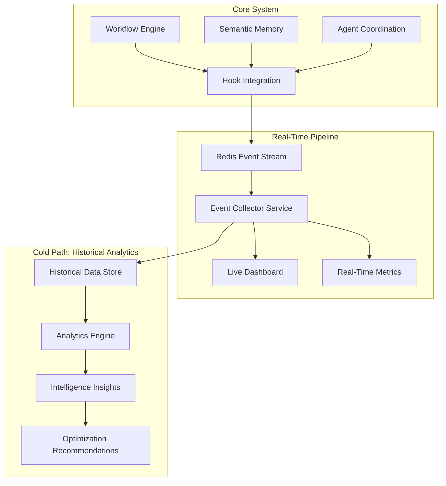

# Phase 4: Full System Observability - Strategic Implementation Plan

## 🎯 Executive Summary

**Gemini CLI Strategic Rating: 9/10** - Phase 4 will implement comprehensive observability for our intelligent multi-agent system, providing real-time monitoring and historical analytics without impacting performance targets.

## 📋 Phase 4 Objectives (Weeks 10-12)

### **VS 6.1: Hook System with Python Scripts and Event Collector**
- Asynchronous, non-blocking hooks capturing critical multi-agent events
- Standalone event collector service processing observability data
- Contract-first event schema enabling coordinated development
- Performance-optimized with <5ms hook overhead

### **VS 6.2: Live Dashboard Integration with Event Streaming** 
- Two-tiered architecture: Real-time monitoring + Historical analytics
- Enhanced dashboard with semantic intelligence visualization
- Live workflow constellation showing agent interactions and context flow
- Intelligence KPI dashboard with trend analysis and optimization insights

## 🏗️ Two-Tiered Observability Architecture

### **Hot Path: Real-Time Monitoring**


### **Event Schema Contract** (Gemini CLI Recommended)
```json
{
  "event_id": "uuid",
  "timestamp": "2024-01-01T12:00:00Z",
  "event_type": "WorkflowStarted|NodeExecuting|SemanticQuery|...",
  "workflow_id": "uuid",
  "agent_id": "uuid", 
  "context_id": "uuid",
  "semantic_embedding": [1536d_vector],
  "payload": {
    "specific_event_data": "..."
  },
  "performance_metrics": {
    "execution_time_ms": 150,
    "memory_usage_mb": 25
  }
}
```

## 🤖 Coordinated Subagent Development Plan

### **Contract-First Development Strategy**
**CRITICAL FIRST STEP** (Week 1, Days 1-2): Define comprehensive Event Schema and deploy mock event streams for parallel development.

### **Subagent Specialization Matrix**

| **Subagent** | **Primary Focus** | **Deliverables** | **Dependencies** |
|--------------|------------------|------------------|-----------------|
| **Observability-Agent** | VS 6.1 Core Infrastructure | Event hooks, collector service, schema | **CRITICAL PATH** |
| **Dashboard-Agent** | VS 6.2 Visualization | Enhanced dashboard, intelligence KPIs | Event schema contract |
| **Analytics-Agent** | Historical Intelligence | Pattern analysis, optimization insights | Historical data access |
| **Performance-Agent** | Performance Validation | Monitoring overhead, regression detection | Event streams |

## 📅 Phase 4 Implementation Schedule

### **Week 1: Event Infrastructure Foundation**
#### **Days 1-2: Event Schema & Contract Definition**
- **Observability-Agent + Dashboard-Agent**: Define comprehensive event schema
- Deploy mock event streams with realistic data simulation
- **ALL AGENTS**: Contract freeze and parallel development begins

#### **Days 3-7: Core Hook Implementation**
- **Observability-Agent**: Implement asynchronous hooks with <5ms overhead
- **Dashboard-Agent**: Build dashboard components against mock streams
- **Analytics-Agent**: Design historical data architecture
- **Performance-Agent**: Create monitoring framework for hook overhead

### **Week 2: Real-Time Integration & Visualization**
#### **Days 8-10: Event Collector Service**
- **Observability-Agent**: Complete standalone event collector service
- **Dashboard-Agent**: Integrate with real-time event streams
- **Performance-Agent**: Validate performance targets with live system

#### **Days 11-14: Enhanced Dashboard**
- **Dashboard-Agent**: Implement semantic intelligence visualizations
- **Analytics-Agent**: Begin historical data processing
- **Performance-Agent**: Comprehensive performance validation

### **Week 3: Historical Analytics & Optimization**
#### **Days 15-17: Intelligence Analytics**
- **Analytics-Agent**: Pattern recognition and optimization insights
- **Dashboard-Agent**: Intelligence KPI dashboard and trend analysis
- **Performance-Agent**: Long-term performance trend monitoring

#### **Days 18-21: Phase 4 Milestone**
- **ALL AGENTS**: Integration testing and optimization
- **Phase 4 Complete**: Full observability operational
- **Milestone Demo**: Comprehensive monitoring of intelligent workflows

## 🔍 Critical Events & Hooks (Gemini CLI Validated)

### **Core Event Categories**
| **Category** | **Events** | **Critical Payload** | **Purpose** |
|--------------|------------|---------------------|------------|
| **Workflow** | `WorkflowStarted`, `WorkflowEnded` | `workflow_id`, `dag_definition`, `initial_context` | High-level process tracking |
| **Task Node** | `NodeExecuting`, `NodeCompleted`, `NodeFailed` | `workflow_id`, `node_id`, `agent_id`, `inputs`, `outputs` | DAG progression debugging |
| **Agent** | `AgentStateChanged` | `agent_id`, `old_state`, `new_state`, `capability_usage` | Agent lifecycle monitoring |
| **Tool** | `PreToolUse`, `PostToolUse` | `agent_id`, `tool_name`, `tool_params`, `execution_time` | Most critical for debugging |
| **Memory** | `SemanticQuery`, `SemanticUpdate` | `agent_id`, `query_embedding`, `result_count`, `latency_ms` | Intelligence system monitoring |
| **Communication** | `MessagePublished`, `MessageReceived` | `channel`, `publisher_id`, `consumer_id`, `message_id` | Information exchange tracking |
| **Recovery** | `FailureDetected`, `RecoveryInitiated` | `workflow_id`, `failure_details`, `recovery_strategy` | Resilience monitoring |

### **Semantic Intelligence Events**
- **Context Injection**: When semantic context enhances task execution
- **Knowledge Sharing**: Cross-agent knowledge transfer events
- **Learning Events**: When agents update knowledge from workflow outcomes
- **Optimization Triggers**: System learning and adaptation events

## 🎨 Enhanced Dashboard Features (Gemini CLI Recommended)

### **Intelligence Visualization**
1. **Live Workflow Constellation**: Real-time graph showing agents as nodes with semantic concepts flowing between them as glowing particles
2. **Semantic Query Explorer**: Natural language interface to query historical event database
3. **Context Trajectory View**: Trace the lineage of semantic context used in task completion
4. **Intelligence KPI Dashboard**: Real-time trend lines for intelligence improvement and coordination amplification

### **Operational Monitoring**
- **Multi-Agent State Overview**: Real-time agent status and capability utilization
- **Performance Heatmaps**: System bottlenecks and optimization opportunities
- **Failure Pattern Analysis**: Automatic detection of recurring issues
- **Resource Utilization**: Memory, CPU, and semantic memory usage trends

## ⚡ Performance Optimization Strategy

### **Non-Blocking Hook Architecture**
```python
class AsyncObservabilityHook:
    async def emit_event(self, event: ObservabilityEvent):
        # <5ms operation - fire and forget
        await self.redis_stream.xadd(
            stream_name="observability_events",
            fields=event.to_dict(),
            maxlen=1000000  # Limit memory usage
        )
```

### **Dynamic Sampling Strategy**
- **Normal Operation**: Event summaries and critical events only
- **Error Detection**: Automatic increase to full verbosity for affected workflows
- **Performance Mode**: Minimal logging during high-load periods
- **Debug Mode**: Complete event capture for development/troubleshooting

### **Efficient Data Processing**
- **Binary Serialization**: MessagePack for minimal network overhead
- **Batch Processing**: Event collector processes events in batches
- **Asynchronous I/O**: Non-blocking database operations
- **Connection Pooling**: Optimized database and Redis connections

## 📊 Intelligence Analytics Framework

### **Pattern Recognition**
- **Workflow Effectiveness**: Identify which workflows perform best with semantic context
- **Agent Specialization**: Discover emerging agent expertise patterns
- **Knowledge Utilization**: Track which semantic knowledge is most valuable
- **Collaboration Patterns**: Analyze effective multi-agent coordination strategies

### **Optimization Insights**
- **Context Optimization**: Recommend optimal context injection strategies
- **Resource Allocation**: Suggest agent workload balancing improvements
- **Knowledge Management**: Identify knowledge gaps and sharing opportunities
- **Performance Tuning**: Automated recommendations for system optimization

## 🛡️ Risk Mitigation Strategy

### **Performance Impact Risks**
| **Risk** | **Impact** | **Mitigation** | **Owner** |
|----------|------------|----------------|-----------|
| **Hook overhead >5ms** | High | Asynchronous fire-and-forget design | Observability-Agent |
| **Event stream flooding** | Medium | Dynamic sampling and rate limiting | Performance-Agent |
| **Dashboard performance** | Medium | Efficient data aggregation and caching | Dashboard-Agent |
| **Historical data growth** | Low | Automated data retention and archival | Analytics-Agent |

### **Integration Complexity**
- **Event Schema Versioning**: Backward-compatible schema evolution
- **Service Dependencies**: Graceful degradation when observability unavailable
- **Data Consistency**: Event ordering and deduplication strategies
- **Security**: Sensitive data filtering and access controls

## 🎯 Success Validation Framework

### **Phase 4 Milestone Criteria**
✅ **Hook System**: <5ms overhead with comprehensive event capture
✅ **Real-Time Dashboard**: Live visualization of intelligent workflows
✅ **Historical Analytics**: Pattern recognition and optimization insights
✅ **Performance Targets**: No degradation of existing system performance
✅ **Intelligence Monitoring**: Visibility into semantic memory and agent coordination
✅ **End-to-End Demo**: Complete observability of multi-agent intelligent workflows

### **Quality Gates**
- **Event Schema Compliance**: 100% adherence to contract specification
- **Performance Validation**: No regression in core system metrics
- **Dashboard Responsiveness**: <2 seconds for all visualization loads
- **Analytics Accuracy**: Validated pattern recognition and insights
- **System Integration**: Seamless operation with Phase 1-3 infrastructure

## 🚀 Expected Business Impact

### **Operational Excellence**
- **Real-Time Visibility**: Complete understanding of multi-agent system behavior
- **Proactive Issue Detection**: Early warning system for performance degradation
- **Intelligent Debugging**: Semantic query capabilities for rapid problem resolution
- **Optimization Guidance**: Data-driven recommendations for system improvements

### **Intelligence Enhancement**
- **Learning Acceleration**: Understanding how agents acquire and share knowledge
- **Collaboration Optimization**: Insights into effective multi-agent coordination
- **Context Effectiveness**: Measurement of semantic memory impact on performance
- **Adaptive System**: Continuous learning and optimization based on observability data

## 🎖️ Phase 4 Success Definition

**Phase 4 Complete** when the system demonstrates:
1. **Comprehensive Observability**: Complete visibility into intelligent multi-agent workflows
2. **Performance Excellence**: Full monitoring without impacting existing performance targets
3. **Intelligence Analytics**: Data-driven insights into system learning and optimization
4. **Real-Time Dashboard**: Live visualization of semantic intelligence and agent coordination
5. **Production Monitoring**: Enterprise-grade observability ready for autonomous operation

This strategic plan leverages Gemini CLI's 9/10 rated approach with contract-first development, two-tiered architecture, and coordinated subagent coordination to deliver comprehensive observability while maintaining our enterprise-grade performance and intelligence capabilities.