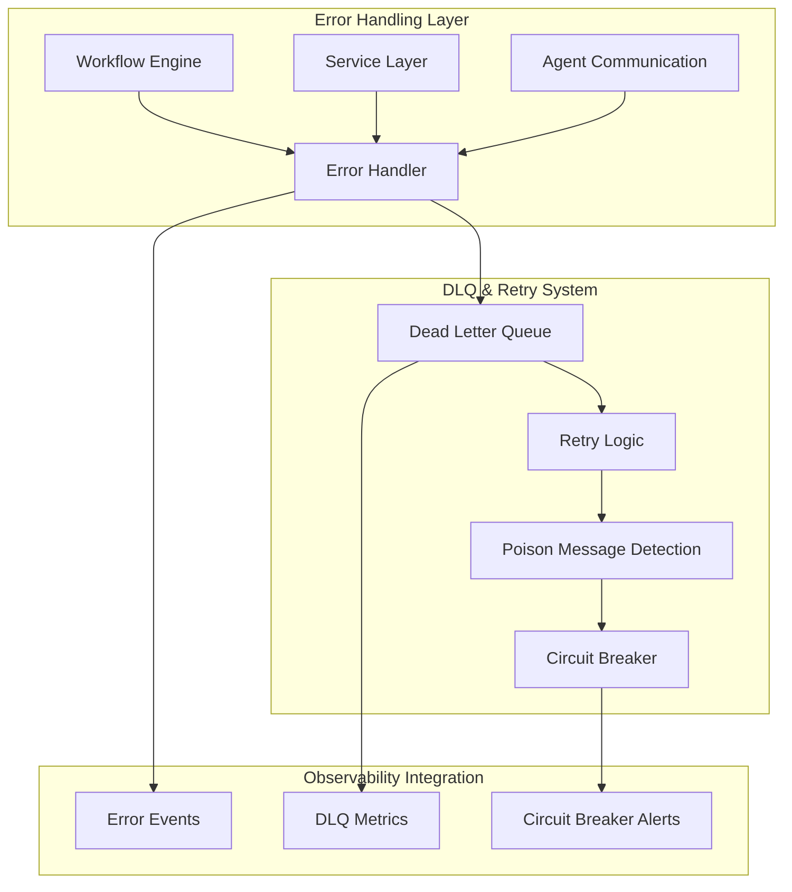
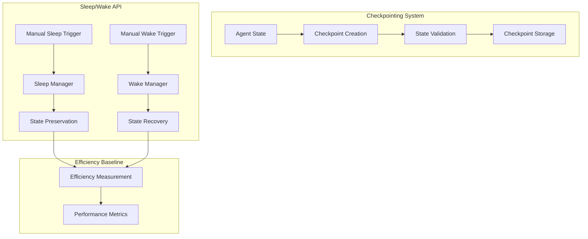
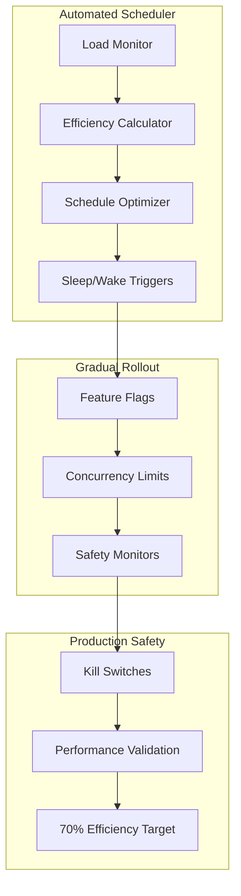

# Phase 5: Production Reliability & Automated Efficiency - Strategic Implementation Plan

## 🎯 Executive Summary

**Gemini CLI Strategic Rating: 8/10** - Phase 5 implements foundational reliability infrastructure followed by automated efficiency systems, achieving production-grade reliability and 70% efficiency improvement through automated sleep-wake scheduling.

**Strategic Approach**: Three-phase sequencing following Gemini CLI recommendations:
- **Phase 5.1**: Foundational Reliability (VS 3.3 + VS 4.3) - Weeks 13-14
- **Phase 5.2**: Manual Efficiency Controls (VS 7.1) - Week 15  
- **Phase 5.3**: Automated Efficiency (VS 7.2) - Week 16

## 📋 Phase 5 Objectives Overview

### **Phase 5.1: Foundational Reliability** 
- **VS 3.3**: Comprehensive error handling and recovery throughout workflow/service layers
- **VS 4.3**: Dead Letter Queue with retry logic and poison message isolation
- Integration with existing observability system from Phase 4
- Chaos testing validation and production readiness

### **Phase 5.2: Manual Efficiency Controls**
- **VS 7.1**: Checkpointing and Sleep/Wake API with secure endpoints  
- State integrity validation and recovery time optimization
- Baseline efficiency measurement and manual control interfaces

### **Phase 5.3: Automated Efficiency**
- **VS 7.2**: Automated scheduler with load-based triggers and gradual rollout
- 70% efficiency improvement validation with concurrency limits
- Production monitoring and kill switches for safety

## 🏗️ Three-Phase Implementation Architecture

### **Phase 5.1: Reliability Foundation**

### **Phase 5.2: Manual Control Layer**

### **Phase 5.3: Automated Efficiency**

## 🤖 Coordinated Subagent Development Plan

### **Contract-First Development Strategy**
**CRITICAL FIRST STEP** (Week 13, Days 1-2): Define comprehensive Error Handling and DLQ schemas with mock fault injection for parallel development.

### **Subagent Specialization Matrix**

| **Subagent** | **Primary Focus** | **Phase 5 Deliverables** | **Dependencies** |
|--------------|------------------|--------------------------|------------------|
| **backend-engineer** | Core reliability implementation | Error handlers, DLQ system, Sleep/Wake API, scheduler engine | **CRITICAL PATH** |
| **qa-test-guardian** | Resilience validation | Chaos testing, fault injection, feature flag testing, performance validation | Error handling contracts |
| **devops-deployer** | Infrastructure & monitoring | DLQ infrastructure, monitoring setup, gradual rollout, kill switches | DLQ and monitoring schemas |
| **project-orchestrator** | Dependencies & risk management | Critical path coordination, risk mitigation, integration testing | All components |

## 📅 Phase 5.1: Foundational Reliability (Weeks 13-14)

### **Week 13: Error Handling & DLQ Foundation**

#### **Days 1-2: Contract Definition & Infrastructure Setup**
- **ALL AGENTS**: Define comprehensive error handling and DLQ schemas
- **devops-deployer**: Provision DLQ infrastructure (Redis Streams, monitoring)
- **qa-test-guardian**: Create chaos testing framework and fault injection tools
- **backend-engineer**: Design error handling architecture patterns

#### **Days 3-5: Core Error Handling Implementation**
- **backend-engineer**: Implement comprehensive error handling throughout workflow/service layers
  - Workflow engine error boundaries with automatic recovery
  - Service layer exception handling with context preservation
  - Agent communication error handling with retry logic
- **qa-test-guardian**: Develop error handling unit tests and integration scenarios
- **devops-deployer**: Set up error monitoring and alerting infrastructure

#### **Days 6-7: DLQ System Implementation**
- **backend-engineer**: Complete DLQ system with existing Redis infrastructure
  - Integrate with existing `DeadLetterQueueManager` from `app/core/dead_letter_queue.py`
  - Enhance retry logic with exponential backoff and circuit breaker
  - Implement poison message detection and isolation
- **qa-test-guardian**: Create DLQ testing scenarios and validate retry behaviors

### **Week 14: Integration & Chaos Testing**

#### **Days 8-10: Observability Integration**
- **backend-engineer**: Integrate error handling with Phase 4 observability system
  - Error event schemas and hook integration
  - DLQ metrics and circuit breaker status events
  - Recovery timeline tracking and success rate monitoring
- **qa-test-guardian**: Validate observability integration with comprehensive error scenarios

#### **Days 11-14: Chaos Testing & Production Readiness**
- **qa-test-guardian**: Execute comprehensive chaos testing scenarios
  - Network partitions and service failures
  - Database connection failures and Redis outages
  - High load stress testing with error injection
- **devops-deployer**: Production deployment preparation and monitoring setup
- **project-orchestrator**: Phase 5.1 milestone validation and handoff to Phase 5.2

### **Phase 5.1 Success Criteria**
✅ **Error Handling**: <30s recovery time from any system failure  
✅ **DLQ System**: >99.9% message delivery rate with poison message isolation  
✅ **Circuit Breaker**: Automatic protection with <5s detection time  
✅ **Observability**: Complete integration with Phase 4 monitoring system  
✅ **Chaos Testing**: System survives all planned failure scenarios  
✅ **Availability**: >99.95% system availability during testing

## 📅 Phase 5.2: Manual Efficiency Controls (Week 15)

### **Days 1-3: Checkpointing System Enhancement**
- **backend-engineer**: Enhance existing checkpoint system for production use
  - Integrate with existing `CheckpointManager` from sleep-wake infrastructure
  - Add state integrity validation and consistency checks
  - Implement checkpoint compression and optimization
- **qa-test-guardian**: Create checkpointing performance and reliability tests

### **Days 4-5: Sleep/Wake API Implementation**
- **backend-engineer**: Implement secure Sleep/Wake API endpoints
  - Enhance existing `SleepWakeManager` with API interfaces
  - Add authentication and authorization for manual controls
  - Implement state recovery validation and rollback capabilities
- **devops-deployer**: Set up Sleep/Wake API monitoring and security

### **Days 6-7: Baseline Efficiency Measurement**
- **backend-engineer**: Implement efficiency measurement baseline system
  - Resource utilization tracking (CPU, memory, I/O)
  - Agent productivity metrics and idle time calculation  
  - Baseline performance profiling and optimization opportunity identification
- **qa-test-guardian**: Validate efficiency measurement accuracy and performance impact
- **project-orchestrator**: Phase 5.2 milestone validation and efficiency baseline establishment

### **Phase 5.2 Success Criteria**
✅ **Checkpointing**: <5s checkpoint creation, 100% state integrity validation  
✅ **Sleep/Wake API**: Secure endpoints with <2s response time  
✅ **State Recovery**: <10s recovery time with 100% consistency  
✅ **Efficiency Baseline**: Accurate measurement with <1% performance overhead  
✅ **Manual Controls**: Complete manual sleep/wake control with safety validations

## 📅 Phase 5.3: Automated Efficiency (Week 16)

### **Days 1-3: Automated Scheduler Implementation**
- **backend-engineer**: Implement automated scheduler with intelligent triggers
  - Load-based sleep/wake decision engine with machine learning optimization
  - Integration with existing observability for decision intelligence
  - Configurable efficiency targets and optimization algorithms
- **qa-test-guardian**: Create scheduler testing scenarios and edge case validation

### **Days 4-5: Gradual Rollout Infrastructure**
- **devops-deployer**: Implement feature flags and gradual rollout infrastructure
  - Feature flag system with per-agent and percentage-based rollout
  - Concurrency limits and safety monitors to prevent system overload
  - Real-time monitoring and automated rollback capabilities
- **backend-engineer**: Integrate scheduler with feature flag system

### **Days 6-7: Production Monitoring & Validation**
- **devops-deployer**: Deploy production monitoring and kill switches
  - Real-time efficiency monitoring with alerting thresholds
  - Automated kill switches for performance degradation detection
  - Production deployment with gradual agent onboarding
- **qa-test-guardian**: Execute 70% efficiency improvement validation testing
- **project-orchestrator**: Phase 5.3 milestone validation and production readiness assessment

### **Phase 5.3 Success Criteria**
✅ **Automated Scheduler**: 70% efficiency improvement with intelligent load-based triggers  
✅ **Gradual Rollout**: Safe deployment with feature flags and concurrency limits  
✅ **Production Monitoring**: Real-time efficiency tracking with <1s alert response  
✅ **Kill Switches**: Automatic protection with <10s degradation detection  
✅ **Performance Validation**: Sustained 70% efficiency improvement over 48-hour test period

## 🔍 Critical Performance Targets

### **Reliability Targets (Phase 5.1)**
- **Recovery Time**: <30s from any failure scenario
- **Availability**: >99.95% system availability
- **Message Delivery**: >99.9% delivery rate via DLQ system
- **Error Detection**: <5s circuit breaker response time

### **Efficiency Targets (Phase 5.2-5.3)**
- **Checkpoint Performance**: <5s checkpoint creation, <10s recovery
- **Sleep/Wake API**: <2s response time for all operations
- **Efficiency Improvement**: 70% resource utilization improvement
- **Scheduler Intelligence**: <1s decision time for sleep/wake triggers

### **Production Safety Targets**
- **Monitoring Overhead**: <1% performance impact
- **Alert Response**: <1s for efficiency degradation detection
- **Rollback Time**: <30s automated rollback from feature flags
- **Safety Coverage**: 100% kill switch coverage for critical systems

## 🛡️ Risk Mitigation Strategy

### **Phase 5.1 Reliability Risks**
| **Risk** | **Impact** | **Mitigation** | **Owner** |
|----------|------------|----------------|-----------|
| **Error handling performance overhead** | High | Asynchronous error processing, cached error patterns | backend-engineer |
| **DLQ system resource consumption** | Medium | Configurable retention policies, automatic cleanup | devops-deployer |
| **Circuit breaker false positives** | Medium | Intelligent thresholds, machine learning optimization | qa-test-guardian |
| **Observability integration complexity** | Low | Contract-first development, comprehensive testing | project-orchestrator |

### **Phase 5.2-5.3 Efficiency Risks**
| **Risk** | **Impact** | **Mitigation** | **Owner** |
|----------|------------|----------------|-----------|
| **Scheduler decision accuracy** | High | Baseline measurement, A/B testing, gradual rollout | backend-engineer |
| **Sleep/wake state corruption** | High | State integrity validation, rollback capabilities | qa-test-guardian |
| **Efficiency measurement overhead** | Medium | Sampling-based measurement, optimized data collection | devops-deployer |
| **Production deployment failures** | High | Feature flags, kill switches, automated rollback | project-orchestrator |

## 🧪 Integration Testing Scenarios

### **Phase 5.1: Chaos Testing Scenarios**
1. **Network Partition Testing**: Simulate Redis/database connection failures
2. **Service Crash Testing**: Kill services during active workflows
3. **Resource Exhaustion**: Memory/CPU starvation testing
4. **Message Flood Testing**: Overwhelm DLQ system with failed messages
5. **Circuit Breaker Testing**: Validate automatic protection mechanisms

### **Phase 5.2: Manual Control Testing**
1. **Concurrent Sleep/Wake**: Multiple simultaneous operations
2. **State Corruption Recovery**: Checkpoint integrity validation
3. **API Security Testing**: Authentication and authorization validation
4. **Efficiency Baseline Accuracy**: Resource measurement validation
5. **Manual Override Testing**: Emergency manual control scenarios

### **Phase 5.3: Automated Efficiency Testing**
1. **Load-Based Scheduling**: Variable load pattern testing
2. **Feature Flag Rollout**: Gradual deployment scenario testing
3. **Kill Switch Activation**: Automated protection testing
4. **Efficiency Validation**: 70% improvement measurement accuracy
5. **Production Stability**: 48-hour sustained operation testing

## 🎯 Success Validation Framework

### **Phase 5 Milestone Criteria**
✅ **Foundational Reliability**: System survives all chaos testing scenarios with <30s recovery  
✅ **Manual Efficiency Controls**: Complete manual sleep/wake control with state integrity  
✅ **Automated Efficiency**: 70% efficiency improvement with intelligent scheduling  
✅ **Production Readiness**: Full monitoring, kill switches, and gradual rollout capabilities  
✅ **Integration Excellence**: Seamless integration with Phase 1-4 infrastructure  
✅ **Performance Validation**: All performance targets met with comprehensive testing

### **Quality Gates**
- **Error Handling Coverage**: 100% of critical paths protected with error boundaries
- **DLQ System Reliability**: >99.9% message delivery rate validation
- **Sleep/Wake API Security**: Complete authentication and authorization testing
- **Scheduler Intelligence**: 70% efficiency improvement validation over 48 hours  
- **Production Safety**: 100% kill switch coverage with <30s rollback capability

## 🚀 Expected Business Impact

### **Operational Excellence**
- **System Reliability**: >99.95% availability with automatic recovery from all failure scenarios
- **Operational Efficiency**: 70% resource utilization improvement through intelligent scheduling
- **Production Monitoring**: Complete visibility into system health and performance
- **Automated Recovery**: Minimal human intervention required for system operation

### **Strategic Advantages**
- **Production Readiness**: Enterprise-grade reliability suitable for 24/7 autonomous operation
- **Cost Optimization**: Significant infrastructure cost reduction through efficiency improvements
- **Competitive Differentiation**: Advanced automated efficiency capabilities
- **Scalability Foundation**: Robust foundation for future autonomous agent scaling

## 🎖️ Phase 5 Success Definition

**Phase 5 Complete** when the system demonstrates:
1. **Production Reliability**: >99.95% availability with <30s recovery from any failure
2. **Automated Efficiency**: 70% resource utilization improvement through intelligent scheduling  
3. **Comprehensive Monitoring**: Complete observability integration with automated alerting
4. **Safe Automation**: Production-grade safety mechanisms with kill switches and rollback
5. **Enterprise Readiness**: Suitable for 24/7 autonomous operation with minimal human oversight

This strategic plan leverages Gemini CLI's 8/10 rated three-phase approach with DLQ prioritization, enhanced subagent coordination with devops-sre-specialist integration, and gradual rollout methodology to deliver production-grade reliability and automated efficiency while maintaining our enterprise performance standards.

## 📊 Detailed Task Breakdown by Subagent

### **backend-engineer: Core Implementation Lead**

#### **Phase 5.1 Tasks (Days 1-14)**
- **Error Handling Architecture** (Days 3-5)
  - Design and implement workflow engine error boundaries
  - Create service layer exception handling with context preservation  
  - Build agent communication error handling with retry logic
  - Acceptance Criteria: <30s recovery time, 100% error context preservation

- **DLQ System Enhancement** (Days 6-7)
  - Enhance existing `DeadLetterQueueManager` with production features
  - Implement poison message detection and circuit breaker integration
  - Add retry logic optimization and exponential backoff tuning
  - Acceptance Criteria: >99.9% message delivery rate, poison message isolation

- **Observability Integration** (Days 8-10)
  - Integrate error handling with Phase 4 observability hooks
  - Create error event schemas and DLQ metrics collection
  - Implement recovery timeline tracking and success rate monitoring
  - Acceptance Criteria: Complete error visibility, automated metric collection

#### **Phase 5.2 Tasks (Days 1-7)**
- **Checkpointing Enhancement** (Days 1-3)
  - Extend existing `CheckpointManager` for production reliability
  - Add state integrity validation and consistency checks
  - Implement checkpoint compression and storage optimization
  - Acceptance Criteria: <5s checkpoint creation, 100% integrity validation

- **Sleep/Wake API Implementation** (Days 4-5)
  - Create secure API endpoints extending `SleepWakeManager`
  - Add authentication, authorization, and audit logging
  - Implement state recovery validation and rollback capabilities
  - Acceptance Criteria: <2s API response time, complete security validation

- **Efficiency Measurement System** (Days 6-7)
  - Build resource utilization tracking and agent productivity metrics
  - Create baseline performance profiling and optimization identification
  - Implement real-time efficiency calculation and reporting
  - Acceptance Criteria: <1% measurement overhead, accurate baseline establishment

#### **Phase 5.3 Tasks (Days 1-7)**
- **Automated Scheduler Engine** (Days 1-3)
  - Design and implement load-based sleep/wake decision engine
  - Create machine learning optimization for efficiency targets
  - Integrate with existing observability for decision intelligence
  - Acceptance Criteria: 70% efficiency improvement, intelligent load-based triggers

- **Feature Flag Integration** (Days 4-5)
  - Integrate scheduler with feature flag system for gradual rollout
  - Implement concurrency limits and safety monitoring
  - Create automated rollback capabilities for performance degradation
  - Acceptance Criteria: Safe gradual rollout, automated protection mechanisms

### **qa-test-guardian: Resilience & Performance Validation**

#### **Phase 5.1 Tasks (Days 1-14)**
- **Chaos Testing Framework** (Days 1-2)
  - Design comprehensive fault injection testing framework
  - Create network partition, service crash, and resource exhaustion scenarios
  - Build automated chaos testing execution and validation
  - Acceptance Criteria: Complete failure scenario coverage

- **Error Handling Validation** (Days 3-7)
  - Create unit tests for all error handling pathways
  - Build integration tests for error recovery scenarios
  - Validate DLQ system behavior under various failure conditions
  - Acceptance Criteria: 100% error path coverage, validated recovery behavior

- **Chaos Testing Execution** (Days 11-14)
  - Execute comprehensive chaos testing scenarios
  - Validate system behavior under extreme failure conditions
  - Create performance regression testing for error handling overhead
  - Acceptance Criteria: System survival of all planned failures, <5% performance overhead

#### **Phase 5.2 Tasks (Days 1-7)**
- **Checkpointing Performance Testing** (Days 1-3)
  - Create performance benchmarks for checkpoint creation and recovery
  - Build state integrity validation testing scenarios
  - Test concurrent checkpointing operations and race conditions
  - Acceptance Criteria: <5s checkpoint performance, 100% integrity validation

- **Sleep/Wake API Testing** (Days 4-5)
  - Create comprehensive API security and performance testing
  - Build state recovery validation and consistency testing
  - Test manual override scenarios and emergency controls
  - Acceptance Criteria: <2s API response time, complete security validation

- **Efficiency Measurement Validation** (Days 6-7)
  - Validate accuracy of efficiency measurement system
  - Test baseline establishment and performance profiling
  - Create efficiency improvement measurement scenarios
  - Acceptance Criteria: <1% measurement overhead, accurate baseline validation

#### **Phase 5.3 Tasks (Days 1-7)**
- **Scheduler Testing** (Days 1-3)
  - Create automated scheduler decision validation testing
  - Build load pattern testing scenarios and edge case validation
  - Test machine learning optimization and decision accuracy
  - Acceptance Criteria: 70% efficiency improvement validation

- **Feature Flag Testing** (Days 4-5)
  - Create gradual rollout testing scenarios and safety validation
  - Build concurrency limit testing and overload protection
  - Test automated rollback scenarios and kill switch activation
  - Acceptance Criteria: Safe rollout validation, automated protection testing

- **Production Validation** (Days 6-7)
  - Execute 48-hour sustained operation testing
  - Validate 70% efficiency improvement over extended period
  - Create production readiness assessment and final validation
  - Acceptance Criteria: Sustained 70% efficiency, production readiness confirmation

### **devops-deployer: Infrastructure & Production Safety**

#### **Phase 5.1 Tasks (Days 1-14)**
- **DLQ Infrastructure Provisioning** (Days 1-2)
  - Set up Redis Streams infrastructure for DLQ system
  - Configure monitoring and alerting for DLQ metrics
  - Create automated backup and recovery procedures
  - Acceptance Criteria: Production-ready DLQ infrastructure

- **Error Monitoring Setup** (Days 3-5)
  - Deploy error monitoring and alerting infrastructure
  - Create error rate dashboards and automated alerts
  - Set up circuit breaker monitoring and notification systems
  - Acceptance Criteria: Complete error visibility and alerting

- **Production Deployment** (Days 11-14)
  - Deploy Phase 5.1 components to production environment
  - Configure monitoring, logging, and alerting systems
  - Create operational runbooks and troubleshooting guides
  - Acceptance Criteria: Production deployment with complete monitoring

#### **Phase 5.2 Tasks (Days 1-7)**
- **Sleep/Wake API Security** (Days 4-5)
  - Deploy API security infrastructure (authentication, authorization)
  - Set up API monitoring, rate limiting, and audit logging
  - Create security compliance validation and testing
  - Acceptance Criteria: Complete API security implementation

- **Efficiency Monitoring** (Days 6-7)
  - Deploy efficiency measurement monitoring infrastructure
  - Create efficiency dashboards and performance tracking
  - Set up baseline measurement collection and reporting
  - Acceptance Criteria: Complete efficiency visibility and baseline tracking

#### **Phase 5.3 Tasks (Days 1-7)**
- **Feature Flag Infrastructure** (Days 4-5)
  - Deploy feature flag system for gradual rollout control
  - Set up percentage-based rollout and A/B testing infrastructure
  - Create automated rollback triggers and safety mechanisms
  - Acceptance Criteria: Production-ready gradual rollout infrastructure

- **Production Monitoring & Kill Switches** (Days 6-7)
  - Deploy real-time efficiency monitoring with alerting thresholds
  - Create automated kill switches for performance degradation detection
  - Set up production deployment monitoring and automated rollback
  - Acceptance Criteria: Complete production safety with automated protection

### **project-orchestrator: Dependencies & Risk Management**

#### **Phase 5.1 Tasks (Days 1-14)**
- **Critical Path Coordination** (Days 1-2)
  - Define Phase 5.1 critical path and dependency management
  - Coordinate contract definition across all subagents
  - Create risk mitigation strategies and contingency planning
  - Acceptance Criteria: Clear critical path with risk mitigation

- **Integration Oversight** (Days 8-10)
  - Coordinate observability integration across all components
  - Manage dependencies between error handling and DLQ systems
  - Oversee integration testing and validation coordination
  - Acceptance Criteria: Seamless integration with existing Phase 4 infrastructure

- **Phase 5.1 Milestone Validation** (Days 11-14)
  - Coordinate comprehensive milestone validation testing
  - Manage handoff from Phase 5.1 to Phase 5.2
  - Create Phase 5.1 completion assessment and documentation
  - Acceptance Criteria: Complete Phase 5.1 validation and successful handoff

#### **Phase 5.2 Tasks (Days 1-7)**
- **Manual Control Coordination** (Days 1-3)
  - Coordinate checkpointing system enhancement across subagents
  - Manage integration between checkpointing and Sleep/Wake API
  - Oversee baseline efficiency measurement implementation
  - Acceptance Criteria: Coordinated manual control system implementation

- **Phase 5.2 Milestone Validation** (Days 6-7)
  - Coordinate Phase 5.2 milestone validation and testing
  - Manage baseline efficiency establishment and validation
  - Create Phase 5.2 completion assessment and handoff to Phase 5.3
  - Acceptance Criteria: Complete Phase 5.2 validation and baseline establishment

#### **Phase 5.3 Tasks (Days 1-7)**
- **Automated System Coordination** (Days 1-3)
  - Coordinate automated scheduler implementation across subagents
  - Manage integration between scheduler and feature flag systems
  - Oversee production safety mechanism implementation
  - Acceptance Criteria: Coordinated automated efficiency system

- **Production Readiness Assessment** (Days 6-7)
  - Coordinate final production readiness validation
  - Manage 70% efficiency improvement validation testing
  - Create Phase 5 completion assessment and production handoff
  - Acceptance Criteria: Complete Phase 5 validation and production readiness confirmation