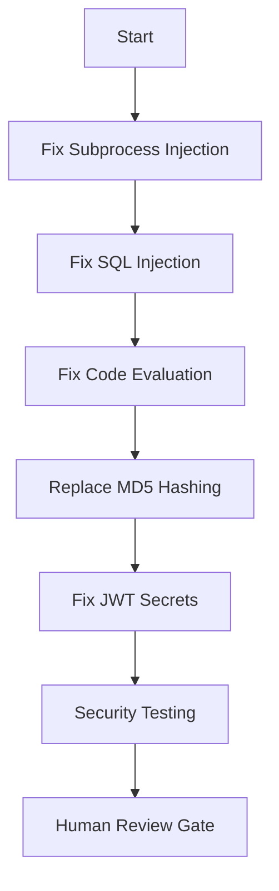
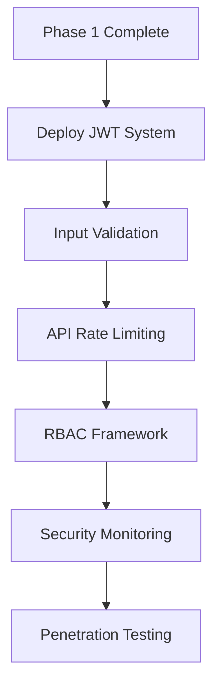
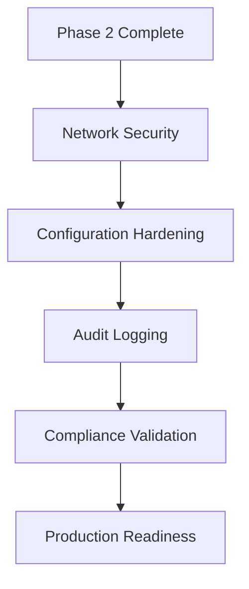

# Security Vulnerability Remediation Priority Matrix
## Agent Hive 2.0 - Epic 3 Production Security Hardening

---

## Priority Classification Framework

### CVSS Score Mapping
- **CRITICAL (9.0-10.0)**: Immediate exploitation, system compromise
- **HIGH (7.0-8.9)**: High impact, moderate complexity 
- **MEDIUM (4.0-6.9)**: Moderate impact, limited scope
- **LOW (0.1-3.9)**: Limited impact, theoretical risk

### Business Impact Factors
- **Data Security**: Risk to sensitive data
- **System Availability**: Risk to service uptime
- **Compliance**: GDPR/SOC2 requirements
- **Reputation**: Public security exposure

---

## Critical Priority (Day 1-3) - Production Blockers

| Vulnerability ID | CVSS | Impact | Complexity | Timeline | Human Review |
|------------------|------|---------|------------|----------|--------------|
| CVE-CRITICAL-002 | 8.1 | System Compromise | Low | Day 1 | ✅ MANDATORY |
| CVE-CRITICAL-004 | 8.5 | Data Breach | Medium | Day 1-2 | ✅ MANDATORY |
| CVE-CRITICAL-006 | 7.9 | Code Injection | Low | Day 1 | ✅ MANDATORY |
| CVE-CRITICAL-003 | 7.8 | Auth Bypass | Medium | Day 1-2 | ✅ MANDATORY |
| CVE-CRITICAL-001 | 7.5 | Crypto Weakness | High | Day 2-3 | ✅ MANDATORY |

### Critical Items Detail

#### 🚨 CVE-CRITICAL-002: Subprocess Shell Injection
**File:** `app/core/onboarding_automation.py:752`
```python
# VULNERABLE CODE
subprocess.run(command, shell=True, ...)
```
**Fix Priority:** IMMEDIATE - Day 1
**Remediation:** Replace with `subprocess.run(shlex.split(command), shell=False)`
**Risk:** Remote code execution, system takeover

#### 🚨 CVE-CRITICAL-004: SQL Injection Vectors  
**File:** `app/api/v1/autonomous_development.py`
**Fix Priority:** IMMEDIATE - Day 1-2
**Remediation:** Implement parameterized queries, input sanitization
**Risk:** Database compromise, data exfiltration

#### 🚨 CVE-CRITICAL-006: Unsafe Code Evaluation
**File:** `app/core/adaptive_scaler.py:106`
**Fix Priority:** IMMEDIATE - Day 1
**Remediation:** Replace `eval()` with `ast.literal_eval()` or JSON parsing
**Risk:** Arbitrary code execution

---

## High Priority (Day 4-7) - Security Foundation

| Vulnerability ID | CVSS | Component | Timeline | Dependencies |
|------------------|------|-----------|----------|--------------|
| CVE-CRITICAL-005 | 6.2 | File Permissions | Day 4 | Critical fixes |
| AUTH-WEAK-001 | 6.8 | JWT Implementation | Day 4-5 | Secret management |
| INPUT-VAL-001 | 6.1 | API Validation | Day 5-6 | Auth system |
| RATE-LIMIT-001 | 5.9 | API Protection | Day 6-7 | Monitoring |

### High Priority Implementation

#### 🔒 Secure Authentication System
1. **JWT Secret Management**
   - Implement secure key rotation
   - Environment-based configuration
   - HSM integration for production

2. **Input Validation Framework**
   - Comprehensive schema validation
   - Sanitization middleware
   - Rate limiting integration

3. **API Security Hardening** 
   - CORS configuration
   - Security headers
   - Request/response encryption

---

## Medium Priority (Week 2-3) - Operational Security

| Category | Issues | CVSS Range | Timeline | Resources |
|----------|---------|------------|----------|-----------|
| Network Security | 8 issues | 4.2-6.0 | Week 2 | 2 engineers |
| Configuration | 12 issues | 3.8-5.5 | Week 2-3 | 1 engineer |
| Monitoring | 6 issues | 4.1-5.8 | Week 3 | 1 engineer |
| Documentation | 4 issues | 3.2-4.9 | Week 3 | 1 engineer |

---

## Implementation Strategy

### Phase 1: Critical Security Fixes (Days 1-3)


### Phase 2: Authentication Hardening (Days 4-7)


### Phase 3: Infrastructure Security (Days 8-14)


---

## Resource Allocation

### Critical Phase (Days 1-3)
- **Security Engineer Lead**: Full-time critical fixes
- **Senior Developer**: Crypto and auth implementation  
- **DevOps Engineer**: Infrastructure security
- **QA Engineer**: Security testing validation

### Implementation Phase (Days 4-14)
- **Security Engineer**: Architecture review and validation
- **Full-stack Developer**: API security implementation
- **DevOps Engineer**: Monitoring and logging
- **Compliance Officer**: GDPR/SOC2 validation

---

## Quality Gates

### Gate 1: Critical Fixes Complete (Day 3)
- ✅ All CRITICAL vulnerabilities fixed
- ✅ Security testing passed
- ✅ Code review approved
- ✅ No regression issues

### Gate 2: Authentication System (Day 7) 
- ✅ JWT system deployed
- ✅ Input validation active
- ✅ Rate limiting functional
- ✅ Penetration test clean

### Gate 3: Production Ready (Day 14)
- ✅ All HIGH/MEDIUM issues resolved
- ✅ Security monitoring active
- ✅ Compliance validation complete
- ✅ Incident response tested

---

## Risk Mitigation

### Immediate Risks (Days 1-3)
- **Code Injection**: Disable affected endpoints until fixed
- **SQL Injection**: Enable WAF protection
- **Weak Crypto**: Implement crypto migration strategy
- **Auth Bypass**: Require additional MFA temporarily

### Ongoing Risks (Days 4-14)
- **Performance Impact**: Monitor response times during fixes
- **User Experience**: Gradual rollout of security features
- **Integration Issues**: Comprehensive testing at each phase

---

## Success Metrics

### Security Metrics
- **Vulnerability Count**: Target 0 HIGH/CRITICAL
- **CVSS Average**: Target < 4.0 across all findings
- **Fix Time**: Target < 24h for CRITICAL issues
- **Test Coverage**: Target 95% security test coverage

### Operational Metrics  
- **API Response Time**: Maintain < 100ms p95
- **System Uptime**: Maintain 99.9% availability
- **False Positive Rate**: < 5% in security monitoring
- **Incident Response**: < 30 seconds alert latency

---

## Escalation Matrix

### Immediate Escalation Required
- **Critical vulnerability discovered**: Security team + CISO
- **Fix implementation blocked**: Engineering manager + Security lead
- **Compliance concerns**: Legal team + Compliance officer
- **Production impact**: Operations team + Engineering director

### Review Checkpoints
- **Daily**: Critical fix progress review
- **Weekly**: Overall security posture assessment  
- **Bi-weekly**: Compliance and audit readiness
- **Monthly**: Security architecture review

---

*Priority Matrix maintained by DevOps-Deployer Agent - Epic 3 Security Implementation*