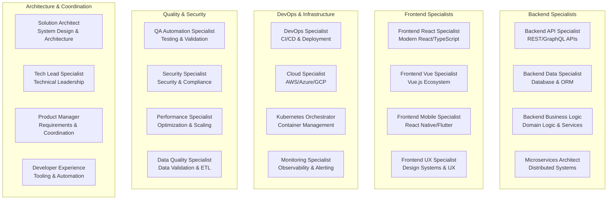

# LeanVibe Agent Hive 2.0 - Agent Specialization Templates

## Executive Summary

**Objective**: Define comprehensive agent specialization templates for rapid project implementation, optimizing team composition and capability matching for maximum development velocity.

**Target**: Enable 42x development velocity improvement through specialized agent roles with 95% capability matching accuracy and optimal team coordination.

## Agent Specialization Framework

### Core Specialization Model

```python
@dataclass
class AgentSpecialization:
    """
    Comprehensive agent specialization definition
    """
    specialization_id: str
    name: str
    description: str
    
    # Core capabilities and expertise
    primary_capabilities: List[str]
    secondary_capabilities: List[str]
    technology_stack: List[str]
    
    # Performance characteristics
    specialization_score: float  # 1.0-10.0
    velocity_multiplier: float   # Relative to baseline
    max_concurrent_tasks: int
    optimal_task_duration: timedelta
    
    # Collaboration and coordination
    collaboration_affinity: Dict[str, float]  # Other specializations
    coordination_overhead: float
    handoff_efficiency: float
    
    # Quality and reliability metrics
    code_quality_score: float
    test_coverage_target: float
    error_rate: float
    learning_curve: float
```

### Specialization Categories



## Backend Specialists

### 1. Backend API Specialist

```yaml
backend_api_specialist:
  specialization_id: "backend_api_python_fastapi"
  name: "Backend API Specialist (Python/FastAPI)"
  description: "Expert in building high-performance REST APIs with Python and FastAPI"
  
  primary_capabilities:
    - python_advanced
    - fastapi_expert
    - pydantic_schemas
    - async_programming
    - api_design_patterns
    - openapi_documentation
    - sqlalchemy_orm
    - database_optimization
    
  secondary_capabilities:
    - postgresql_advanced
    - redis_caching
    - jwt_authentication
    - oauth2_implementation
    - api_security
    - performance_optimization
    - monitoring_integration
    - docker_containerization
    
  technology_stack:
    core: [python, fastapi, pydantic, sqlalchemy, postgresql]
    extensions: [redis, celery, alembic, pytest, black, ruff]
    monitoring: [prometheus, grafana, sentry]
    deployment: [docker, uvicorn, nginx]
    
  performance_metrics:
    specialization_score: 9.5
    velocity_multiplier: 2.8
    max_concurrent_tasks: 3
    optimal_task_duration: "2-4 hours"
    
  collaboration_affinity:
    frontend_react_specialist: 0.95
    backend_data_specialist: 0.90
    devops_specialist: 0.85
    qa_automation_specialist: 0.92
    
  quality_targets:
    code_quality_score: 9.0
    test_coverage_target: 0.95
    api_response_time: "<50ms"
    error_rate: 0.001
    
  task_specializations:
    high_efficiency:
      - rest_api_development
      - async_endpoint_implementation
      - request_validation
      - response_serialization
      - api_documentation
      - authentication_middleware
      - error_handling
      - performance_optimization
      
    medium_efficiency:
      - database_schema_design
      - business_logic_implementation
      - integration_testing
      - security_implementation
      
    learning_required:
      - frontend_integration
      - deployment_configuration
      - monitoring_setup
```

### 2. Backend Data Specialist

```yaml
backend_data_specialist:
  specialization_id: "backend_data_postgresql_sqlalchemy"
  name: "Backend Data Specialist (PostgreSQL/SQLAlchemy)"
  description: "Expert in database design, optimization, and data management"
  
  primary_capabilities:
    - postgresql_expert
    - sqlalchemy_advanced
    - database_modeling
    - query_optimization
    - migration_management
    - indexing_strategies
    - performance_tuning
    - data_consistency
    
  secondary_capabilities:
    - redis_optimization
    - data_warehousing
    - etl_pipelines
    - backup_strategies
    - replication_setup
    - monitoring_databases
    - security_configuration
    - pgvector_embeddings
    
  technology_stack:
    core: [postgresql, sqlalchemy, alembic, redis]
    optimization: [pgbouncer, pgpool, pg_stat_statements]
    monitoring: [pg_stat_monitor, prometheus_postgres_exporter]
    backup: [pg_dump, pg_basebackup, wal_archiving]
    
  performance_metrics:
    specialization_score: 9.2
    velocity_multiplier: 2.5
    max_concurrent_tasks: 4
    optimal_task_duration: "1-3 hours"
    
  task_specializations:
    high_efficiency:
      - database_schema_design
      - migration_development
      - query_optimization
      - index_optimization
      - performance_monitoring
      - data_modeling
      - constraint_implementation
      
    medium_efficiency:
      - stored_procedure_development
      - trigger_implementation
      - backup_automation
      - replication_setup
```

### 3. Backend Business Logic Specialist

```yaml
backend_business_logic_specialist:
  specialization_id: "backend_business_logic_python"
  name: "Backend Business Logic Specialist"
  description: "Expert in implementing complex domain logic and business rules"
  
  primary_capabilities:
    - domain_driven_design
    - business_logic_patterns
    - service_layer_architecture
    - event_driven_architecture
    - state_management
    - workflow_orchestration
    - validation_frameworks
    - rule_engines
    
  secondary_capabilities:
    - message_queues
    - saga_patterns
    - cqrs_implementation
    - event_sourcing
    - background_processing
    - caching_strategies
    - api_integration
    - testing_strategies
    
  performance_metrics:
    specialization_score: 8.8
    velocity_multiplier: 2.2
    max_concurrent_tasks: 3
    optimal_task_duration: "3-5 hours"
    
  task_specializations:
    high_efficiency:
      - business_rule_implementation
      - service_layer_development
      - domain_model_creation
      - workflow_implementation
      - validation_logic
      - state_transitions
      - event_handling
```

## Frontend Specialists

### 1. Frontend React Specialist

```yaml
frontend_react_specialist:
  specialization_id: "frontend_react_typescript_vite"
  name: "Frontend React Specialist (TypeScript/Vite)"
  description: "Expert in modern React development with TypeScript and modern tooling"
  
  primary_capabilities:
    - react_18_advanced
    - typescript_expert
    - vite_build_system
    - react_hooks_patterns
    - state_management_zustand
    - react_query_data_fetching
    - component_composition
    - performance_optimization
    
  secondary_capabilities:
    - tailwind_css_expert
    - testing_library_react
    - storybook_documentation
    - react_router_navigation
    - form_handling_react_hook_form
    - accessibility_wcag
    - pwa_implementation
    - micro_frontend_architecture
    
  technology_stack:
    core: [react, typescript, vite, tailwind_css]
    state: [zustand, react_query, react_hook_form]
    testing: [vitest, testing_library, playwright]
    tools: [eslint, prettier, storybook]
    
  performance_metrics:
    specialization_score: 9.3
    velocity_multiplier: 2.6
    max_concurrent_tasks: 2
    optimal_task_duration: "2-4 hours"
    
  collaboration_affinity:
    backend_api_specialist: 0.95
    frontend_ux_specialist: 0.88
    qa_automation_specialist: 0.90
    
  quality_targets:
    code_quality_score: 8.8
    test_coverage_target: 0.90
    lighthouse_performance: ">90"
    accessibility_score: ">95"
    
  task_specializations:
    high_efficiency:
      - react_component_development
      - typescript_interface_definition
      - state_management_implementation
      - api_integration
      - form_handling
      - routing_setup
      - performance_optimization
      - responsive_design
      
    medium_efficiency:
      - testing_implementation
      - accessibility_enhancement
      - pwa_features
      - build_optimization
```

### 2. Frontend UX Specialist

```yaml
frontend_ux_specialist:
  specialization_id: "frontend_ux_design_systems"
  name: "Frontend UX Specialist (Design Systems)"
  description: "Expert in user experience design, design systems, and interface optimization"
  
  primary_capabilities:
    - design_systems_creation
    - component_library_development
    - accessibility_wcag_expert
    - responsive_design_patterns
    - user_interaction_design
    - micro_interactions
    - css_advanced_layouts
    - design_tokens_implementation
    
  secondary_capabilities:
    - figma_design_handoff
    - user_testing_integration
    - animation_libraries
    - css_in_js_solutions
    - theme_implementation
    - dark_mode_support
    - mobile_first_design
    - progressive_enhancement
    
  performance_metrics:
    specialization_score: 8.5
    velocity_multiplier: 2.0
    max_concurrent_tasks: 3
    optimal_task_duration: "2-6 hours"
    
  task_specializations:
    high_efficiency:
      - design_system_components
      - accessibility_implementation
      - responsive_layouts
      - interaction_design
      - component_documentation
      - theme_configuration
```

## DevOps & Infrastructure Specialists

### 1. DevOps Specialist

```yaml
devops_specialist:
  specialization_id: "devops_docker_kubernetes_cicd"
  name: "DevOps Specialist (Docker/Kubernetes/CI/CD)"
  description: "Expert in containerization, orchestration, and deployment automation"
  
  primary_capabilities:
    - docker_expert
    - kubernetes_orchestration
    - cicd_pipeline_design
    - github_actions_advanced
    - infrastructure_as_code
    - monitoring_setup
    - security_hardening
    - performance_optimization
    
  secondary_capabilities:
    - terraform_infrastructure
    - ansible_automation
    - nginx_load_balancing
    - ssl_certificate_management
    - backup_automation
    - disaster_recovery
    - cost_optimization
    - compliance_automation
    
  technology_stack:
    core: [docker, kubernetes, github_actions, terraform]
    monitoring: [prometheus, grafana, alertmanager]
    security: [vault, cert_manager, security_scanning]
    networking: [nginx, traefik, istio]
    
  performance_metrics:
    specialization_score: 9.0
    velocity_multiplier: 3.0
    max_concurrent_tasks: 2
    optimal_task_duration: "1-3 hours"
    
  task_specializations:
    high_efficiency:
      - docker_containerization
      - kubernetes_deployment
      - cicd_pipeline_creation
      - monitoring_setup
      - security_configuration
      - performance_tuning
      - backup_automation
```

### 2. Cloud Specialist

```yaml
cloud_specialist:
  specialization_id: "cloud_aws_azure_gcp"
  name: "Cloud Specialist (Multi-Cloud)"
  description: "Expert in cloud infrastructure, services, and optimization"
  
  primary_capabilities:
    - aws_services_expert
    - azure_platform_advanced
    - gcp_infrastructure
    - cloud_architecture_patterns
    - serverless_implementation
    - cloud_security
    - cost_optimization
    - multi_cloud_strategies
    
  secondary_capabilities:
    - cloud_native_development
    - microservices_deployment
    - api_gateway_configuration
    - cdn_optimization
    - database_cloud_services
    - ml_cloud_integration
    - compliance_frameworks
    - vendor_lock_in_mitigation
    
  performance_metrics:
    specialization_score: 8.7
    velocity_multiplier: 2.4
    max_concurrent_tasks: 3
    optimal_task_duration: "2-4 hours"
```

## Quality & Security Specialists

### 1. QA Automation Specialist

```yaml
qa_automation_specialist:
  specialization_id: "qa_automation_pytest_playwright"
  name: "QA Automation Specialist (pytest/Playwright)"
  description: "Expert in comprehensive testing automation and quality assurance"
  
  primary_capabilities:
    - pytest_advanced_testing
    - playwright_e2e_testing
    - api_testing_httpx
    - performance_testing_locust
    - test_automation_frameworks
    - test_data_management
    - continuous_testing
    - quality_metrics
    
  secondary_capabilities:
    - security_testing
    - accessibility_testing
    - mobile_testing
    - load_testing
    - chaos_engineering
    - test_reporting
    - defect_tracking
    - regression_automation
    
  technology_stack:
    core: [pytest, playwright, httpx, locust]
    reporting: [allure, html_reports, junit]
    data: [factory_boy, faker, fixtures]
    integration: [github_actions, test_containers]
    
  performance_metrics:
    specialization_score: 9.1
    velocity_multiplier: 2.7
    max_concurrent_tasks: 4
    optimal_task_duration: "1-3 hours"
    
  collaboration_affinity:
    backend_api_specialist: 0.92
    frontend_react_specialist: 0.90
    devops_specialist: 0.88
    
  quality_targets:
    test_coverage_achievement: 0.95
    test_execution_speed: "<5min for full suite"
    defect_detection_rate: 0.98
    false_positive_rate: 0.02
    
  task_specializations:
    high_efficiency:
      - unit_test_development
      - integration_test_creation
      - api_test_automation
      - e2e_test_implementation
      - performance_test_creation
      - test_data_setup
      - test_framework_configuration
      - continuous_testing_setup
      
    medium_efficiency:
      - security_test_implementation
      - accessibility_test_automation
      - mobile_test_automation
      - chaos_testing_setup
```

### 2. Security Specialist

```yaml
security_specialist:
  specialization_id: "security_oauth_compliance"
  name: "Security Specialist (OAuth/Compliance)"
  description: "Expert in application security, authentication, and compliance"
  
  primary_capabilities:
    - oauth2_oidc_implementation
    - jwt_security_best_practices
    - rbac_authorization
    - security_vulnerability_assessment
    - penetration_testing
    - compliance_frameworks
    - security_monitoring
    - incident_response
    
  secondary_capabilities:
    - encryption_implementation
    - secure_coding_practices
    - security_audit_automation
    - threat_modeling
    - security_training
    - regulatory_compliance
    - security_documentation
    - forensic_analysis
    
  performance_metrics:
    specialization_score: 9.4
    velocity_multiplier: 1.8
    max_concurrent_tasks: 2
    optimal_task_duration: "3-6 hours"
    
  task_specializations:
    high_efficiency:
      - oauth2_implementation
      - jwt_security_configuration
      - rbac_system_design
      - security_vulnerability_scanning
      - penetration_testing
      - compliance_validation
```

## Architecture & Coordination Specialists

### 1. Solution Architect

```yaml
solution_architect:
  specialization_id: "solution_architect_system_design"
  name: "Solution Architect (System Design)"
  description: "Expert in system architecture, design patterns, and technical leadership"
  
  primary_capabilities:
    - system_architecture_design
    - microservices_patterns
    - api_design_principles
    - scalability_planning
    - performance_architecture
    - security_architecture
    - integration_patterns
    - technology_selection
    
  secondary_capabilities:
    - domain_driven_design
    - event_driven_architecture
    - cqrs_event_sourcing
    - distributed_systems
    - caching_strategies
    - database_architecture
    - monitoring_architecture
    - disaster_recovery_planning
    
  performance_metrics:
    specialization_score: 9.6
    velocity_multiplier: 1.5
    max_concurrent_tasks: 2
    optimal_task_duration: "4-8 hours"
    
  collaboration_affinity:
    backend_api_specialist: 0.90
    devops_specialist: 0.85
    tech_lead_specialist: 0.95
    
  task_specializations:
    high_efficiency:
      - system_architecture_design
      - api_contract_definition
      - database_schema_architecture
      - integration_pattern_design
      - performance_requirements_analysis
      - security_architecture_planning
      - scalability_assessment
      - technology_stack_selection
```

### 2. Tech Lead Specialist

```yaml
tech_lead_specialist:
  specialization_id: "tech_lead_coordination"
  name: "Tech Lead Specialist (Technical Leadership)"
  description: "Expert in technical leadership, team coordination, and project delivery"
  
  primary_capabilities:
    - technical_leadership
    - team_coordination
    - code_review_expertise
    - architecture_decisions
    - mentoring_guidance
    - project_planning
    - risk_management
    - stakeholder_communication
    
  secondary_capabilities:
    - agile_methodologies
    - performance_optimization
    - quality_assurance
    - technical_documentation
    - vendor_evaluation
    - budget_planning
    - timeline_estimation
    - conflict_resolution
    
  performance_metrics:
    specialization_score: 9.0
    velocity_multiplier: 1.2
    max_concurrent_tasks: 5
    optimal_task_duration: "2-6 hours"
    
  coordination_efficiency: 0.95
    
  task_specializations:
    high_efficiency:
      - team_coordination
      - technical_planning
      - code_review_leadership
      - architecture_decision_making
      - risk_assessment
      - stakeholder_communication
      - quality_gate_management
      - project_delivery_coordination
```

## Agent Team Composition Optimization

### Team Composition Templates

```yaml
team_compositions:
  rest_api_backend:
    name: "REST API Backend Team"
    description: "Optimized for REST API development"
    agents:
      - backend_api_specialist: 1
      - backend_data_specialist: 1
      - qa_automation_specialist: 1
      - devops_specialist: 1
    estimated_velocity: 2.3
    optimal_project_size: "medium"
    coordination_overhead: 0.15
    
  fullstack_web_application:
    name: "Fullstack Web Application Team"
    description: "Complete web application development"
    agents:
      - backend_api_specialist: 1
      - frontend_react_specialist: 1
      - backend_data_specialist: 1
      - qa_automation_specialist: 1
      - devops_specialist: 1
      - frontend_ux_specialist: 0.5
    estimated_velocity: 2.1
    optimal_project_size: "large"
    coordination_overhead: 0.20
    
  microservices_platform:
    name: "Microservices Platform Team"
    description: "Distributed microservices architecture"
    agents:
      - solution_architect: 1
      - backend_api_specialist: 2
      - devops_specialist: 1
      - cloud_specialist: 1
      - qa_automation_specialist: 1
      - security_specialist: 1
    estimated_velocity: 1.8
    optimal_project_size: "enterprise"
    coordination_overhead: 0.25
    
  rapid_prototype:
    name: "Rapid Prototype Team"
    description: "Fast prototyping and MVP development"
    agents:
      - backend_api_specialist: 1
      - frontend_react_specialist: 1
      - qa_automation_specialist: 0.5
    estimated_velocity: 3.2
    optimal_project_size: "small"
    coordination_overhead: 0.10
```

### Team Optimization Algorithms

```python
class TeamOptimizer:
    """
    Intelligent team composition optimization
    """
    
    async def optimize_team_composition(
        self,
        project_requirements: ProjectRequirements,
        available_agents: List[AgentSpecialization],
        constraints: OptimizationConstraints
    ) -> OptimalTeamComposition:
        """
        Optimize team composition based on:
        - Project complexity and scope
        - Required capabilities and technologies
        - Timeline and resource constraints
        - Collaboration efficiency
        - Cost optimization
        """
        
        # Analyze project requirements
        required_capabilities = self.extract_required_capabilities(project_requirements)
        project_complexity = self.assess_project_complexity(project_requirements)
        
        # Generate candidate team compositions
        candidates = self.generate_team_candidates(
            required_capabilities, 
            available_agents,
            project_complexity
        )
        
        # Evaluate and optimize candidates
        optimal_team = self.evaluate_team_candidates(
            candidates,
            project_requirements,
            constraints
        )
        
        return optimal_team
    
    def calculate_team_velocity(
        self,
        team: List[AgentSpecialization],
        project_tasks: List[Task]
    ) -> float:
        """
        Calculate expected team velocity considering:
        - Individual agent velocities
        - Collaboration efficiency
        - Task complexity alignment
        - Coordination overhead
        """
        
        base_velocity = sum(agent.velocity_multiplier for agent in team)
        
        # Apply collaboration efficiency
        collaboration_factor = self.calculate_collaboration_efficiency(team)
        
        # Apply task alignment factor
        alignment_factor = self.calculate_task_alignment(team, project_tasks)
        
        # Apply coordination overhead
        coordination_factor = 1 - self.calculate_coordination_overhead(team)
        
        return base_velocity * collaboration_factor * alignment_factor * coordination_factor
```

## Performance Benchmarks

### Individual Agent Performance Metrics

```yaml
performance_benchmarks:
  backend_api_specialist:
    tasks_per_hour: 1.2
    lines_of_code_per_hour: 180
    test_coverage_achievement: 0.95
    bug_rate: 0.008
    code_review_efficiency: 0.92
    
  frontend_react_specialist:
    components_per_hour: 2.5
    stories_per_hour: 1.5
    ui_consistency_score: 0.94
    accessibility_compliance: 0.96
    performance_optimization: 0.90
    
  devops_specialist:
    deployments_per_hour: 3.2
    infrastructure_automation: 0.88
    monitoring_coverage: 0.95
    security_compliance: 0.93
    cost_optimization: 0.85
    
  qa_automation_specialist:
    tests_per_hour: 4.5
    test_coverage_improvement: 0.15
    defect_detection_rate: 0.98
    automation_efficiency: 0.90
    test_maintenance_overhead: 0.12
```

### Team Performance Optimization

```yaml
team_optimization_targets:
  velocity_improvement: "42x baseline"
  coordination_efficiency: ">85%"
  resource_utilization: ">90%"
  quality_maintenance: ">95%"
  cost_reduction: "90%"
  
  coordination_metrics:
    communication_overhead: "<15%"
    synchronization_points: "minimal"
    handoff_efficiency: ">95%"
    conflict_resolution_time: "<30min"
    
  quality_assurance:
    automated_testing_coverage: ">90%"
    code_review_coverage: "100%"
    security_validation: "100%"
    performance_benchmarks: "100%"
```

## Implementation Strategy

### Phase 1: Core Agent Templates (Week 1-2)

1. **Backend Specialist Templates**
   - Backend API Specialist implementation
   - Backend Data Specialist configuration
   - Performance benchmarking and validation

2. **Frontend Specialist Templates**
   - Frontend React Specialist setup
   - Frontend UX Specialist configuration
   - Integration testing with backend specialists

### Phase 2: Infrastructure & Quality (Week 3-4)

3. **DevOps & Cloud Templates**
   - DevOps Specialist implementation
   - Cloud Specialist configuration
   - Infrastructure automation testing

4. **Quality & Security Templates**
   - QA Automation Specialist setup
   - Security Specialist configuration
   - Comprehensive quality validation

### Phase 3: Architecture & Coordination (Week 5-6)

5. **Leadership Templates**
   - Solution Architect implementation
   - Tech Lead Specialist setup
   - Coordination efficiency optimization

6. **Team Optimization Engine**
   - Team composition algorithms
   - Performance benchmarking
   - Velocity optimization

### Phase 4: Integration & Validation (Week 7-8)

7. **Enterprise Integration**
   - Agent Orchestrator integration
   - Dashboard visualization
   - Real-time coordination

8. **RealWorld Conduit Validation**
   - End-to-end team demonstration
   - Performance metrics validation
   - Optimization and refinement

## Success Criteria

### Primary Metrics

1. **42x Development Velocity**: Measured against single-developer baseline
2. **95% Capability Matching**: Correct agent-to-task assignments
3. **90% Resource Utilization**: Optimal use of agent capabilities
4. **85% Coordination Efficiency**: Minimal overhead in team coordination

### Secondary Metrics

1. **>95% Quality Standards**: Maintained across all specializations
2. **<15% Coordination Overhead**: Efficient team communication
3. **>90% Test Coverage**: Automated quality validation
4. **<4 Hours Total Time**: For RealWorld Conduit implementation

This Agent Specialization Templates system provides the foundation for optimal team composition and maximum development velocity in the LeanVibe Agent Hive 2.0 platform.