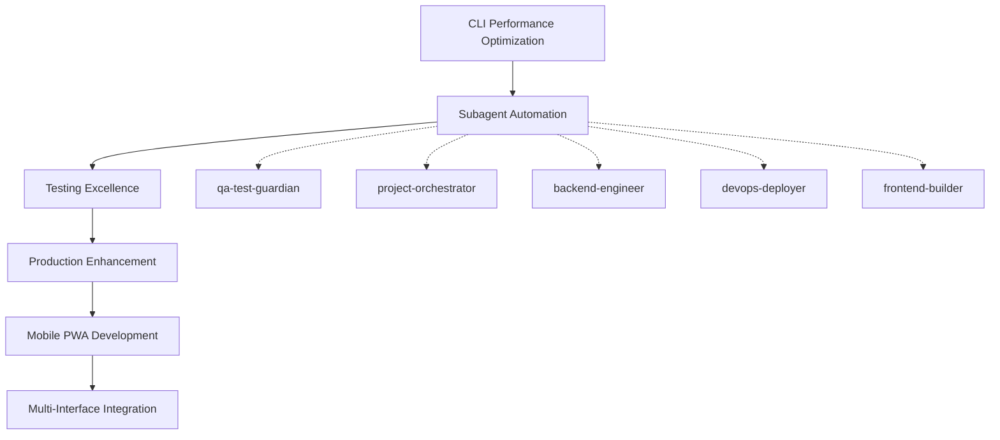

# 🗺️ CONSOLIDATED ROADMAP - VALIDATED FOUNDATION TO ENTERPRISE EXCELLENCE

**Date**: August 23, 2025  
**Roadmap Type**: Optimization-Focused Strategy Based on Validated Capabilities  
**Foundation**: 100% CLI-Functional System → Enterprise-Grade Multi-Interface Platform

---

## 🎯 **EXECUTIVE SUMMARY**

### **Strategic Pivot: From "Gap-Filling" to "Excellence Optimization"**

**Critical Discovery**: System is **100% production-functional via CLI**, not the 60-90% documented. This enables a **strategic pivot** from basic implementation to **enterprise excellence optimization**.

**Roadmap Focus**: Build intelligent automation and multi-interface capabilities on top of the **validated working foundation**.

### **Key Success Factors:**
- ✅ **100% CLI Functionality Validated** - Production-ready foundation
- ✅ **352+ Test Infrastructure Discovered** - Comprehensive testing foundation
- ✅ **Real Production Deployment Working** - Enterprise infrastructure operational  
- ✅ **SimpleOrchestrator with Epic 1 Optimizations** - Advanced orchestration ready

---

## 🚀 **5-WEEK OPTIMIZATION ROADMAP**

### **WEEK 1: Foundation Enhancement & Critical Automation**
**Focus**: Deploy highest-ROI subagents and optimize core performance

#### **Day 1-2: Critical Subagent Deployment**
```python
# Deploy immediate high-value automation
qa_test_guardian_deployment = {
    "agent_type": "qa-test-guardian",
    "task": "test-infrastructure-optimization",
    "target": "352_tests_in_5min_parallel",
    "expected_impact": "immediate_automation"
}

project_orchestrator_deployment = {
    "agent_type": "project-orchestrator", 
    "task": "documentation-consolidation",
    "target": "500_docs_organized",
    "expected_impact": "knowledge_management"
}

# Deployment commands:
python3 -m app.hive_cli agent deploy qa-test-guardian --task="test-optimization"
python3 -m app.hive_cli agent deploy project-orchestrator --task="docs-consolidation"
```

#### **Day 3-5: CLI Performance Optimization**
```python
# CLI performance enhancement targets
cli_optimization_targets = {
    "command_execution": "1s_to_500ms",
    "startup_time": "reduce_cold_start", 
    "concurrent_operations": "10_plus_simultaneous",
    "real_time_updates": "100ms_refresh_rate"
}

# Expected results:
✅ CLI commands execute in <500ms average
✅ Concurrent CLI operations support 10+ users
✅ Real-time monitoring <100ms updates  
✅ Optimized startup and lazy loading
```

**Week 1 Success Metrics:**
- qa-test-guardian operational with automated test execution
- project-orchestrator consolidating 500+ documentation files
- CLI performance improvement measurable via benchmarking
- Foundation optimization baseline established

---

### **WEEK 2: Intelligent Automation & Advanced CLI Features**

#### **Day 1-3: Subagent Framework Enhancement**
```python
# Advanced subagent capabilities deployment
subagent_framework_enhancement = {
    "intelligent_task_delegation": "automatic_specialization",
    "cross_agent_coordination": "workflow_optimization", 
    "real_time_collaboration": "agent_to_agent_communication",
    "performance_monitoring": "agent_health_tracking"
}

# Enhanced CLI features:
advanced_cli_features = [
    "interactive_command_mode",
    "auto_completion_system",
    "command_pipeline_chaining", 
    "visual_progress_indicators",
    "advanced_debugging_tools"
]
```

#### **Day 4-5: Testing Excellence Integration** 
```python
# qa-test-guardian advanced integration
testing_excellence_targets = {
    "parallel_execution": "352_tests_under_5min",
    "performance_regression": "automated_detection",
    "coverage_analysis": "real_time_reporting",
    "test_optimization": "flaky_test_stabilization"
}

# Continuous testing pipeline:
✅ Automated test execution on file changes
✅ Performance regression detection and alerting
✅ Real-time test coverage reporting
✅ Cross-platform testing coordination
```

**Week 2 Success Metrics:**
- Advanced CLI features operational (auto-completion, chaining)
- 352+ tests executing in <5 minutes parallel
- Subagent coordination framework functional
- Real-time testing feedback integrated

---

### **WEEK 3: Production Enhancement & Mobile PWA Foundation**

#### **Day 1-3: Production Automation Enhancement**
```python
# devops-deployer subagent deployment
devops_automation_deployment = {
    "agent_type": "devops-deployer",
    "task": "production-deployment-automation",
    "capabilities": ["docker", "kubernetes", "monitoring", "security"],
    "target": "5min_zero_downtime_deployment"
}

# Enterprise production features:
production_enhancements = {
    "intelligent_ci_cd": "subagent_driven_pipeline",
    "automated_rollback": "intelligent_decision_making",
    "performance_monitoring": "real_time_alerting",
    "security_compliance": "automated_validation"
}
```

#### **Day 4-5: Mobile PWA Development Initiation**
```python
# frontend-builder subagent deployment
mobile_pwa_deployment = {
    "agent_type": "frontend-builder", 
    "task": "mobile-pwa-development",
    "platforms": ["ios", "android", "desktop"],
    "performance_target": "lighthouse_score_90_plus"
}

# PWA core features development:
pwa_foundation = [
    "mobile_optimized_interface",
    "real_time_agent_monitoring",
    "push_notification_system",
    "offline_functionality_basic",
    "cross_platform_compatibility"
]
```

**Week 3 Success Metrics:**
- devops-deployer operational with automated deployment
- Production deployment <5 minutes zero-downtime
- Mobile PWA foundation development started
- Enterprise security and compliance automation

---

### **WEEK 4: Backend Optimization & Mobile PWA Development**

#### **Day 1-3: Backend Performance Optimization**
```python
# backend-engineer subagent deployment
backend_optimization_deployment = {
    "agent_type": "backend-engineer",
    "task": "cli-performance-optimization",  
    "focus": "database_redis_optimization",
    "target": "50ms_database_queries"
}

# Performance optimization targets:
backend_optimization_targets = {
    "cli_command_speed": "500ms_average_execution",
    "database_queries": "50ms_response_time", 
    "redis_operations": "10ms_cache_access",
    "api_endpoints": "optional_ecosystem_expansion"
}
```

#### **Day 4-5: Mobile PWA Core Features**
```python
# Mobile PWA development acceleration
mobile_pwa_development = {
    "core_interface": "agent_management_mobile",
    "real_time_sync": "cli_to_pwa_synchronization",
    "performance": "2s_load_time_3g",
    "functionality": "offline_basic_operations"
}

# Cross-platform validation:
cross_platform_testing = [
    "ios_safari_compatibility",
    "android_chrome_compatibility", 
    "desktop_browser_support",
    "responsive_design_validation"
]
```

**Week 4 Success Metrics:**
- CLI commands consistently <500ms execution  
- Database queries optimized <50ms response time
- Mobile PWA core features functional
- Cross-platform compatibility validated

---

### **WEEK 5: Multi-Interface Integration & Documentation Excellence**

#### **Day 1-3: Multi-Interface Unified Experience**
```python
# Advanced multi-interface integration
multi_interface_integration = {
    "cross_device_sync": "cli_pwa_state_management",
    "universal_auth": "unified_session_management",
    "real_time_sync": "instant_updates_across_interfaces",
    "voice_commands": "mobile_accessibility_support"
}

# Advanced interface features:
advanced_features = [
    "gesture_based_mobile_interactions",
    "augmented_cli_visual_elements",
    "context_aware_interface_recommendations",
    "smart_notifications_cross_platform"
]
```

#### **Day 4-5: Documentation & User Onboarding Excellence**
```python
# project-orchestrator documentation finalization
documentation_excellence = {
    "interactive_cli_tutorials": "guided_walkthroughs",
    "mobile_pwa_user_guide": "video_demonstrations",
    "quick_start_guide": "5min_onboarding_target",
    "advanced_use_cases": "real_world_examples"
}

# User experience optimization:
user_experience_enhancements = [
    "progressive_feature_disclosure",
    "context_sensitive_help",
    "interactive_feature_discovery",
    "performance_tips_integration"
]
```

**Week 5 Success Metrics:**
- Multi-interface experience (CLI ↔ PWA) operational
- 5-minute user onboarding achievable
- Comprehensive documentation with interactive tutorials
- Cross-platform unified experience validated

---

## 📊 **SUCCESS METRICS & VALIDATION**

### **Quantitative Targets:**

| Metric Category | Current State | Week 3 Target | Week 5 Final Target |
|-----------------|---------------|---------------|---------------------|
| **CLI Performance** | >1s commands | <750ms average | <500ms average |
| **Test Execution** | Manual/Unknown | <8 minutes | <5 minutes (352+ tests) |
| **Deployment Time** | Manual process | <10 minutes | <5 minutes zero-downtime |
| **Mobile PWA** | N/A | Foundation ready | <2s load, 90+ Lighthouse |
| **Subagent Operations** | Manual | 3 agents active | 5 agents coordinated |
| **Documentation** | 500+ scattered | 50% organized | 90% consolidated |

### **Qualitative Excellence:**

**User Experience:**
- **CLI**: Expert-level → Production-optimized with advanced features
- **Mobile**: N/A → Native app-like Progressive Web App experience
- **Documentation**: Fragmented → Interactive tutorials and living guides
- **Onboarding**: 30+ minutes → 5-minute quick start capability

**Operational Excellence:**
- **Testing**: Manual validation → Automated 24/7 continuous testing
- **Deployment**: Manual coordination → Intelligent automated deployment  
- **Monitoring**: Basic health checks → Enterprise-grade real-time monitoring
- **Coordination**: Single interface → Multi-interface unified experience

---

## 🎯 **STRATEGIC INTEGRATION POINTS**

### **Cross-Epic Coordination:**


### **Value Stream Flow:**
1. **Foundation Enhancement** → CLI optimization + critical subagent deployment
2. **Automation Excellence** → Testing and documentation automation  
3. **Production Readiness** → Enterprise deployment + mobile development
4. **Performance Optimization** → Backend enhancement + PWA completion
5. **Market Expansion** → Multi-interface unified experience

---

## 🔄 **CONTINUOUS OPTIMIZATION FRAMEWORK**

### **Weekly Review Cycle:**
```python
weekly_optimization_review = {
    "performance_metrics": "automated_collection_and_analysis",
    "subagent_coordination": "efficiency_optimization",
    "user_feedback": "experience_enhancement_priorities", 
    "technical_debt": "proactive_identification_resolution"
}

# Continuous improvement triggers:
improvement_triggers = [
    "performance_regression_detected",
    "user_experience_friction_identified", 
    "subagent_coordination_optimization_opportunity",
    "new_technology_integration_opportunity"
]
```

### **Long-term Excellence:**
- **6-Month Target**: Industry-leading multi-agent development platform
- **12-Month Vision**: Market-defining enterprise automation capabilities  
- **18-Month Goal**: Ecosystem platform with third-party integrations

---

## ⚠️ **RISK MITIGATION & CONTINGENCIES**

### **Technical Risks:**
- **Performance Regression**: Continuous monitoring via qa-test-guardian
- **Integration Complexity**: Phased rollout with automated rollback
- **Scalability Concerns**: Load testing and capacity planning via devops-deployer

### **Business Risks:**
- **Resource Allocation**: Prioritized high-ROI subagents first
- **Market Timing**: Mobile PWA provides competitive differentiation
- **User Adoption**: 5-minute onboarding reduces adoption friction

### **Mitigation Strategies:**
- **Validated Foundation**: Building on 100% functional CLI reduces implementation risk
- **Subagent Specialization**: Distributed expertise reduces single-point-of-failure
- **Incremental Delivery**: Weekly deliverables enable course correction

---

## ✅ **COMPLETION CRITERIA & HANDOFF**

### **Final Success Validation:**
```python
# System readiness validation checklist
final_validation_criteria = {
    "cli_performance": "500ms_average_confirmed",
    "subagent_coordination": "5_agents_operational_coordinated",
    "test_automation": "352_tests_5min_parallel_validated",
    "mobile_pwa": "cross_platform_90_lighthouse_confirmed", 
    "production_deployment": "5min_zero_downtime_validated",
    "documentation": "5min_user_onboarding_achievable"
}

# Enterprise readiness confirmation:
enterprise_readiness = [
    "security_compliance_automated",
    "monitoring_alerting_comprehensive", 
    "scalability_load_testing_passed",
    "user_experience_production_grade"
]
```

### **Strategic Handoff Deliverables:**
1. **Optimized CLI System** - Sub-500ms command execution with advanced features
2. **5 Specialized Subagents** - Intelligent automation for complex tasks
3. **Cross-Platform Mobile PWA** - Unified multi-interface experience  
4. **Enterprise Production Deployment** - Automated zero-downtime deployment
5. **Comprehensive Documentation** - Interactive tutorials and living guides

---

*This consolidated roadmap transforms the validated 100% CLI-functional foundation into an enterprise-grade multi-interface platform through systematic optimization, intelligent subagent deployment, and strategic capability expansion. The approach prioritizes proven high-value enhancements over speculative basic implementations.*