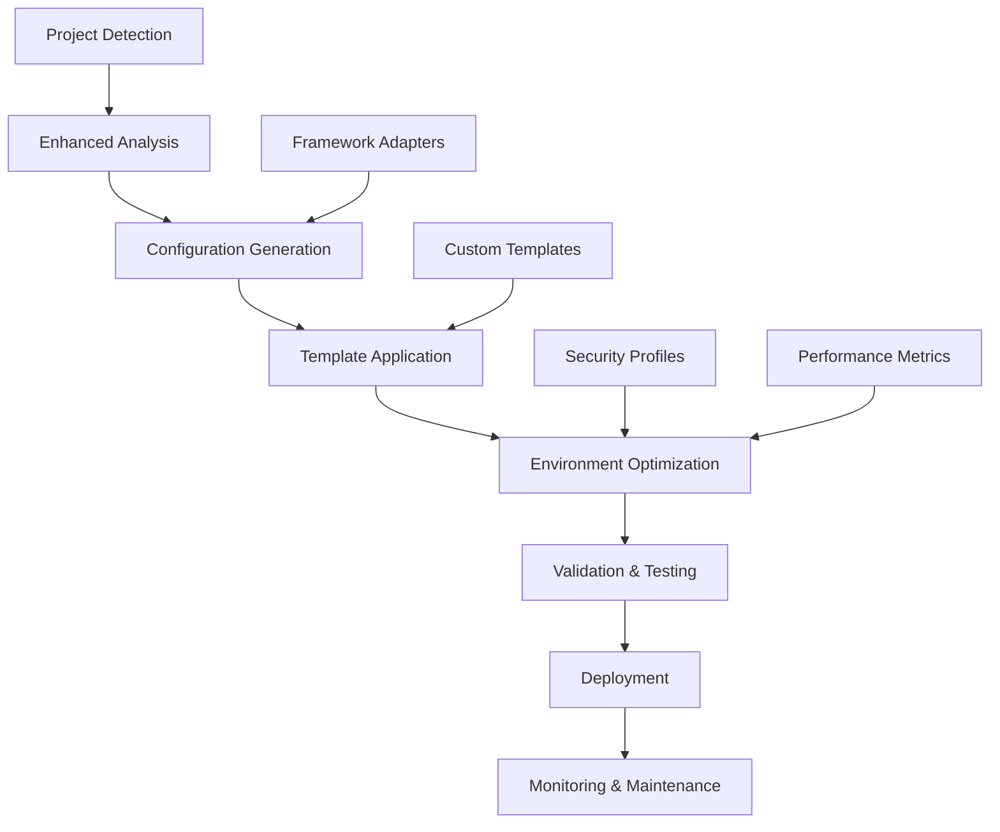

# Enhanced Intelligent Configuration Generator System

## Overview

The Enhanced Intelligent Configuration Generator is an advanced system that automatically creates optimal Project Index configurations based on comprehensive project analysis. It integrates machine learning-enhanced optimization, environment-specific deployment, and comprehensive validation to provide out-of-the-box configuration that works intelligently.

## Key Features

### 🎯 Intelligent Configuration Generation
- **Automatic Project Detection**: Advanced analysis of programming languages, frameworks, and project structure
- **ML-Enhanced Optimization**: Machine learning algorithms optimize settings based on project characteristics
- **Framework-Specific Optimizations**: Tailored configurations for Django, React, Express, Spring Boot, and more
- **Environment-Aware Settings**: Different configurations for development, testing, staging, and production

### 🔧 Advanced Customization
- **Configuration Templates**: Pre-built templates for common project types and patterns
- **Custom Override System**: Hierarchical configuration overrides with deep merging
- **Interactive Setup**: Guided configuration customization during installation
- **Real-time Validation**: Comprehensive validation with multiple severity levels

### 🔒 Security & Compliance
- **Security Profiling**: Automatic security configuration based on environment and requirements
- **Compliance Validation**: Built-in checks for enterprise and regulatory compliance
- **Vulnerability Assessment**: Integration with dependency scanning and security auditing
- **Sensitive File Detection**: Automatic identification and protection of sensitive files

### 📊 Performance Optimization
- **Resource-Aware Configuration**: Automatic optimization based on system capabilities
- **Performance Profiling**: Real-time performance metrics and optimization suggestions
- **Caching Strategies**: Intelligent caching configuration based on project size and usage patterns
- **Scalability Planning**: Configuration scaling recommendations for growing projects

## Architecture



## Core Components

### 1. Enhanced Configuration Generator

The main orchestrator that combines all components to generate intelligent configurations.

```python
from enhanced_configuration_generator import (
    EnhancedConfigurationGenerator,
    ConfigurationStrategy,
    ConfigurationEnvironment,
    ValidationLevel
)

# Initialize generator
generator = EnhancedConfigurationGenerator()

# Generate configuration
profile = generator.generate_enhanced_configuration(
    detection_result,
    strategy=ConfigurationStrategy.PRODUCTION,
    environment=ConfigurationEnvironment.PRODUCTION,
    validation_level=ValidationLevel.STRICT
)
```

### 2. Configuration Validation System

Comprehensive validation with multiple levels and custom rules.

```python
from configuration_validation_schemas import (
    ConfigurationValidator,
    SchemaLevel
)

# Initialize validator
validator = ConfigurationValidator(SchemaLevel.ENTERPRISE)

# Validate configuration
result = validator.validate_configuration(
    config,
    environment="production",
    frameworks=["django", "react"]
)

print(f"Valid: {result['valid']}")
print(f"Errors: {len(result['errors'])}")
print(f"Warnings: {len(result['warnings'])}")
```

### 3. Universal Installer Integration

Seamless integration with the universal installer for one-command setup.

```python
from enhanced_universal_installer_integration import EnhancedInstallerWorkflow

# Initialize workflow
workflow = EnhancedInstallerWorkflow({
    'interactive': True,
    'auto_optimize': True,
    'backup_existing': True
})

# Run enhanced installation
result = workflow.install_with_enhanced_detection(
    "/path/to/project",
    strategy=ConfigurationStrategy.PRODUCTION,
    environment=ConfigurationEnvironment.PRODUCTION
)
```

## Configuration Templates

### Built-in Templates

#### Python Microservice Template
```json
{
  "name": "Python Microservice",
  "description": "Optimized configuration for Python microservices",
  "target_environments": ["production", "staging"],
  "base_settings": {
    "analysis": {
      "parse_ast": true,
      "extract_dependencies": true,
      "calculate_complexity": true,
      "analyze_docstrings": true,
      "check_type_hints": true,
      "validate_imports": true
    },
    "performance": {
      "max_concurrent_analyses": 6,
      "analysis_batch_size": 75,
      "cache_enabled": true,
      "memory_limit_mb": 1024,
      "enable_profiling": true
    },
    "security": {
      "scan_dependencies": true,
      "check_vulnerabilities": true,
      "validate_secrets": true,
      "audit_imports": true
    }
  }
}
```

#### JavaScript SPA Template
```json
{
  "name": "JavaScript Single Page Application",
  "description": "Optimized for modern JavaScript SPAs",
  "base_settings": {
    "analysis": {
      "parse_ast": true,
      "extract_dependencies": true,
      "analyze_bundles": true,
      "check_tree_shaking": true,
      "validate_imports": true
    },
    "performance": {
      "max_concurrent_analyses": 4,
      "analysis_batch_size": 50,
      "cache_enabled": true,
      "memory_limit_mb": 768,
      "bundle_analysis": true
    },
    "file_patterns": {
      "include": ["**/*.js", "**/*.jsx", "**/*.ts", "**/*.tsx", "**/*.vue"],
      "exclude": ["**/dist/**", "**/build/**", "**/.next/**"]
    }
  }
}
```

#### Enterprise Monolith Template
```json
{
  "name": "Enterprise Monolithic Application",
  "description": "High-performance configuration for large enterprise applications",
  "base_settings": {
    "analysis": {
      "parse_ast": true,
      "extract_dependencies": true,
      "calculate_complexity": true,
      "deep_analysis": true,
      "cross_module_analysis": true,
      "architecture_analysis": true
    },
    "performance": {
      "max_concurrent_analyses": 12,
      "analysis_batch_size": 200,
      "cache_enabled": true,
      "memory_limit_mb": 4096,
      "distributed_processing": true,
      "load_balancing": true
    },
    "optimization": {
      "aggressive_optimization": true,
      "ml_optimization": true,
      "predictive_analysis": true
    },
    "security": {
      "scan_dependencies": true,
      "check_vulnerabilities": true,
      "validate_licenses": true,
      "audit_sensitive_files": true,
      "compliance_checking": true,
      "security_reporting": true
    }
  }
}
```

### Custom Template Creation

```python
from enhanced_configuration_generator import ConfigurationTemplate, ConfigurationEnvironment

# Create custom template
custom_template = ConfigurationTemplate(
    name="Custom API Template",
    description="Optimized for REST API services",
    target_environments=[ConfigurationEnvironment.PRODUCTION],
    base_settings={
        "analysis": {
            "api_analysis": True,
            "endpoint_mapping": True,
            "swagger_integration": True
        },
        "monitoring": {
            "api_metrics": True,
            "response_time_tracking": True,
            "error_rate_monitoring": True
        }
    },
    tags=["api", "rest", "microservice"]
)

# Add to generator
generator.add_custom_template(custom_template)
```

## Environment-Specific Configuration

### Development Environment
```json
{
  "analysis": {
    "timeout_seconds": 15,
    "max_file_size_mb": 5
  },
  "performance": {
    "max_concurrent_analyses": 2,
    "cache_enabled": true,
    "debug_mode": true
  },
  "monitoring": {
    "debug_logging": true,
    "verbose_output": true
  }
}
```

### Production Environment
```json
{
  "analysis": {
    "timeout_seconds": 60,
    "max_file_size_mb": 20,
    "production_optimizations": true
  },
  "performance": {
    "max_concurrent_analyses": 8,
    "aggressive_caching": true,
    "memory_optimization": true
  },
  "security": {
    "strict_security": true,
    "audit_mode": true,
    "compliance_mode": true
  },
  "monitoring": {
    "performance_metrics": true,
    "error_tracking": true,
    "alerting": true
  }
}
```

### Enterprise Environment
```json
{
  "security": {
    "enabled": true,
    "scan_dependencies": true,
    "check_vulnerabilities": true,
    "validate_licenses": true,
    "security_reporting": true
  },
  "performance": {
    "max_concurrent_analyses": 12,
    "memory_limit_mb": 4096,
    "distributed_processing": true,
    "load_balancing": true
  },
  "compliance": {
    "audit_logging": true,
    "data_governance": true,
    "regulatory_compliance": true
  }
}
```

## Validation Levels

### Basic Validation
- Schema structure validation
- Required field checks
- Basic type validation

### Standard Validation
- Performance constraint validation
- Security requirement checks
- Framework compatibility validation

### Strict Validation
- Advanced security checks
- Performance optimization validation
- Best practice compliance

### Enterprise Validation
- Regulatory compliance checks
- Advanced security requirements
- Performance benchmarking
- Documentation requirements

## Framework-Specific Optimizations

### Python Projects

#### Django Framework
```json
{
  "analysis": {
    "orm_analysis": true,
    "migration_tracking": true,
    "template_analysis": true
  },
  "security": {
    "django_security_checks": true,
    "settings_validation": true,
    "csrf_protection_check": true
  },
  "file_patterns": {
    "include": ["**/models.py", "**/views.py", "**/urls.py", "**/settings.py"],
    "sensitive_patterns": ["**/settings.py", "**/.env", "**/secrets.py"]
  }
}
```

#### Flask Framework
```json
{
  "analysis": {
    "route_analysis": true,
    "blueprint_mapping": true,
    "template_analysis": true
  },
  "security": {
    "flask_security_checks": true,
    "config_validation": true
  }
}
```

### JavaScript/TypeScript Projects

#### React Framework
```json
{
  "analysis": {
    "component_analysis": true,
    "hook_analysis": true,
    "bundle_analysis": true,
    "jsx_parsing": true
  },
  "performance": {
    "chunk_analysis": true,
    "lazy_loading_detection": true,
    "render_optimization": true
  },
  "file_patterns": {
    "include": ["**/*.jsx", "**/*.tsx", "**/components/**", "**/hooks/**"]
  }
}
```

#### Vue Framework
```json
{
  "analysis": {
    "component_analysis": true,
    "composition_api_analysis": true,
    "single_file_component_parsing": true
  },
  "file_patterns": {
    "include": ["**/*.vue", "**/components/**", "**/composables/**"]
  }
}
```

#### Angular Framework
```json
{
  "analysis": {
    "component_analysis": true,
    "service_analysis": true,
    "module_analysis": true,
    "decorator_analysis": true
  },
  "typescript": {
    "strict_mode": true,
    "type_checking": true
  }
}
```

### Go Projects

#### Gin Framework
```json
{
  "analysis": {
    "route_analysis": true,
    "middleware_analysis": true,
    "handler_analysis": true
  },
  "performance": {
    "goroutine_analysis": true,
    "memory_profiling": true
  }
}
```

### Java Projects

#### Spring Boot Framework
```json
{
  "analysis": {
    "annotation_analysis": true,
    "bean_analysis": true,
    "controller_analysis": true,
    "repository_analysis": true
  },
  "security": {
    "spring_security_checks": true,
    "actuator_security": true
  },
  "performance": {
    "jvm_optimization": true,
    "heap_analysis": true
  }
}
```

## Usage Examples

### Basic Usage

```bash
# Generate configuration for a Python project
python enhanced_configuration_generator.py detection_result.json \
  --output ./config \
  --strategy production \
  --environment production \
  --validation-level standard

# Generate with specific template
python enhanced_configuration_generator.py detection_result.json \
  --output ./config \
  --template python_microservice \
  --generate-script
```

### Advanced Usage

```bash
# Enhanced installation with full workflow
python enhanced_universal_installer_integration.py /path/to/project \
  --strategy enterprise \
  --environment production \
  --validation-level enterprise \
  --auto-optimize \
  --backup

# Non-interactive installation
python enhanced_universal_installer_integration.py /path/to/project \
  --strategy production \
  --environment production \
  --non-interactive \
  --verbose
```

### Programmatic Usage

```python
from enhanced_configuration_generator import (
    EnhancedConfigurationGenerator,
    ConfigurationStrategy,
    ConfigurationEnvironment,
    ValidationLevel
)

# Initialize components
generator = EnhancedConfigurationGenerator()

# Load detection result
with open('detection_result.json') as f:
    detection_result = json.load(f)

# Generate configuration profile
profile = generator.generate_enhanced_configuration(
    detection_result,
    strategy=ConfigurationStrategy.PRODUCTION,
    environment=ConfigurationEnvironment.PRODUCTION,
    template_name="python_microservice",
    validation_level=ValidationLevel.STRICT,
    custom_overrides={
        "performance": {
            "max_concurrent_analyses": 8,
            "memory_limit_mb": 2048
        }
    }
)

# Export configuration
exported_files = generator.export_configuration_profile(
    profile,
    output_dir=Path("./config"),
    format="json",
    include_environments=True
)

# Generate deployment script
generator.generate_deployment_script(
    profile,
    ConfigurationEnvironment.PRODUCTION,
    Path("./deploy.sh")
)

print(f"Configuration generated: {profile.profile_id}")
print(f"Performance Score: {profile.performance_metrics['performance_score']}")
print(f"Security Score: {profile.security_audit['security_score']}")
```

### Custom Validator Example

```python
from configuration_validation_schemas import ConfigurationValidator

def validate_microservice_config(config):
    """Custom validator for microservice configurations."""
    errors = []
    warnings = []
    suggestions = []
    
    # Check for microservice-specific requirements
    if not config.get("monitoring", {}).get("health_checks", False):
        errors.append("Microservices must have health checks enabled")
    
    if not config.get("security", {}).get("api_authentication", False):
        warnings.append("API authentication should be enabled for microservices")
    
    # Check performance settings
    memory_limit = config.get("performance", {}).get("memory_limit_mb", 512)
    if memory_limit < 256:
        suggestions.append("Consider increasing memory limit for better performance")
    
    return {
        "errors": errors,
        "warnings": warnings,
        "suggestions": suggestions
    }

# Add custom validator
validator = ConfigurationValidator()
validator.add_custom_validator(validate_microservice_config)

# Validate configuration
result = validator.validate_configuration(config)
```

## Integration with CI/CD

### GitHub Actions Integration

```yaml
name: Project Index Configuration Validation

on:
  push:
    branches: [ main, develop ]
  pull_request:
    branches: [ main ]

jobs:
  validate-config:
    runs-on: ubuntu-latest
    
    steps:
    - uses: actions/checkout@v3
    
    - name: Setup Python
      uses: actions/setup-python@v4
      with:
        python-version: '3.9'
    
    - name: Install Dependencies
      run: |
        pip install -r requirements.txt
        pip install jsonschema pyyaml
    
    - name: Validate Configuration
      run: |
        python .project-index/cli.py --validate
        python .project-index/cli.py --performance
        python .project-index/cli.py --security
    
    - name: Upload Reports
      uses: actions/upload-artifact@v3
      with:
        name: project-index-reports
        path: .project-index/reports/
```

### GitLab CI Integration

```yaml
project_index_validation:
  stage: test
  script:
    - python .project-index/cli.py --validate
    - python .project-index/cli.py --performance
    - python .project-index/cli.py --security
  artifacts:
    reports:
      junit: .project-index/reports/junit.xml
    paths:
      - .project-index/reports/
    expire_in: 1 week
  only:
    - main
    - develop
    - merge_requests
```

## Performance Optimization

### Small Projects (< 100 files)
- `max_concurrent_analyses`: 1-2
- `memory_limit_mb`: 256-512
- `analysis_batch_size`: 25
- `cache_enabled`: true

### Medium Projects (100-1000 files)
- `max_concurrent_analyses`: 2-4
- `memory_limit_mb`: 512-1024
- `analysis_batch_size`: 50
- `cache_enabled`: true
- `incremental_updates`: true

### Large Projects (1000-5000 files)
- `max_concurrent_analyses`: 4-8
- `memory_limit_mb`: 1024-2048
- `analysis_batch_size`: 100
- `cache_enabled`: true
- `aggressive_caching`: true
- `predictive_loading`: true

### Enterprise Projects (5000+ files)
- `max_concurrent_analyses`: 8-12
- `memory_limit_mb`: 2048-4096
- `analysis_batch_size`: 200
- `cache_enabled`: true
- `aggressive_caching`: true
- `distributed_processing`: true
- `load_balancing`: true
- `ml_optimization`: true

## Security Configuration

### Development Environment
- Basic dependency scanning
- Simple vulnerability checks
- Minimal file access restrictions

### Production Environment
- Comprehensive dependency scanning
- Advanced vulnerability assessment
- Strict file access controls
- Audit logging
- Security reporting

### Enterprise Environment
- Full security suite
- Compliance validation
- License verification
- Advanced threat detection
- Regulatory compliance
- Security incident response

## Monitoring and Maintenance

### Performance Monitoring
```json
{
  "performance_monitoring": {
    "enabled": true,
    "metrics": ["cpu_usage", "memory_usage", "analysis_time", "queue_size"],
    "alert_thresholds": {
      "cpu_usage_percent": 80,
      "memory_usage_mb": 1024,
      "analysis_timeout_seconds": 60
    },
    "reporting": {
      "interval_minutes": 5,
      "retention_days": 30
    }
  }
}
```

### Health Checks
```json
{
  "health_checks": {
    "enabled": true,
    "interval_seconds": 60,
    "endpoints": ["/health", "/metrics", "/status"],
    "timeout_seconds": 10,
    "failure_threshold": 3
  }
}
```

### Alerting
```json
{
  "alerting": {
    "enabled": true,
    "channels": ["email", "slack", "webhook"],
    "severity_levels": ["critical", "warning", "info"],
    "escalation_policy": {
      "critical": "immediate",
      "warning": "15_minutes",
      "info": "1_hour"
    }
  }
}
```

## Troubleshooting

### Common Issues

#### Configuration Validation Errors
1. **Schema Validation Failed**
   - Check JSON syntax
   - Verify required fields
   - Validate data types

2. **Performance Constraint Violations**
   - Reduce memory limits
   - Lower concurrency settings
   - Adjust timeout values

3. **Security Requirement Failures**
   - Enable required security features
   - Update security levels
   - Review compliance settings

#### Performance Issues
1. **High Memory Usage**
   - Reduce `memory_limit_mb`
   - Lower `max_concurrent_analyses`
   - Clear cache files

2. **Slow Analysis**
   - Increase `timeout_seconds`
   - Enable caching
   - Optimize file patterns

3. **High CPU Usage**
   - Reduce concurrency
   - Increase debounce intervals
   - Check for monitoring loops

### Debug Commands

```bash
# Validate configuration
python .project-index/cli.py --validate

# Check performance metrics
python .project-index/cli.py --performance

# Review security audit
python .project-index/cli.py --security

# View detailed logs
tail -f .project-index/logs/monitoring.log

# Test configuration changes
python -c "
from configuration_validation_schemas import ConfigurationValidator
import json

with open('.project-index/config.json') as f:
    config = json.load(f)

validator = ConfigurationValidator()
result = validator.validate_configuration(config)
print(json.dumps(result, indent=2))
"
```

## Best Practices

### Configuration Management
1. **Version Control**: Always version control your configuration files
2. **Environment Separation**: Use separate configurations for different environments
3. **Validation**: Always validate configurations before deployment
4. **Backup**: Keep backups of working configurations
5. **Documentation**: Document any custom modifications

### Performance Optimization
1. **Resource Monitoring**: Regularly monitor system resource usage
2. **Cache Management**: Implement appropriate caching strategies
3. **Batch Processing**: Use optimal batch sizes for your project
4. **Incremental Updates**: Enable incremental processing for large projects
5. **Profiling**: Use performance profiling to identify bottlenecks

### Security Hardening
1. **Regular Updates**: Keep security definitions up to date
2. **Compliance Checks**: Regularly validate compliance requirements
3. **Access Controls**: Implement appropriate file access restrictions
4. **Audit Logging**: Enable comprehensive audit logging
5. **Incident Response**: Have security incident response procedures

### Maintenance
1. **Regular Validation**: Periodically validate configurations
2. **Performance Reviews**: Review performance metrics regularly
3. **Security Audits**: Conduct regular security audits
4. **Documentation Updates**: Keep documentation current
5. **Training**: Ensure team members understand the configuration system

## Contributing

### Adding New Templates
1. Create template configuration
2. Add validation rules
3. Include documentation
4. Add test cases
5. Submit pull request

### Custom Validators
1. Implement validator function
2. Add comprehensive error handling
3. Include test coverage
4. Document usage examples
5. Submit for review

### Framework Support
1. Analyze framework patterns
2. Create framework-specific configurations
3. Implement detection logic
4. Add validation rules
5. Include comprehensive tests

For more information and the latest updates, visit:
- **Documentation**: https://docs.leanvibe.dev/project-index
- **Repository**: https://github.com/leanvibe/bee-hive
- **Community**: https://discord.gg/leanvibe