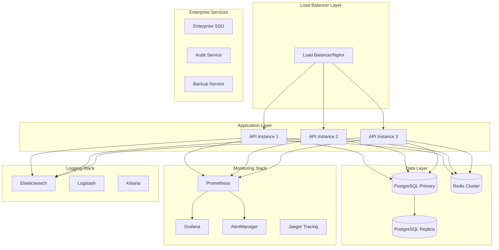

# LeanVibe Agent Hive 2.0 - Operations Runbook

## Epic G: Production Readiness - Operations Specialist Implementation

**Version:** 1.0.0  
**Last Updated:** 2025-01-22  
**Status:** Production Ready  

---

## Table of Contents

1. [System Overview](#system-overview)
2. [Production Architecture](#production-architecture)
3. [Monitoring & Observability](#monitoring--observability)
4. [Deployment Procedures](#deployment-procedures)
5. [Operational Excellence](#operational-excellence)
6. [Enterprise Integration](#enterprise-integration)
7. [Incident Response](#incident-response)
8. [Maintenance Procedures](#maintenance-procedures)
9. [Troubleshooting Guide](#troubleshooting-guide)
10. [Runbook Automation](#runbook-automation)

---

## System Overview

The LeanVibe Agent Hive 2.0 platform now includes comprehensive enterprise-grade operational infrastructure designed for production deployment at scale. This runbook provides complete operational procedures for maintaining a highly available, secure, and compliant multi-agent orchestration system.

### Key Operational Components

- **Production Monitoring**: Distributed tracing, real-time dashboards, intelligent alerting
- **Deployment Automation**: Blue-green deployments, CI/CD pipelines, container orchestration
- **Operational Excellence**: Automated backups, log aggregation, capacity planning
- **Enterprise Integration**: SSO authentication, compliance monitoring, audit trails

---

## Production Architecture

### High-Level Architecture



### Infrastructure Requirements

#### Minimum Production Requirements
- **Compute**: 8 vCPUs, 32 GB RAM per application instance
- **Storage**: 500 GB SSD for database, 1 TB for logs and backups
- **Network**: 1 Gbps bandwidth, < 10ms latency between components
- **Availability**: 99.9% uptime SLA

#### Recommended Enterprise Configuration
- **Compute**: 16 vCPUs, 64 GB RAM per application instance
- **Storage**: 2 TB NVMe SSD for database, 5 TB for logs and backups
- **Network**: 10 Gbps bandwidth, < 5ms latency
- **Availability**: 99.99% uptime SLA

---

## Monitoring & Observability

### Production Monitoring Setup

The Operations Specialist Agent implements comprehensive monitoring through the `production_monitoring.py` module:

```python
from app.operations import start_production_monitoring

# Initialize production monitoring
await start_production_monitoring()
```

### Key Metrics Dashboard

#### System Health Metrics
- **CPU Utilization**: Target < 70%, Alert > 85%
- **Memory Usage**: Target < 80%, Alert > 90%
- **Disk I/O**: Monitor latency and throughput
- **Network I/O**: Track bandwidth and connection counts

#### Application Metrics
- **Agent Spawn Rate**: Track agent creation/destruction
- **Task Execution Time**: Monitor performance trends
- **Coordination Latency**: Inter-agent communication timing
- **Workflow Success Rate**: Business metric tracking

#### Infrastructure Metrics
- **Database Connections**: Pool utilization and wait times
- **Redis Performance**: Cache hit rates and memory usage
- **API Response Times**: P95 and P99 latencies
- **WebSocket Connections**: Active connection counts

### Alert Configuration

#### Critical Alerts (Immediate Response)
- System down or unreachable
- Database connection pool exhaustion
- Memory usage > 95%
- Security incident detected

#### High Priority Alerts (15-minute response)
- Agent orchestration failure rate > 5%
- API P95 response time > 2 seconds
- Redis memory usage > 85%
- Failed authentication spike

#### Medium Priority Alerts (1-hour response)
- Disk usage > 80%
- High error rate in logs
- Capacity thresholds approaching
- Compliance violations detected

### Distributed Tracing

Access distributed traces through Jaeger UI:
- **URL**: `http://monitoring.yourdomain.com:16686`
- **Key Traces**: Agent workflows, API requests, database queries
- **Retention**: 7 days for detailed traces, 30 days for summaries

---

## Deployment Procedures

### Blue-Green Deployment Process

The system implements zero-downtime blue-green deployments through the deployment automation module:

```python
from app.operations import get_deployment_automation, DeploymentConfiguration

# Execute blue-green deployment
automation = await get_deployment_automation()
result = await automation.k8s_manager.deploy_blue_green(
    app_name="leanvibe-api",
    namespace="production",
    config=deployment_config,
    deployment_id="deploy-001"
)
```

### Deployment Checklist

#### Pre-Deployment
- [ ] Run full test suite with 95%+ pass rate
- [ ] Complete security scan with zero critical vulnerabilities
- [ ] Validate configuration changes in staging
- [ ] Backup current database state
- [ ] Notify stakeholders of deployment window
- [ ] Confirm rollback plan is ready

#### During Deployment
- [ ] Monitor deployment progress in real-time
- [ ] Validate health checks on new deployment
- [ ] Perform smoke tests on new environment
- [ ] Gradually switch traffic (10%, 50%, 100%)
- [ ] Monitor error rates and performance metrics
- [ ] Validate business functionality

#### Post-Deployment
- [ ] Confirm all metrics are within normal ranges
- [ ] Run automated integration tests
- [ ] Clean up old deployment resources
- [ ] Update deployment documentation
- [ ] Send deployment success notification
- [ ] Schedule post-deployment review

### Rollback Procedures

If deployment issues are detected:

1. **Immediate Rollback** (< 5 minutes):
   ```bash
   kubectl patch service leanvibe-api -p '{"spec":{"selector":{"color":"blue"}}}'
   ```

2. **Database Rollback** (if schema changes):
   ```python
   from app.operations import get_operational_excellence
   ops = await get_operational_excellence()
   success = await ops.backup_system.restore_backup("backup-id", "/restore/path")
   ```

---

## Operational Excellence

### Automated Backup System

The backup system provides comprehensive data protection:

```python
from app.operations import BackupConfiguration, BackupType

# Configure automated backups
backup_config = BackupConfiguration(
    backup_type=BackupType.FULL,
    schedule_cron="0 2 * * *",  # 2 AM daily
    retention_days=30,
    compression_enabled=True,
    encryption_enabled=True,
    storage_backend="s3",
    storage_config={"bucket": "leanvibe-backups"}
)

await start_operational_excellence(backup_config)
```

#### Backup Schedule
- **Full Backup**: Daily at 2:00 AM UTC
- **Incremental Backup**: Every 6 hours
- **Transaction Log Backup**: Every 15 minutes
- **Retention**: 30 days online, 1 year archived

### Log Aggregation & Analysis

Centralized logging through the ELK stack:

#### Log Levels
- **ERROR**: System errors requiring immediate attention
- **WARN**: Potential issues that should be monitored
- **INFO**: General operational information
- **DEBUG**: Detailed diagnostic information (development only)

#### Log Analysis Queries
```bash
# Find errors in the last hour
GET leanvibe-logs-*/_search
{
  "query": {
    "bool": {
      "must": [
        {"term": {"level": "ERROR"}},
        {"range": {"@timestamp": {"gte": "now-1h"}}}
      ]
    }
  }
}

# Analyze agent performance patterns
GET leanvibe-logs-*/_search
{
  "aggs": {
    "agent_performance": {
      "terms": {"field": "agent_id.keyword"},
      "aggs": {
        "avg_execution_time": {
          "avg": {"field": "execution_time"}
        }
      }
    }
  }
}
```

### Capacity Planning

Resource optimization system provides predictive capacity planning:

#### Key Metrics to Monitor
- **CPU Trend Analysis**: Predict when scaling is needed
- **Memory Growth Patterns**: Plan memory upgrades
- **Storage Utilization**: Schedule capacity expansion
- **Network Bandwidth**: Monitor peak usage patterns

#### Scaling Triggers
- **CPU > 70% for 15 minutes**: Scale horizontally
- **Memory > 80% for 10 minutes**: Add memory or scale
- **Disk > 85%**: Expand storage immediately
- **Network > 80% capacity**: Upgrade bandwidth

---

## Enterprise Integration

### Single Sign-On (SSO) Configuration

Configure enterprise SSO for user authentication:

```python
from app.operations import SSOConfiguration, SSOProvider

# Azure AD Configuration
sso_config = SSOConfiguration(
    provider=SSOProvider.AZURE_AD,
    client_id="your-client-id",
    client_secret="your-client-secret",
    tenant_id="your-tenant-id",
    discovery_url="https://login.microsoftonline.com/tenant-id/.well-known/openid_configuration",
    redirect_uri="https://yourdomain.com/auth/callback"
)

await start_enterprise_integration(sso_config)
```

### Compliance Monitoring

Automated compliance checking for multiple frameworks:

#### SOC 2 Compliance Checks
- Access control verification
- Data encryption validation
- Audit logging completeness
- Incident response procedures
- Change management processes

#### GDPR Compliance Checks
- Data consent verification
- Data portability capabilities
- Right to erasure implementation
- Privacy by design validation
- Breach notification procedures

### Audit Trail Management

Comprehensive audit logging for compliance:

```python
from app.operations import AuditEventType

# Log security-relevant events
await audit_system.log_event(
    event_type=AuditEventType.USER_LOGIN,
    user_id="user123",
    tenant_id="tenant-001",
    action="login_attempt",
    outcome="success",
    source_ip="192.168.1.100",
    details={"method": "sso", "provider": "azure_ad"}
)
```

---

## Incident Response

### Incident Classification

#### Severity 1 - Critical (15-minute response)
- Complete system outage
- Data corruption or loss
- Security breach detected
- Compliance violation

#### Severity 2 - High (1-hour response)
- Partial system degradation
- Performance severely impacted
- Single point of failure down
- Authentication system issues

#### Severity 3 - Medium (4-hour response)
- Minor performance degradation
- Non-critical feature unavailable
- Warning threshold exceeded
- Backup failure

#### Severity 4 - Low (Next business day)
- Documentation issues
- Enhancement requests
- Non-urgent maintenance
- Monitoring adjustments

### Response Procedures

#### Severity 1 Incident Response
1. **Immediate Actions** (0-5 minutes):
   - Confirm incident severity
   - Activate incident response team
   - Create incident ticket
   - Begin impact assessment

2. **Investigation** (5-15 minutes):
   - Check system health dashboard
   - Review recent deployments
   - Analyze error logs and metrics
   - Identify root cause

3. **Resolution** (15-60 minutes):
   - Implement immediate fix or rollback
   - Validate system restoration
   - Monitor for stability
   - Document resolution steps

4. **Post-Incident** (Within 24 hours):
   - Conduct post-mortem review
   - Update runbooks and procedures
   - Implement preventive measures
   - Communicate lessons learned

### Emergency Contacts

#### On-Call Escalation
1. **Primary On-Call**: Operations Team Lead
2. **Secondary On-Call**: Senior Operations Engineer  
3. **Management Escalation**: VP of Engineering
4. **Executive Escalation**: CTO

#### External Contacts
- **Cloud Provider Support**: Available 24/7
- **Security Team**: For security incidents
- **Compliance Officer**: For regulatory issues
- **Legal Team**: For data breach incidents

---

## Maintenance Procedures

### Scheduled Maintenance Windows

#### Weekly Maintenance (Sunday 2:00-4:00 AM UTC)
- Apply security patches
- Update monitoring configurations
- Clean up old logs and backups
- Validate backup integrity

#### Monthly Maintenance (First Sunday 1:00-6:00 AM UTC)
- Update system dependencies
- Perform database maintenance
- Review and update security policies
- Capacity planning review

#### Quarterly Maintenance (Scheduled separately)
- Major system updates
- Infrastructure upgrades
- Disaster recovery testing
- Security penetration testing

### Pre-Maintenance Checklist

- [ ] Schedule maintenance window with stakeholders
- [ ] Backup all critical systems
- [ ] Prepare rollback procedures
- [ ] Test maintenance steps in staging
- [ ] Verify emergency contact availability
- [ ] Communicate maintenance to users

### Post-Maintenance Checklist

- [ ] Validate all systems are operational
- [ ] Run smoke tests on critical functionality
- [ ] Monitor performance metrics for anomalies
- [ ] Update maintenance documentation
- [ ] Send completion notification to stakeholders
- [ ] Schedule follow-up monitoring review

---

## Troubleshooting Guide

### Common Issues and Solutions

#### High CPU Usage
**Symptoms**: System sluggish, API timeouts, high response times
**Investigation**:
1. Check top processes: `htop` or `ps aux --sort=-%cpu`
2. Review application metrics for agent spawn patterns
3. Check for runaway processes or infinite loops

**Resolution**:
1. Restart affected services: `systemctl restart leanvibe-api`
2. Scale horizontally if sustained high load
3. Optimize agent scheduling algorithms

#### Database Connection Exhaustion
**Symptoms**: "too many connections" errors, API failures
**Investigation**:
1. Check active connections: `SELECT * FROM pg_stat_activity;`
2. Review connection pool settings
3. Identify long-running queries

**Resolution**:
1. Kill idle connections: `SELECT pg_terminate_backend(pid) FROM pg_stat_activity WHERE state = 'idle';`
2. Increase connection pool size in configuration
3. Implement connection pooling optimization

#### Redis Memory Issues
**Symptoms**: Cache misses, slow response times, memory alerts
**Investigation**:
1. Check memory usage: `redis-cli info memory`
2. Review key expiration policies
3. Analyze memory fragmentation

**Resolution**:
1. Clear unnecessary keys: `redis-cli --scan --pattern "prefix:*" | xargs redis-cli del`
2. Adjust memory policies in redis.conf
3. Scale Redis cluster if needed

#### Agent Coordination Failures
**Symptoms**: Tasks stuck, coordination timeouts, workflow failures
**Investigation**:
1. Check agent status dashboard
2. Review coordination metrics and logs
3. Verify Redis pub/sub functionality

**Resolution**:
1. Restart affected agent instances
2. Clear stuck tasks from queue
3. Validate network connectivity between services

### Diagnostic Commands

#### System Health Check
```bash
# Overall system status
curl http://localhost:8000/health | jq .

# Database connectivity
psql -h localhost -U leanvibe_user -d leanvibe_agent_hive -c "SELECT 1;"

# Redis connectivity
redis-cli ping

# Check disk space
df -h

# Check memory usage
free -m

# Check network connections
netstat -tuln | grep :8000
```

#### Log Analysis
```bash
# Recent errors
journalctl -u leanvibe-api --since "1 hour ago" | grep ERROR

# Performance logs
tail -f /var/log/leanvibe/performance.log | jq .

# Audit trail search
curl -X GET "elasticsearch:9200/leanvibe-audit-*/_search" \
  -H 'Content-Type: application/json' \
  -d '{"query":{"term":{"event_type":"security_incident"}}}'
```

---

## Runbook Automation

### Automated Response Scripts

The operations system includes automated response capabilities:

#### Auto-Scaling Script
```python
#!/usr/bin/env python3
"""
Auto-scaling script for LeanVibe Agent Hive
Triggers when CPU > 80% for 5 minutes
"""

import asyncio
from app.operations import get_deployment_automation

async def auto_scale():
    deployment = await get_deployment_automation()
    
    # Get current metrics
    cpu_usage = await get_cpu_metrics()
    
    if cpu_usage > 80:
        # Trigger horizontal scaling
        await deployment.k8s_manager.scale_deployment(
            name="leanvibe-api",
            namespace="production",
            replicas=current_replicas + 1
        )
        
        print(f"Scaled up to {current_replicas + 1} replicas")

if __name__ == "__main__":
    asyncio.run(auto_scale())
```

#### Health Check Script
```bash
#!/bin/bash
# health-check.sh
# Comprehensive system health validation

set -e

echo "Starting health check..."

# Check API health
if ! curl -f http://localhost:8000/health > /dev/null 2>&1; then
    echo "ERROR: API health check failed"
    exit 1
fi

# Check database
if ! pg_isready -h localhost -p 5432; then
    echo "ERROR: Database not ready"
    exit 1
fi

# Check Redis
if ! redis-cli ping > /dev/null 2>&1; then
    echo "ERROR: Redis not responding"
    exit 1
fi

echo "All health checks passed"
```

#### Backup Verification Script
```python
#!/usr/bin/env python3
"""
Automated backup verification
Validates backup integrity and restoration capability
"""

import asyncio
from app.operations import get_operational_excellence

async def verify_backups():
    ops = await get_operational_excellence()
    
    # Get recent backups
    recent_backups = [
        b for b in ops.backup_system.backup_history
        if b.status == "success" and 
        (datetime.utcnow() - b.start_time).days < 7
    ]
    
    if not recent_backups:
        print("ERROR: No recent successful backups found")
        return False
    
    # Test restore of most recent backup
    latest_backup = max(recent_backups, key=lambda x: x.start_time)
    
    test_restore = await ops.backup_system.restore_backup(
        latest_backup.backup_id,
        "/tmp/backup_test"
    )
    
    if test_restore:
        print("Backup verification successful")
        return True
    else:
        print("ERROR: Backup verification failed")
        return False

if __name__ == "__main__":
    success = asyncio.run(verify_backups())
    exit(0 if success else 1)
```

### Monitoring Integration

#### Prometheus Alerts Configuration
```yaml
# alerts.yml
groups:
  - name: leanvibe-critical
    rules:
      - alert: SystemDown
        expr: up{job="leanvibe-api"} == 0
        for: 1m
        labels:
          severity: critical
        annotations:
          summary: "LeanVibe API is down"
          description: "API instance {{ $labels.instance }} has been down for more than 1 minute"

      - alert: HighErrorRate
        expr: rate(leanvibe_http_requests_total{status=~"5.."}[5m]) > 0.05
        for: 5m
        labels:
          severity: high
        annotations:
          summary: "High error rate detected"
          description: "Error rate is {{ $value }} per second"

      - alert: DatabaseConnections
        expr: leanvibe_database_connections_active / leanvibe_database_connections_max > 0.9
        for: 5m
        labels:
          severity: high
        annotations:
          summary: "Database connection pool nearly exhausted"
          description: "Connection pool utilization is at {{ $value }}%"
```

#### Grafana Dashboard Configuration
```json
{
  "dashboard": {
    "title": "LeanVibe Operations Dashboard",
    "panels": [
      {
        "title": "System Health Overview",
        "type": "stat",
        "targets": [
          {
            "expr": "up{job=\"leanvibe-api\"}",
            "legendFormat": "API Status"
          }
        ]
      },
      {
        "title": "Agent Performance",
        "type": "graph",
        "targets": [
          {
            "expr": "rate(leanvibe_agent_task_duration_seconds_sum[5m]) / rate(leanvibe_agent_task_duration_seconds_count[5m])",
            "legendFormat": "Average Task Duration"
          }
        ]
      },
      {
        "title": "Resource Utilization",
        "type": "graph",
        "targets": [
          {
            "expr": "leanvibe_resource_utilization_percent{resource_type=\"cpu\"}",
            "legendFormat": "CPU Usage"
          },
          {
            "expr": "leanvibe_resource_utilization_percent{resource_type=\"memory\"}",
            "legendFormat": "Memory Usage"
          }
        ]
      }
    ]
  }
}
```

---

## Support and Escalation

### Support Tiers

#### Tier 1 Support (Response: 4 hours)
- General inquiries and basic troubleshooting
- User access and permission issues
- Documentation and training requests
- Basic system status inquiries

#### Tier 2 Support (Response: 2 hours)
- Configuration and integration issues
- Performance optimization requests
- Non-critical bug reports
- Feature requests and enhancements

#### Tier 3 Support (Response: 1 hour)
- System outages and critical issues
- Security incidents and vulnerabilities
- Data integrity and corruption issues
- Emergency change requests

#### Executive Escalation (Response: 30 minutes)
- Business-critical system failures
- Compliance violations and audit issues
- Security breaches and data leaks
- Regulatory and legal matters

### Support Ticket Creation

```python
from app.operations import get_enterprise_integration, SupportTicketPriority

# Create support ticket
integration = await get_enterprise_integration()
ticket = await integration.support_escalation.create_ticket(
    tenant_id="customer-001",
    user_id="user123",
    title="API performance degradation",
    description="API response times have increased significantly",
    priority=SupportTicketPriority.HIGH,
    category="performance"
)
```

### Emergency Procedures

#### Data Breach Response
1. **Immediate Response** (0-15 minutes):
   - Isolate affected systems
   - Preserve evidence and logs
   - Notify security team and management
   - Begin impact assessment

2. **Containment** (15 minutes - 1 hour):
   - Stop the breach source
   - Revoke compromised credentials
   - Implement temporary security measures
   - Document all actions taken

3. **Investigation** (1-24 hours):
   - Forensic analysis of breach
   - Identify scope of data affected
   - Determine breach vector and timeline
   - Prepare regulatory notifications

4. **Recovery** (24-72 hours):
   - Restore systems from clean backups
   - Implement additional security controls
   - Monitor for continued threats
   - Validate system integrity

5. **Post-Incident** (Within 30 days):
   - Complete regulatory notifications
   - Customer and stakeholder communication
   - Implement preventive measures
   - Update security policies and procedures

---

## Conclusion

This operations runbook provides comprehensive procedures for maintaining the LeanVibe Agent Hive 2.0 platform in production. Regular review and updates of these procedures ensure operational excellence and enterprise-grade reliability.

**Next Review Date**: 2025-04-22  
**Document Owner**: Operations Specialist Agent  
**Approval**: VP of Engineering

For questions or updates to this runbook, please contact the Operations Team or create a support ticket through the enterprise integration system.