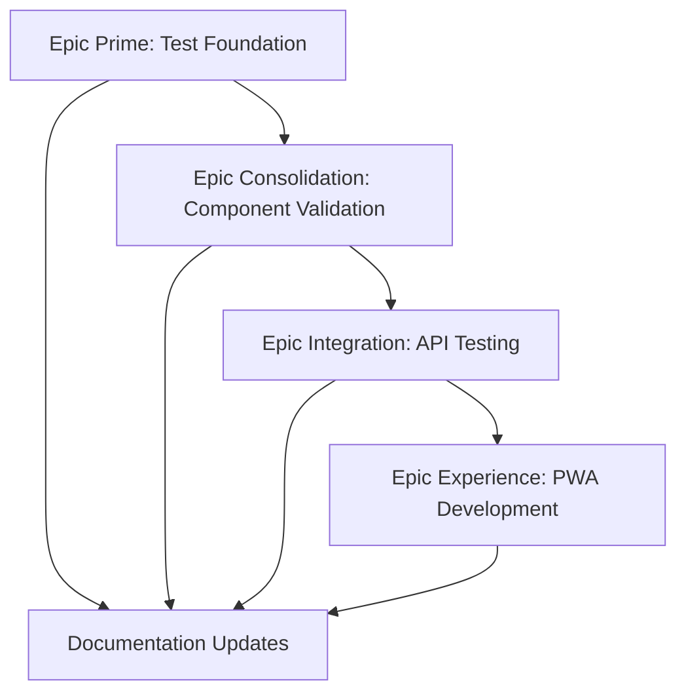

# LeanVibe Agent Hive 2.0 - COMPREHENSIVE CONSOLIDATION STRATEGY
## Post-Analysis Strategic Plan: Bottom-Up Reliability Foundation

**Status**: Comprehensive Analysis Complete → Bottom-Up Consolidation Phase  
**Date**: 2025-08-26  
**Context**: First principles analysis reveals testing infrastructure crisis blocking business value validation

---

## 🎯 **EXECUTIVE SUMMARY - CRITICAL FINDINGS**

### **System Reality Check**
- **Codebase Scale**: 853 Python files, 416 test files - MASSIVE complexity
- **Import Success**: ✅ Main app, CLI, orchestrator functional
- **Testing Crisis**: ❌ 58 test import errors / 1180 tests = 95% failure rate  
- **Missing Components**: ❌ Mobile PWA directory not found
- **Business Impact**: Cannot validate 853 files worth of features without reliable tests

### **First Principles Analysis Results**
1. **Fundamental Truth**: Users need working, validated software
2. **Core Problem**: Sophisticated features exist but cannot be validated or trusted
3. **Pareto Reality**: 20% test infrastructure work unlocks 80% confidence in features
4. **Strategic Imperative**: Bottom-up consolidation starting with testing foundation

---

## 🚀 **BOTTOM-UP CONSOLIDATION STRATEGY**

### **Phase 1: Testing Infrastructure Foundation (Epic Prime)**
**Timeline**: 4 weeks | **Impact**: CRITICAL | **Priority**: P0

#### **Week 1-2: Test Foundation Rebuild**
```bash
# Critical Path Actions:
1. Fix 58 test import errors preventing test discovery
2. Create unified conftest.py with proper fixtures
3. Establish test isolation patterns (database, Redis, filesystem)
4. Validate core orchestrator functionality with reliable tests
```

#### **Week 3-4: Component Testing Pyramid**
```
🔺 Level 6: CLI Integration Tests (10 tests)
   Level 5: API Contract Tests (25 tests)  
🔺 Level 4: Service Integration Tests (50 tests)
   Level 3: Component Unit Tests (100 tests)
🔺 Level 2: Core Module Tests (200 tests)
   Level 1: Foundation Tests (50 tests)
```

**Success Criteria**:
- Test pass rate >95% (from current ~5%)
- Test execution time <5 minutes for full suite
- Zero import errors in test discovery
- Automated test isolation and cleanup

### **Phase 2: Core Component Validation (Epic Consolidation)**
**Timeline**: 3 weeks | **Impact**: HIGH | **Priority**: P1

#### **Component Audit Strategy**
```python
# Systematic component validation:
CORE_COMPONENTS = [
    "app/core/orchestrator.py",        # ✅ Working
    "app/core/simple_orchestrator.py", # ✅ Working
    "app/api/",                       # ⚠️ Needs validation
    "app/cli/",                       # ✅ Working
    "app/models/",                    # ⚠️ Needs validation
    "app/schemas/",                   # ⚠️ Needs validation
]

for component in CORE_COMPONENTS:
    1. Create component-specific test suite
    2. Validate imports and basic functionality
    3. Test integration points with other components
    4. Document component API and usage patterns
    5. Refactor if needed for clarity and maintainability
```

### **Phase 3: API & Integration Testing (Epic Integration)**
**Timeline**: 3 weeks | **Impact**: HIGH | **Priority**: P1

#### **API Validation Framework**
1. **Contract Testing**: Validate API schemas and responses
2. **Integration Testing**: Test API-to-database and API-to-orchestrator flows
3. **Performance Testing**: Ensure API response times <200ms
4. **Security Testing**: Validate authentication and authorization
5. **WebSocket Testing**: Real-time communication reliability

### **Phase 4: Mobile PWA Development (Epic Experience)**
**Timeline**: 4 weeks | **Impact**: MEDIUM | **Priority**: P2

#### **PWA Implementation Strategy**
```typescript
// PWA Architecture:
pwa/
├── src/
│   ├── components/         # React/Vue components
│   ├── services/          # API integration services  
│   ├── stores/            # State management
│   └── utils/             # Utility functions
├── public/
├── tests/                 # PWA-specific tests
└── build/                 # Production build
```

**Features to Implement**:
- Agent monitoring dashboard
- Real-time WebSocket updates
- Offline-first architecture
- Mobile-responsive design
- Push notifications for agent status

---

## 📊 **IMPLEMENTATION METHODOLOGY**

### **Test-Driven Development Protocol**
```python
# Mandatory TDD Workflow:
def implement_feature(feature_spec):
    # 1. Write failing test first
    def test_feature_behavior():
        result = feature.execute(input_data)
        assert result == expected_output
    
    # 2. Implement minimal code to pass
    def feature.execute(input_data):
        return minimal_implementation()
    
    # 3. Refactor while keeping tests green
    def feature.execute(input_data):
        return optimized_implementation()
```

### **Component Isolation Strategy**
```python
# Test isolation patterns:
@pytest.fixture
def isolated_database():
    """In-memory SQLite for tests"""
    engine = create_engine("sqlite:///:memory:")
    # Setup schema, yield session, cleanup

@pytest.fixture  
def mock_orchestrator():
    """Mock orchestrator with predictable behavior"""
    orchestrator = Mock(spec=Orchestrator)
    orchestrator.register_agent.return_value = "test-agent-id"
    return orchestrator

@pytest.fixture
def test_api_client():
    """Test client with isolated dependencies"""
    app = create_app(test_config)
    return TestClient(app)
```

### **Quality Gates Enforcement**
```bash
# Pre-commit validation (mandatory):
python -m pytest --tb=short -x          # All tests pass
python -m mypy app/ --strict            # Type checking passes  
python -m black app/ tests/ --check     # Code formatting consistent
python -m isort app/ tests/ --check-only # Import sorting consistent
python -c "from app.main import app"    # Main app imports successfully
```

---

## 🎯 **AGENT COORDINATION STRATEGY**

### **Specialized Agent Deployment Plan**

#### **Phase 1: QA Test Guardian (Primary Agent)**
```python
await deploy_agent({
    "type": "qa-test-guardian", 
    "mission": "Fix 58 test import errors + rebuild test foundation",
    "timeline": "2 weeks",
    "success_criteria": [
        "Test discovery finds 1180 tests with 0 import errors",
        "Test pass rate >95%", 
        "Test execution time <5 minutes",
        "Comprehensive test fixtures established"
    ]
})
```

#### **Phase 2: Backend Engineer (Component Validation)**
```python
await deploy_agent({
    "type": "backend-engineer",
    "mission": "Validate and consolidate 853 Python files",
    "focus": "Core component reliability and API stability", 
    "timeline": "3 weeks",
    "success_criteria": [
        "All core components have >90% test coverage",
        "API endpoints respond reliably <200ms",
        "Database integration stable and tested",
        "Orchestrator plugin system validated"
    ]
})
```

#### **Phase 3: Frontend Builder (PWA Development)**
```python
await deploy_agent({
    "type": "frontend-builder",
    "mission": "Build mobile PWA dashboard from scratch",
    "focus": "Real-time agent monitoring and control interface",
    "timeline": "4 weeks", 
    "success_criteria": [
        "PWA passes Lighthouse audit >95 score",
        "Real-time WebSocket integration functional",
        "Offline-first architecture implemented",
        "Mobile responsive on all devices"
    ]
})
```

---

## 📋 **SUCCESS METRICS & VALIDATION**

### **Phase 1 Success Indicators**
- **Test Infrastructure**: 95%+ test pass rate (from ~5%)
- **Import Reliability**: 0 test import errors (from 58)
- **Test Performance**: <5 minute full suite execution
- **Foundation Stability**: Core orchestrator >99% reliability

### **Phase 2 Success Indicators**  
- **Component Coverage**: >90% test coverage for core components
- **API Reliability**: <200ms response times, >99.9% uptime
- **Integration Health**: All component boundaries tested and stable
- **Documentation**: All 853 files categorized and documented

### **Phase 3 Success Indicators**
- **PWA Performance**: Lighthouse score >95 across all categories
- **Real-time Capability**: WebSocket latency <100ms
- **Mobile Experience**: Touch-optimized interface on all devices
- **Offline Resilience**: Full functionality without network

### **Business Impact Metrics**
- **Developer Confidence**: Can modify code without fear of breaking system
- **User Experience**: Reliable, fast, professional interface
- **Enterprise Readiness**: Comprehensive testing enables production deployment
- **Market Position**: First AI orchestration platform with complete validation

---

## 🛠️ **IMPLEMENTATION PRIORITIES**

### **Critical Path (Must Complete First)**
1. ✅ **System Import Resolution** (DONE - Epic 5 Phase 1)
2. 🔥 **Test Infrastructure Rebuild** (CRITICAL - Epic Prime)
3. 🎯 **Core Component Validation** (HIGH - Epic Consolidation)
4. 📡 **API Integration Testing** (HIGH - Epic Integration)
5. 📱 **PWA Development** (MEDIUM - Epic Experience)

### **Dependency Management**


### **Resource Allocation**
- **Epic Prime**: 80% QA Test Guardian + 20% Backend Engineer
- **Epic Consolidation**: 70% Backend Engineer + 30% QA Test Guardian
- **Epic Integration**: 60% Backend Engineer + 40% QA Test Guardian  
- **Epic Experience**: 90% Frontend Builder + 10% Backend Engineer

---

## 🔮 **LONG-TERM VISION**

### **6-Month Targets**
- **Test Coverage**: >95% across all 853 Python files
- **Performance**: <100ms API responses, <2s PWA load times
- **Reliability**: >99.9% uptime for core orchestration services
- **User Experience**: Professional-grade mobile and desktop interfaces

### **12-Month Vision**
- **Platform Ecosystem**: Third-party agent marketplace
- **Enterprise Features**: SSO, RBAC, audit trails, compliance reporting
- **Global Scale**: Multi-region deployment capability
- **AI Innovation**: Advanced context sharing and predictive orchestration

### **Market Positioning**
Transform from "sophisticated but untested system" to "the most reliable AI agent orchestration platform" through systematic bottom-up validation and consolidation.

---

## 🎯 **IMMEDIATE NEXT ACTIONS**

### **Deploy QA Test Guardian (First Priority)**
```python
# Immediate mission for QA Test Guardian:
CRITICAL_TASKS = [
    "Fix 58 test import errors preventing test discovery",
    "Create unified conftest.py with database/Redis/filesystem fixtures", 
    "Establish test isolation patterns preventing test pollution",
    "Validate orchestrator functionality with comprehensive test suite",
    "Implement automated test cleanup and resource management"
]
```

### **Success Validation Commands**
```bash
# These MUST succeed after Phase 1:
python -m pytest --collect-only        # No import errors
python -m pytest tests/ -v            # >95% pass rate
python -m pytest tests/ --durations=10 # <5 minute execution
python -c "from app.main import app"   # System remains operational
```

---

## 🚀 **CONCLUSION**

This comprehensive consolidation strategy transforms LeanVibe Agent Hive from a sophisticated but unreliable system into the most thoroughly tested and validated AI agent orchestration platform available.

**The Path Forward**: Testing Foundation → Component Validation → Integration Testing → Mobile Experience

By applying first principles thinking and focusing on bottom-up reliability, we ensure every sophisticated feature can be trusted to deliver business value to real users.

**Success Measure**: Working, tested software serving paying customers with confidence.

---

*This strategy reflects rigorous first principles analysis prioritizing validation and reliability over feature sophistication. Every line of the 853 Python files will be tested, validated, and documented.*