# LeanVibe Agent Hive 2.0 - Quality Gates Automation

## Executive Summary

**Objective**: Design and implement an intelligent automated quality gates system that ensures continuous quality validation throughout the development process without impeding the 42x development velocity improvement target.

**Target**: Achieve 100% automated quality compliance with <5% performance overhead and progressive quality requirements that scale with project phases.

## System Overview

The Quality Gates Automation system provides comprehensive, automated quality validation that integrates seamlessly with the workflow orchestration, ensuring high-quality deliverables while maintaining rapid development velocity.

### Core Architecture

```mermaid
graph TB
    subgraph "Quality Gates Automation Engine"
        QGC[Quality Gate Controller<br/>Orchestration & Management]
        CQV[Continuous Quality Validator<br/>Real-time Validation]
        PQM[Progressive Quality Manager<br/>Phase-based Requirements]
        AQF[Automated Quality Fixer<br/>Issue Resolution]
        QAR[Quality Analytics & Reporting<br/>Metrics & Insights]
        QGI[Quality Gate Integration<br/>Workflow Integration]
    end
    
    subgraph "Quality Validation Engines"
        CVE[Code Quality Engine<br/>Static Analysis & Standards]
        TVE[Test Validation Engine<br/>Coverage & Effectiveness]
        SVE[Security Validation Engine<br/>Security & Compliance]
        PVE[Performance Validation Engine<br/>Performance & Optimization]
        AVE[API Validation Engine<br/>Contract & Compliance]
        DVE[Documentation Validation<br/>Completeness & Quality]
    end
    
    subgraph "Automated Resolution Systems"
        AQF1[Code Quality Fixer<br/>Automated Code Improvements]
        ATG[Automated Test Generator<br/>Missing Test Creation]
        ASF[Automated Security Fixer<br/>Security Issue Resolution]
        APO[Automated Performance Optimizer<br/>Performance Improvements]
        ADG[Automated Doc Generator<br/>Documentation Creation]
    end
    
    subgraph "Integration Points"
        WOE[Workflow Orchestration<br/>Seamless Integration]
        AO[Agent Orchestrator<br/>Task Coordination]
        CD[Coordination Dashboard<br/>Real-time Visibility]
        CE[Context Engine<br/>Quality Context Management]
    end
    
    subgraph "Quality Metrics & Analytics"
        QMC[Quality Metrics Collector<br/>Comprehensive Metrics]
        QTR[Quality Trend Reporter<br/>Trend Analysis]
        QPA[Quality Predictive Analytics<br/>Issue Prediction]
        QBE[Quality Benchmark Engine<br/>Industry Comparisons]
    end
    
    QGC --> CQV
    QGC --> PQM
    QGC --> AQF
    QGC --> QAR
    QGC --> QGI
    
    CQV --> CVE
    CQV --> TVE
    CQV --> SVE
    CQV --> PVE
    CQV --> AVE
    CQV --> DVE
    
    AQF --> AQF1
    AQF --> ATG
    AQF --> ASF
    AQF --> APO
    AQF --> ADG
    
    QGI --> WOE
    QGI --> AO
    QGI --> CD
    QGI --> CE
    
    QAR --> QMC
    QAR --> QTR
    QAR --> QPA
    QAR --> QBE
```



## Core Components

### 1. Quality Gate Controller

**Purpose**: Central orchestration and management of all quality validation activities

```python
class QualityGateController:
    """
    Central quality gate orchestration and management
    """
    
    async def orchestrate_quality_validation(
        self,
        workflow_context: WorkflowContext,
        quality_requirements: QualityRequirements,
        validation_scope: ValidationScope
    ) -> QualityValidationResult:
        """
        Orchestrate comprehensive quality validation including:
        - Real-time continuous validation
        - Phase-appropriate quality requirements
        - Automated issue resolution
        - Quality metrics collection
        - Workflow integration coordination
        """
        
    async def coordinate_quality_engines(
        self,
        validation_request: ValidationRequest,
        active_engines: List[QualityEngine]
    ) -> CoordinatedValidationResult:
        """
        Coordinate multiple quality engines for comprehensive validation
        """
        
    async def manage_quality_lifecycle(
        self,
        project_phase: ProjectPhase,
        quality_progression: QualityProgression
    ) -> QualityLifecycleManagement:
        """
        Manage quality requirements progression through project phases
        """
```

**Quality Orchestration Features**:

```yaml
orchestration_features:
  real_time_coordination:
    validation_frequency: "on_every_change"
    response_time: "<2 seconds"
    batch_optimization: "intelligent_batching"
    priority_handling: "critical_first"
    
  phase_aware_management:
    foundation_phase: "basic_quality_requirements"
    implementation_phase: "progressive_quality_scaling"
    integration_phase: "comprehensive_validation"
    finalization_phase: "production_readiness"
    
  adaptive_quality_management:
    requirement_adjustment: "based_on_project_complexity"
    threshold_optimization: "performance_vs_quality_balance"
    exception_handling: "intelligent_quality_exceptions"
    escalation_management: "automated_human_escalation"
```

### 2. Continuous Quality Validator

**Purpose**: Real-time quality validation with minimal performance impact

```python
class ContinuousQualityValidator:
    """
    Real-time continuous quality validation system
    """
    
    async def validate_incremental_changes(
        self,
        code_changes: CodeChanges,
        validation_context: ValidationContext
    ) -> IncrementalValidationResult:
        """
        Validate only incremental changes for maximum efficiency:
        - Delta-based code analysis
        - Affected test identification
        - Impact-based security scanning
        - Performance regression detection
        """
        
    async def execute_parallel_validation(
        self,
        validation_tasks: List[ValidationTask],
        resource_constraints: ResourceConstraints
    ) -> ParallelValidationResult:
        """
        Execute multiple validation tasks in parallel with resource optimization
        """
        
    async def cache_validation_results(
        self,
        validation_results: ValidationResults,
        cache_strategy: CacheStrategy
    ) -> CachedValidationOptimization:
        """
        Intelligent caching of validation results for performance optimization
        """
```

**Continuous Validation Strategies**:

```yaml
validation_strategies:
  incremental_validation:
    scope: "changed_files_only"
    dependency_analysis: "intelligent_impact_analysis"
    cache_utilization: "aggressive_caching"
    performance_target: "<2_seconds_per_change"
    
  smart_validation_selection:
    code_changes: "static_analysis + unit_tests"
    api_changes: "contract_validation + integration_tests"
    security_changes: "security_scan + penetration_tests"
    performance_changes: "performance_tests + benchmarks"
    
  parallel_validation_execution:
    max_concurrent_validations: 8
    resource_allocation: "cpu_memory_optimized"
    priority_queue: "critical_fast_normal"
    failure_fast: "stop_on_critical_failure"
    
  result_caching_optimization:
    code_hash_based: "file_content_hash_caching"
    dependency_aware: "intelligent_cache_invalidation"
    distributed_cache: "redis_cluster_caching"
    cache_hit_rate_target: ">85%"
```

### 3. Progressive Quality Manager

**Purpose**: Phase-based quality requirements that scale with project complexity

```python
class ProgressiveQualityManager:
    """
    Progressive quality requirements management
    """
    
    async def define_phase_quality_requirements(
        self,
        project_phase: ProjectPhase,
        project_complexity: ProjectComplexity,
        quality_profile: QualityProfile
    ) -> PhaseQualityRequirements:
        """
        Define appropriate quality requirements for each project phase:
        - Foundation phase: Basic quality gates
        - Implementation phase: Progressive quality scaling
        - Integration phase: Comprehensive validation
        - Finalization phase: Production readiness
        """
        
    async def adjust_quality_thresholds(
        self,
        current_metrics: QualityMetrics,
        performance_impact: PerformanceImpact,
        timeline_constraints: TimelineConstraints
    ) -> QualityThresholdAdjustment:
        """
        Dynamically adjust quality thresholds based on context
        """
        
    async def validate_quality_progression(
        self,
        quality_history: QualityHistory,
        progression_targets: ProgressionTargets
    ) -> QualityProgressionValidation:
        """
        Validate that quality is progressing appropriately through phases
        """
```

**Progressive Quality Framework**:

```yaml
progressive_quality_framework:
  foundation_phase:
    duration_percentage: 0.15
    quality_focus: "basic_standards"
    requirements:
      code_quality_score: ">7.5"
      test_coverage: ">60%"
      security_basics: "100%"
      documentation_basic: ">50%"
      performance_baseline: "established"
    
    validation_frequency: "every_commit"
    failure_tolerance: "medium"
    auto_fix_enabled: true
    
  implementation_phase:
    duration_percentage: 0.60
    quality_focus: "progressive_improvement"
    requirements:
      code_quality_score: ">8.5"
      test_coverage: ">80%"
      security_comprehensive: "100%"
      documentation_detailed: ">75%"
      performance_optimization: "monitored"
    
    validation_frequency: "real_time"
    failure_tolerance: "low"
    auto_fix_enabled: true
    
  integration_phase:
    duration_percentage: 0.20
    quality_focus: "comprehensive_validation"
    requirements:
      code_quality_score: ">9.0"
      test_coverage: ">90%"
      security_production_ready: "100%"
      documentation_complete: ">90%"
      performance_benchmarks: "met"
    
    validation_frequency: "continuous"
    failure_tolerance: "very_low"
    auto_fix_enabled: "limited"
    
  finalization_phase:
    duration_percentage: 0.05
    quality_focus: "production_readiness"
    requirements:
      code_quality_score: ">9.5"
      test_coverage: ">95%"
      security_audit_clean: "100%"
      documentation_comprehensive: ">95%"
      performance_production_ready: "validated"
    
    validation_frequency: "exhaustive"
    failure_tolerance: "zero"
    auto_fix_enabled: false
```

### 4. Automated Quality Fixer

**Purpose**: Intelligent automated resolution of quality issues

```python
class AutomatedQualityFixer:
    """
    Intelligent automated quality issue resolution
    """
    
    async def fix_code_quality_issues(
        self,
        quality_issues: List[CodeQualityIssue],
        fix_constraints: FixConstraints
    ) -> CodeQualityFixResult:
        """
        Automatically fix code quality issues:
        - Code formatting and style
        - Import optimization
        - Variable naming improvements
        - Code complexity reduction
        - Documentation generation
        """
        
    async def generate_missing_tests(
        self,
        code_coverage_gaps: CoverageGaps,
        test_generation_strategy: TestGenerationStrategy
    ) -> TestGenerationResult:
        """
        Generate missing tests to meet coverage requirements
        """
        
    async def resolve_security_vulnerabilities(
        self,
        security_issues: List[SecurityIssue],
        resolution_strategy: SecurityResolutionStrategy
    ) -> SecurityFixResult:
        """
        Automatically resolve security vulnerabilities
        """
```

**Automated Fixing Capabilities**:

```yaml
automated_fixing_capabilities:
  code_quality_fixes:
    formatting_issues:
      scope: "all_files"
      tools: ["black", "isort", "ruff"]
      auto_apply: true
      verification: "post_fix_validation"
    
    style_improvements:
      naming_conventions: "auto_rename_with_validation"
      import_optimization: "remove_unused_optimize_order"
      code_complexity: "extract_methods_simplify"
      docstring_generation: "ai_powered_docstrings"
    
    structural_improvements:
      duplicate_code_removal: "intelligent_refactoring"
      dead_code_elimination: "safe_removal_with_validation"
      performance_optimizations: "algorithmic_improvements"
      
  test_generation:
    unit_test_creation:
      coverage_gaps: "identify_untested_functions"
      test_template_generation: "ai_powered_test_creation"
      assertion_generation: "intelligent_assertion_creation"
      mock_generation: "automatic_dependency_mocking"
    
    integration_test_creation:
      api_endpoint_testing: "openapi_spec_driven"
      database_testing: "transaction_based_testing"
      service_integration: "contract_based_testing"
    
  security_fixes:
    vulnerability_patching:
      dependency_updates: "automated_security_updates"
      configuration_hardening: "security_best_practices"
      input_validation: "sanitization_and_validation"
      authentication_improvements: "security_enhancement"
    
  performance_optimization:
    query_optimization: "database_query_improvements"
    caching_implementation: "intelligent_caching_strategies"
    algorithm_optimization: "performance_algorithm_improvements"
    resource_optimization: "memory_and_cpu_optimization"
```

### 5. Quality Validation Engines

#### Code Quality Engine

```python
class CodeQualityEngine:
    """
    Comprehensive code quality validation
    """
    
    async def validate_code_standards(
        self,
        code_files: List[CodeFile],
        quality_standards: QualityStandards
    ) -> CodeQualityResult:
        """
        Validate code against comprehensive quality standards:
        - Code style and formatting
        - Complexity metrics
        - Maintainability index
        - Technical debt assessment
        - Code smells detection
        """
        
    async def analyze_code_metrics(
        self,
        codebase: Codebase,
        metric_targets: MetricTargets
    ) -> CodeMetricsAnalysis:
        """
        Comprehensive code metrics analysis
        """
```

**Code Quality Standards**:

```yaml
code_quality_standards:
  style_standards:
    python:
      formatter: "black"
      import_sorter: "isort"
      linter: "ruff"
      type_checker: "mypy"
      complexity_threshold: 10
      line_length: 88
    
    typescript:
      formatter: "prettier"
      linter: "eslint"
      type_checker: "tsc"
      complexity_threshold: 15
      
  quality_metrics:
    maintainability_index: ">80"
    cyclomatic_complexity: "<10"
    cognitive_complexity: "<15"
    technical_debt_ratio: "<5%"
    duplication_percentage: "<3%"
    
  code_smells_detection:
    long_methods: ">50_lines"
    large_classes: ">300_lines"
    parameter_lists: ">5_parameters"
    nested_conditionals: ">3_levels"
    magic_numbers: "detect_and_flag"
```

#### Test Validation Engine

```python
class TestValidationEngine:
    """
    Comprehensive test coverage and effectiveness validation
    """
    
    async def validate_test_coverage(
        self,
        test_results: TestResults,
        coverage_requirements: CoverageRequirements
    ) -> TestCoverageValidation:
        """
        Validate comprehensive test coverage:
        - Line coverage
        - Branch coverage
        - Function coverage
        - Integration coverage
        - Critical path coverage
        """
        
    async def assess_test_quality(
        self,
        test_suite: TestSuite,
        quality_criteria: TestQualityCriteria
    ) -> TestQualityAssessment:
        """
        Assess test quality and effectiveness
        """
```

**Test Validation Standards**:

```yaml
test_validation_standards:
  coverage_requirements:
    unit_test_coverage: ">90%"
    integration_test_coverage: ">80%"
    e2e_test_coverage: ">70%"
    critical_path_coverage: "100%"
    
  test_quality_metrics:
    test_maintainability: ">8.5"
    test_readability: ">8.0"
    assertion_quality: ">9.0"
    test_isolation: "100%"
    
  test_effectiveness:
    defect_detection_rate: ">95%"
    false_positive_rate: "<2%"
    test_execution_time: "<5_minutes"
    test_reliability: ">99%"
```

#### Security Validation Engine

```python
class SecurityValidationEngine:
    """
    Comprehensive security validation and compliance
    """
    
    async def validate_security_standards(
        self,
        codebase: Codebase,
        security_requirements: SecurityRequirements
    ) -> SecurityValidationResult:
        """
        Comprehensive security validation:
        - Vulnerability scanning
        - Security best practices
        - Compliance validation
        - Threat assessment
        - Security architecture review
        """
        
    async def perform_security_audit(
        self,
        application: Application,
        audit_scope: SecurityAuditScope
    ) -> SecurityAuditResult:
        """
        Perform comprehensive security audit
        """
```

**Security Validation Framework**:

```yaml
security_validation_framework:
  vulnerability_scanning:
    dependency_scanning: "automated_vulnerability_detection"
    code_scanning: "static_security_analysis"
    container_scanning: "image_vulnerability_assessment"
    configuration_scanning: "security_misconfiguration_detection"
    
  security_best_practices:
    authentication: "strong_authentication_validation"
    authorization: "rbac_implementation_validation"
    encryption: "data_encryption_validation"
    input_validation: "injection_prevention_validation"
    
  compliance_validation:
    owasp_top_10: "comprehensive_owasp_validation"
    security_headers: "security_header_validation"
    https_enforcement: "ssl_tls_validation"
    data_privacy: "privacy_compliance_validation"
    
  threat_assessment:
    threat_modeling: "automated_threat_identification"
    attack_surface_analysis: "exposure_assessment"
    risk_assessment: "security_risk_quantification"
    mitigation_validation: "security_control_effectiveness"
```

#### Performance Validation Engine

```python
class PerformanceValidationEngine:
    """
    Comprehensive performance validation and optimization
    """
    
    async def validate_performance_requirements(
        self,
        application: Application,
        performance_targets: PerformanceTargets
    ) -> PerformanceValidationResult:
        """
        Validate application performance against targets:
        - Response time validation
        - Throughput assessment
        - Resource utilization analysis
        - Scalability testing
        - Performance regression detection
        """
        
    async def analyze_performance_bottlenecks(
        self,
        performance_data: PerformanceData,
        analysis_scope: AnalysisScope
    ) -> BottleneckAnalysis:
        """
        Identify and analyze performance bottlenecks
        """
```

**Performance Validation Standards**:

```yaml
performance_validation_standards:
  response_time_targets:
    api_response_time: "<100ms (p95)"
    database_query_time: "<50ms (p95)"
    page_load_time: "<2s"
    time_to_interactive: "<3s"
    
  throughput_targets:
    api_requests_per_second: ">1000"
    concurrent_users: ">500"
    database_connections: ">100"
    
  resource_utilization:
    cpu_utilization: "<70%"
    memory_utilization: "<80%"
    disk_io_efficiency: ">90%"
    network_efficiency: ">85%"
    
  scalability_validation:
    horizontal_scaling: "validated"
    load_balancing: "optimized"
    caching_effectiveness: ">80%"
    database_performance: "optimized"
```

## Quality Gate Integration with Workflow

### Seamless Workflow Integration

```python
class QualityWorkflowIntegration:
    """
    Seamless integration with workflow orchestration
    """
    
    async def integrate_quality_gates(
        self,
        workflow_definition: WorkflowDefinition,
        quality_requirements: QualityRequirements
    ) -> QualityIntegratedWorkflow:
        """
        Integrate quality gates seamlessly into workflow:
        - Parallel quality validation streams
        - Non-blocking quality checks
        - Progressive quality requirements
        - Automated quality resolution
        """
        
    async def coordinate_quality_and_development(
        self,
        development_tasks: List[DevelopmentTask],
        quality_validations: List[QualityValidation]
    ) -> CoordinatedExecution:
        """
        Coordinate quality validation with development tasks
        """
```

**Integration Strategies**:

```yaml
integration_strategies:
  parallel_quality_streams:
    development_stream: "primary_development_tasks"
    quality_stream: "parallel_quality_validation"
    synchronization_points: "minimal_blocking_points"
    coordination_overhead: "<5%"
    
  non_blocking_validation:
    real_time_feedback: "immediate_quality_feedback"
    background_processing: "heavy_analysis_in_background"
    priority_handling: "critical_issues_immediate"
    batch_optimization: "non_critical_batched"
    
  progressive_integration:
    phase_appropriate: "quality_scales_with_phase"
    adaptive_thresholds: "context_aware_requirements"
    intelligent_escalation: "automated_human_escalation"
    continuous_improvement: "learning_from_patterns"
```

## RealWorld Conduit Quality Implementation

### Quality Gate Timeline Integration

```yaml
conduit_quality_timeline:
  foundation_phase_quality:
    duration: "36 minutes"
    parallel_quality_validation: "15 minutes"
    quality_requirements:
      code_quality: ">7.5"
      test_coverage: ">60%"
      security_basic: "100%"
      
    automated_fixes:
      code_formatting: "automatic"
      basic_test_generation: "automatic"
      security_configuration: "automatic"
      
  implementation_phase_quality:
    duration: "144 minutes"
    parallel_quality_validation: "continuous"
    quality_requirements:
      code_quality: ">8.5"
      test_coverage: ">80%"
      security_comprehensive: "100%"
      
    quality_streams:
      backend_quality_stream:
        api_contract_validation: "continuous"
        database_schema_validation: "on_change"
        business_logic_testing: "parallel"
        security_api_scanning: "automated"
        
      frontend_quality_stream:
        component_testing: "parallel"
        accessibility_validation: "continuous"
        performance_monitoring: "automated"
        ui_consistency_checks: "automated"
        
  integration_phase_quality:
    duration: "48 minutes"
    comprehensive_validation: "30 minutes"
    quality_requirements:
      code_quality: ">9.0"
      test_coverage: ">90%"
      security_production: "100%"
      performance_benchmarks: "met"
      
    validation_sequence:
      end_to_end_testing: "comprehensive"
      performance_benchmarking: "full_suite"
      security_audit: "automated_penetration"
      production_readiness: "complete_validation"
```

### Quality Metrics Tracking

```yaml
conduit_quality_metrics:
  real_time_metrics:
    code_quality_score: "tracked_continuously"
    test_coverage_percentage: "updated_on_commit"
    security_vulnerability_count: "real_time_monitoring"
    performance_regression_detection: "automated_alerts"
    
  phase_progression_metrics:
    quality_improvement_rate: "measured_per_phase"
    automation_effectiveness: "fix_success_rate"
    validation_performance: "overhead_measurement"
    team_productivity_impact: "velocity_tracking"
    
  final_quality_report:
    overall_quality_score: ">9.5"
    test_coverage_achieved: ">95%"
    security_vulnerabilities: "0_critical_0_high"
    performance_benchmarks: "100%_met"
    documentation_completeness: ">95%"
```

## Performance Optimization

### Quality Validation Performance

```yaml
performance_optimization:
  validation_speed_targets:
    incremental_validation: "<2_seconds"
    comprehensive_validation: "<5_minutes"
    automated_fix_application: "<30_seconds"
    quality_report_generation: "<10_seconds"
    
  resource_efficiency:
    cpu_overhead: "<10%"
    memory_overhead: "<15%"
    network_overhead: "<5%"
    storage_overhead: "<20%"
    
  scalability_metrics:
    concurrent_validations: ">50"
    validation_throughput: ">100_files_per_minute"
    cache_hit_rate: ">85%"
    parallel_processing_efficiency: ">90%"
```

### Intelligent Optimization Strategies

```python
class QualityPerformanceOptimizer:
    """
    Intelligent optimization of quality validation performance
    """
    
    async def optimize_validation_performance(
        self,
        validation_workload: ValidationWorkload,
        resource_constraints: ResourceConstraints
    ) -> PerformanceOptimization:
        """
        Optimize quality validation performance through:
        - Intelligent batching and scheduling
        - Selective validation based on impact
        - Aggressive result caching
        - Parallel processing optimization
        """
        
    async def predict_validation_needs(
        self,
        code_changes: CodeChanges,
        historical_patterns: HistoricalPatterns
    ) -> ValidationPrediction:
        """
        Predict validation needs to optimize resource allocation
        """
```

## Implementation Roadmap

### Phase 1: Core Quality Infrastructure (Week 1-2)

1. **Quality Gate Controller Implementation**
   - Central orchestration system
   - Progressive quality management
   - Workflow integration framework

2. **Continuous Quality Validator**
   - Real-time validation engine
   - Incremental change processing
   - Performance optimization

### Phase 2: Quality Engines (Week 3-4)

3. **Code Quality & Test Engines**
   - Comprehensive code analysis
   - Test coverage validation
   - Automated test generation

4. **Security & Performance Engines**
   - Security vulnerability scanning
   - Performance benchmark validation
   - Automated optimization

### Phase 3: Automated Fixing (Week 5-6)

5. **Automated Quality Fixer**
   - Code quality issue resolution
   - Test generation automation
   - Security fix automation

6. **Advanced Analytics**
   - Quality metrics collection
   - Predictive analytics
   - Trend analysis and reporting

### Phase 4: Integration & Validation (Week 7-8)

7. **Enterprise Integration**
   - Workflow orchestration integration
   - Dashboard visualization
   - Context engine integration

8. **RealWorld Conduit Demonstration**
   - End-to-end quality validation
   - Performance metrics validation
   - Automated quality achievement

## Success Criteria

### Primary Objectives

1. **100% Automated Quality Compliance**: All quality requirements met automatically
2. **<5% Performance Overhead**: Minimal impact on development velocity
3. **>95% Quality Gate Pass Rate**: Automated validation success
4. **Progressive Quality Achievement**: Quality scales appropriately with project phases

### Secondary Objectives

1. **<2 Seconds Incremental Validation**: Real-time quality feedback
2. **>90% Automated Fix Success**: Automated resolution effectiveness
3. **>85% Cache Hit Rate**: Performance optimization through intelligent caching
4. **Zero Manual Quality Intervention**: Complete automation for standard quality requirements

This Quality Gates Automation system ensures that the 42x development velocity improvement is achieved while maintaining and exceeding traditional quality standards through intelligent automation and progressive quality management.