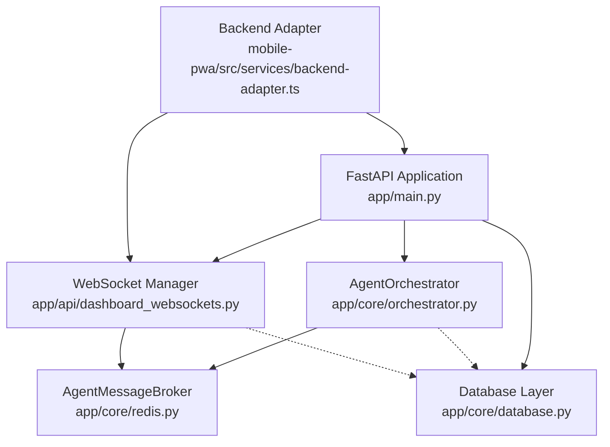

# LeanVibe Agent Hive - Critical Component Contracts Analysis

## Executive Summary

This document maps the critical contracts and interactions between the 6 key components in the LeanVibe Agent Hive system, providing a comprehensive analysis of data flows, API contracts, event patterns, and failure modes for contract testing strategy development.

## Component Architecture Overview



## 1. Contract Matrix: Component-to-Component Interactions

### 1.1 FastAPI Application ↔ AgentOrchestrator

**Data Contracts:**
```python
# Initialization Contract
orchestrator = AgentOrchestrator()
await orchestrator.start()
app.state.orchestrator = orchestrator

# System Status Contract  
async def get_system_status() -> Dict[str, Any]:
    return {
        "active_agents": int,
        "agent_health": Dict[str, str],
        "coordination_metrics": Dict[str, Any],
        "last_updated": str
    }
```

**API Contracts:**
- `orchestrator.start() -> None`: Initialize coordination system
- `orchestrator.shutdown() -> None`: Graceful shutdown
- `orchestrator.get_system_status() -> Dict`: System-wide status
- `orchestrator.spawn_agent(role, capabilities) -> str`: Agent creation
- `orchestrator.delegate_task(task_data) -> bool`: Task delegation

**Event Contracts:**
- Agent lifecycle events (spawn, shutdown, error)
- Task delegation events  
- System health updates

**State Contracts:**
- Shared orchestrator instance in `app.state`
- Lifecycle tied to FastAPI application lifecycle

### 1.2 AgentOrchestrator ↔ AgentMessageBroker (Redis)

**Data Contracts:**
```python
# Redis Stream Message Format
{
    'message_id': str,
    'from_agent': str, 
    'to_agent': str,
    'type': str,  # 'task_assignment', 'heartbeat', 'task_result', 'error'
    'payload': str,  # JSON-serialized Dict[str, Any]
    'correlation_id': str,
    'timestamp': str  # ISO format
}

# Agent Registration Contract
{
    'agent_id': str,
    'capabilities': List[str],
    'role': str,
    'status': 'active' | 'idle' | 'busy' | 'error'
}
```

**API Contracts:**
- `send_message(from_agent, to_agent, message_type, payload) -> str`: Point-to-point messaging
- `broadcast_message(from_agent, message_type, payload) -> str`: System-wide broadcasts
- `register_agent(agent_id, capabilities, role) -> bool`: Agent registration
- `coordinate_workflow_tasks(workflow_id, tasks, assignments) -> bool`: Multi-agent coordination
- `synchronize_agent_states(workflow_id, sync_point) -> Dict`: State synchronization

**Event Contracts:**
```python
# Redis Streams Format
STREAM_PATTERNS = {
    'agent_messages:{agent_id}': 'Direct agent messages',
    'agent_messages:broadcast': 'System-wide broadcasts',
    'workflow_coordination:{workflow_id}': 'Workflow coordination',
    'workflow_sync:{workflow_id}:{sync_point}': 'Synchronization points'
}

# Consumer Groups
GROUP_PATTERN = 'group_{agent_id}'
```

**State Contracts:**
- Redis stream persistence with TTL
- Consumer group management for reliable message delivery
- Workflow coordination state with 2-hour TTL

### 1.3 WebSocket Manager ↔ Frontend Backend Adapter

**Data Contracts:**
```typescript
// WebSocket Contract Version
WS_CONTRACT_VERSION = "1.0.0"

// Message Types (TypeScript)
interface WebSocketMessage {
    type: string;
    data: any;
    timestamp: string;
    correlation_id: string;
}

// Connection Establishment
interface ConnectionEstablished {
    type: "connection_established";
    connection_id: string;
    subscriptions: string[];
    server_time: string;
    contract_version: string;
}

// Subscription Groups
type SubscriptionType = 'agents' | 'coordination' | 'tasks' | 'system' | 'alerts';
```

**API Contracts:**
```python
# WebSocket Endpoints
/api/dashboard/ws/agents         # Agent monitoring
/api/dashboard/ws/coordination   # Coordination events  
/api/dashboard/ws/tasks         # Task management
/api/dashboard/ws/system        # System health
/api/dashboard/ws/dashboard     # Comprehensive dashboard

# Management APIs
GET  /api/dashboard/websocket/stats     # Connection statistics
POST /api/dashboard/websocket/broadcast # Manual broadcast
POST /api/dashboard/websocket/disconnect/{id} # Force disconnect
GET  /api/dashboard/websocket/health    # Health check
```

**Event Contracts:**
```python
# Outbound Message Types
MESSAGE_TYPES = {
    'connection_established': 'Initial connection confirmation',
    'agent_update': 'Agent status changes',
    'coordination_update': 'Coordination metrics',
    'task_update': 'Task queue changes', 
    'system_update': 'System health changes',
    'critical_alert': 'High-priority alerts',
    'error': 'Error messages',
    'pong': 'Ping responses'
}

# Update Frequencies
UPDATE_INTERVALS = {
    'agent_status': 5,      # seconds
    'coordination': 10,     # seconds  
    'tasks': 3,            # seconds
    'system_health': 30    # seconds
}
```

**State Contracts:**
- Connection state with rate limiting (configurable tokens/second)
- Subscription management per connection
- Background task lifecycle tied to active connections
- Idle disconnect after configurable timeout

### 1.4 Database Layer ↔ All Components

**Data Contracts:**
```python
# Agent Model Schema
class Agent(Base):
    id: UUID
    name: str
    type: AgentType  # CLAUDE, GPT, GEMINI, CUSTOM
    role: str
    capabilities: List[str]  # JSON field
    status: AgentStatus  # inactive, active, busy, error, maintenance
    config: Dict[str, Any]  # JSON field
    current_sleep_state: str
    performance_metrics: str  # JSON serialized

# Task Model Schema  
class Task(Base):
    id: UUID
    title: str
    description: str
    task_type: TaskType
    status: TaskStatus  # pending, assigned, in_progress, completed, failed
    priority: TaskPriority  # LOW=1, MEDIUM=5, HIGH=8, CRITICAL=10
    assigned_agent_id: UUID (FK)
    context: Dict[str, Any]  # JSON field
    result: Dict[str, Any]   # JSON field
    dependencies: List[UUID] # Array field
```

**API Contracts:**
```python
# Session Management
async def get_session() -> AsyncSession:
    # Context manager with automatic commit/rollback
    
# Health Checking
async def check_connection() -> bool:
async def check_extensions() -> dict:  # pgvector, uuid-ossp
async def get_connection_stats() -> dict:  # Pool statistics
```

**Event Contracts:**
- Database transactions are atomic
- Connection pooling with configurable size
- Automatic migration support in debug mode

**State Contracts:**
- PostgreSQL with async SQLAlchemy
- Connection pool management
- Extension dependencies (pgvector, uuid-ossp)

### 1.5 Backend Adapter ↔ FastAPI Application

**Data Contracts:**
```typescript
// Live Dashboard Data Format
interface LiveDashboardData {
    metrics: {
        active_projects: number;
        active_agents: number;
        agent_utilization: number;
        completed_tasks: number;
        system_status: 'healthy' | 'degraded' | 'critical';
        last_updated: string;
    };
    agent_activities: AgentActivity[];
    project_snapshots: ProjectSnapshot[];
    conflict_snapshots: ConflictSnapshot[];
}
```

**API Contracts:**
```typescript
// HTTP Endpoints
GET /dashboard/api/live-data     # Primary data source
GET /health                     # Health check fallback

// Transformation Methods  
async getLiveData(forceRefresh?: boolean): Promise<LiveDashboardData>
async getTasksFromLiveData(): Promise<Task[]>
async getAgentsFromLiveData(): Promise<Agent[]>
async getSystemHealthFromLiveData(): Promise<SystemHealth>
```

**Event Contracts:**
- Real-time updates via WebSocket connection
- Polling fallback with exponential backoff
- Event emission for data updates

**State Contracts:**
- Local caching with 5-second TTL
- WebSocket connection management with reconnection
- Fallback to mock data on failure

## 2. Message Schemas with Validation Rules

### 2.1 Redis Stream Messages

```python
# Agent Message Schema
AGENT_MESSAGE_SCHEMA = {
    "type": "object",
    "required": ["message_id", "from_agent", "to_agent", "type", "payload", "timestamp"],
    "properties": {
        "message_id": {"type": "string", "format": "uuid"},
        "from_agent": {"type": "string", "minLength": 1},
        "to_agent": {"type": "string", "minLength": 1},  
        "type": {"enum": ["task_assignment", "heartbeat", "task_result", "error", "coordination"]},
        "payload": {"type": "string"},  # JSON-serialized
        "correlation_id": {"type": "string", "format": "uuid"},
        "timestamp": {"type": "string", "format": "date-time"}
    }
}

# Workflow Coordination Schema
WORKFLOW_COORDINATION_SCHEMA = {
    "type": "object", 
    "required": ["workflow_id", "tasks", "agent_assignments"],
    "properties": {
        "workflow_id": {"type": "string", "format": "uuid"},
        "tasks": {
            "type": "array",
            "items": {
                "type": "object",
                "required": ["id", "title", "task_type"],
                "properties": {
                    "id": {"type": "string"},
                    "title": {"type": "string", "minLength": 1},
                    "task_type": {"enum": ["feature", "bug_fix", "test", "docs"]},
                    "priority": {"enum": ["low", "medium", "high", "critical"]},
                    "estimated_effort": {"type": "number", "minimum": 0}
                }
            }
        },
        "agent_assignments": {
            "type": "object",
            "patternProperties": {
                "^[a-zA-Z0-9_-]+$": {"type": "string"}
            }
        }
    }
}
```

### 2.2 WebSocket Messages

```json
{
  "title": "WebSocket Message Schema",
  "type": "object", 
  "required": ["type", "timestamp"],
  "properties": {
    "type": {
      "enum": [
        "connection_established",
        "agent_update", 
        "coordination_update",
        "task_update",
        "system_update", 
        "critical_alert",
        "error",
        "pong"
      ]
    },
    "data": {
      "type": "object",
      "description": "Message-specific payload"
    },
    "timestamp": {
      "type": "string",
      "format": "date-time"
    },
    "correlation_id": {
      "type": "string",
      "format": "uuid"
    },
    "subscription": {
      "enum": ["agents", "coordination", "tasks", "system", "alerts"]
    }
  }
}
```

### 2.3 Database Model Constraints

```sql
-- Agent Model Constraints
ALTER TABLE agents ADD CONSTRAINT agents_status_check 
    CHECK (status IN ('inactive', 'active', 'busy', 'error', 'maintenance', 'shutting_down'));

ALTER TABLE agents ADD CONSTRAINT agents_type_check
    CHECK (type IN ('claude', 'gpt', 'gemini', 'custom'));

-- Task Model Constraints  
ALTER TABLE tasks ADD CONSTRAINT tasks_status_check
    CHECK (status IN ('pending', 'assigned', 'in_progress', 'blocked', 'completed', 'failed', 'cancelled'));

ALTER TABLE tasks ADD CONSTRAINT tasks_priority_check  
    CHECK (priority IN (1, 5, 8, 10));

-- Referential Integrity
ALTER TABLE tasks ADD CONSTRAINT tasks_assigned_agent_fk
    FOREIGN KEY (assigned_agent_id) REFERENCES agents(id);
```

## 3. Failure Modes and Contract Violations

### 3.1 Redis Message Broker Failures

**Failure Scenarios:**
1. **Connection Loss**: Redis server unavailable
2. **Stream Overflow**: Messages exceed maxlen limit  
3. **Serialization Failure**: Invalid payload data
4. **Consumer Group Conflicts**: Duplicate group creation
5. **Message Delivery Failure**: Network timeouts

**Contract Violations:**
```python
# Invalid Message Format
{
    "missing_required_field": "value",  # Missing message_id, type, etc.
    "invalid_timestamp": "not-iso-format",
    "malformed_payload": "not-json-serializable"
}

# Detection and Handling
try:
    serialized_payload = self._serialize_for_redis(payload)
except Exception as e:
    logger.error(f"Failed to serialize payload: {e}")
    raise ValueError(f"Invalid payload for Redis serialization: {e}")
```

**Recovery Strategies:**
- Retry with exponential backoff (3 attempts)
- Dead letter queue for failed messages
- Circuit breaker pattern for Redis connection
- Fallback to direct database updates

### 3.2 WebSocket Connection Failures

**Failure Scenarios:**
1. **Rate Limit Exceeded**: Client exceeds token bucket capacity
2. **Authentication Failure**: Invalid or missing auth tokens
3. **Connection Timeout**: Idle connections exceed threshold
4. **Backpressure**: Send buffer overflow
5. **Protocol Violation**: Invalid message format

**Contract Violations:**
```typescript
// Rate Limiting Violation
if (!this._consume_token_allow(connection)) {
    this.metrics["messages_dropped_rate_limit_total"] += 1;
    await this._send_to_connection(connection_id, make_error("Rate limit exceeded"));
    return;
}

// Message Size Violation  
if (len(encoded) > this.max_inbound_message_bytes) {
    await this._send_to_connection(connection_id, make_error("Message too large"));
    return;
}
```

**Recovery Strategies:**
- Graceful degradation with disconnect notices
- Automatic reconnection with exponential backoff
- Fallback to HTTP polling for critical data
- Client-side error handling and retry logic

### 3.3 Database Transaction Failures

**Failure Scenarios:**
1. **Connection Pool Exhaustion**: Too many concurrent connections
2. **Transaction Deadlock**: Competing transactions
3. **Constraint Violation**: Invalid data or referential integrity
4. **Migration Conflicts**: Schema changes during operation
5. **Extension Failure**: pgvector or uuid-ossp unavailable

**Contract Violations:**
```python
# Session Management Failure
async with get_session() as session:
    try:
        yield session
        await session.commit()
    except Exception:
        await session.rollback()  # Contract: Always rollback on error
        raise
```

**Recovery Strategies:**
- Automatic retry for transient failures
- Connection pool health monitoring
- Graceful degradation with read-only mode
- Migration rollback procedures

### 3.4 Cross-Component Integration Failures

**Orchestrator → Database Failures:**
- Agent state persistence failures
- Task assignment conflicts
- Performance metric storage issues

**WebSocket → Redis Failures:**
- Event propagation delays
- Message ordering issues
- Subscription state inconsistencies

**Frontend → Backend Failures:**
- API endpoint unavailability
- Data format mismatches
- WebSocket connection instability

## 4. Testing Implications

### 4.1 Contract Testing Strategy

**Unit Tests:**
```python
# Message Serialization Tests
def test_redis_message_serialization():
    broker = AgentMessageBroker(mock_redis)
    complex_payload = {"nested": {"data": [1, 2, 3]}, "timestamp": datetime.now()}
    
    serialized = broker._serialize_for_redis(complex_payload)
    assert isinstance(serialized, str)
    
    deserialized = broker._deserialize_from_redis(serialized)
    assert deserialized["nested"]["data"] == [1, 2, 3]

# WebSocket Contract Tests  
async def test_websocket_message_validation():
    manager = DashboardWebSocketManager()
    
    # Test valid message
    valid_msg = {"type": "ping", "timestamp": datetime.utcnow().isoformat()}
    result = await manager.handle_message("test-conn", valid_msg)
    assert result is None  # No error
    
    # Test invalid message
    invalid_msg = {"invalid_field": "value"}
    with pytest.raises(ValidationError):
        await manager.handle_message("test-conn", invalid_msg)
```

**Integration Tests:**
```python
# End-to-End Message Flow
async def test_agent_task_assignment_flow():
    # Setup: Orchestrator + Redis + Database
    orchestrator = AgentOrchestrator()
    await orchestrator.start()
    
    # Test: Task delegation through full stack
    task_id = await orchestrator.delegate_task({
        "title": "Test Task",
        "task_type": "feature_development",
        "required_capabilities": ["python", "fastapi"]
    })
    
    # Verify: Message in Redis stream
    messages = await broker.read_messages("test-agent", "test-consumer")
    assert len(messages) == 1
    assert messages[0].message_type == "task_assignment"
    
    # Verify: Task in database
    async with get_session() as session:
        task = await session.get(Task, task_id)
        assert task.status == TaskStatus.ASSIGNED
```

**Contract Tests:**
```python
# API Contract Tests using Pact
def test_live_data_contract():
    pact.given("active agents exist")
        .upon_receiving("a request for live dashboard data")
        .with_request("GET", "/dashboard/api/live-data")
        .will_respond_with(200, body={
            "metrics": {
                "active_agents": Matcher.integer(),
                "system_status": Matcher.term("healthy|degraded|critical"),
                "last_updated": Matcher.iso_datetime()
            },
            "agent_activities": Matcher.each_like({
                "agent_id": Matcher.string(),
                "status": Matcher.term("active|idle|busy|error"),
                "performance_score": Matcher.integer()
            })
        })
```

### 4.2 Monitoring and Observability

**Contract Validation Metrics:**
```python
# Redis Message Broker Metrics
redis_message_validation_errors = Counter(
    'redis_message_validation_errors_total',
    'Total number of message validation errors',
    ['error_type', 'agent_id']
)

# WebSocket Contract Metrics
websocket_protocol_violations = Counter(
    'websocket_protocol_violations_total', 
    'Total number of WebSocket protocol violations',
    ['violation_type', 'connection_id']
)

# Database Constraint Violations
database_constraint_violations = Counter(
    'database_constraint_violations_total',
    'Total number of database constraint violations', 
    ['table', 'constraint', 'operation']
)
```

**Health Checks:**
```python
async def validate_component_contracts():
    """Comprehensive contract health check."""
    results = {}
    
    # Redis contract validation
    try:
        test_message = await broker.send_message(
            "health-check", "test", "ping", {"timestamp": datetime.utcnow().isoformat()}
        )
        results["redis_messaging"] = "healthy"
    except Exception as e:
        results["redis_messaging"] = f"failed: {e}"
    
    # WebSocket contract validation  
    try:
        stats = websocket_manager.get_connection_stats()
        results["websocket_management"] = "healthy"
    except Exception as e:
        results["websocket_management"] = f"failed: {e}"
        
    # Database contract validation
    try:
        async with get_session() as session:
            await session.execute(text("SELECT 1"))
        results["database_access"] = "healthy"
    except Exception as e:
        results["database_access"] = f"failed: {e}"
    
    return results
```

## 5. Versioning and Evolution Strategy

### 5.1 Contract Versioning

**WebSocket Contract Versioning:**
```python
WS_CONTRACT_VERSION = "1.0.0"

# Version negotiation
def validate_client_version(requested_version: str) -> bool:
    major, minor, patch = map(int, requested_version.split('.'))
    current_major, current_minor, _ = map(int, WS_CONTRACT_VERSION.split('.'))
    
    # Breaking changes require major version match
    if major != current_major:
        return False
    
    # Minor version backward compatibility
    return minor <= current_minor
```

**API Contract Versioning:**
```python
# URL-based versioning
/api/v1/agents          # Current stable API
/api/v2/agents          # Next version (breaking changes)

# Header-based versioning for WebSocket
headers = {
    "X-Contract-Version": "1.0.0",
    "X-Supported-Versions": "1.0.0,1.1.0"
}
```

### 5.2 Breaking vs Non-Breaking Changes

**Non-Breaking Changes:**
- Adding optional fields to message schemas
- Adding new WebSocket message types
- Adding new database columns with defaults
- Extending enum values
- Adding new API endpoints

**Breaking Changes:**
- Removing required fields from schemas
- Changing data types of existing fields
- Removing WebSocket message types
- Changing database column constraints
- Removing API endpoints

### 5.3 Migration Strategies

**Schema Evolution:**
```python
# Database migration example
async def upgrade_agent_schema():
    """Add new performance tracking fields."""
    async with engine.begin() as conn:
        await conn.execute(text("""
            ALTER TABLE agents 
            ADD COLUMN IF NOT EXISTS context_efficiency FLOAT DEFAULT 0.0,
            ADD COLUMN IF NOT EXISTS collaboration_score FLOAT DEFAULT 0.0
        """))

# Message schema evolution
def migrate_message_format(message: Dict) -> Dict:
    """Migrate old message format to new format."""
    if "legacy_field" in message:
        message["new_field"] = message.pop("legacy_field")
    return message
```

## Conclusion

This analysis provides a comprehensive mapping of the critical contracts between the 6 key components in the LeanVibe Agent Hive system. The identified contracts, schemas, and failure modes form the foundation for a robust contract testing strategy that will ensure system reliability and enable confident evolution of the architecture.

Key recommendations:
1. Implement contract tests for all identified interfaces
2. Add contract validation metrics and monitoring
3. Establish clear versioning policies for breaking changes  
4. Create automated contract compliance checks in CI/CD
5. Develop migration strategies for schema evolution

This contract-first approach will enable the system to scale reliably while maintaining compatibility across all components.