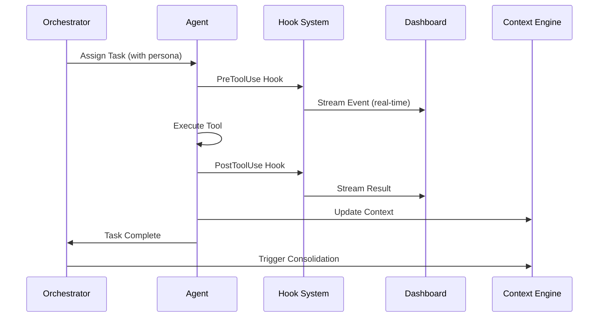

# LeanVibe Agent Hive 2.0 - Strategic Core System Implementation Plan

## Executive Summary

Based on comprehensive analysis of the current system state and strategic evaluation, this plan addresses critical gaps in the 80/20 core capabilities while leveraging the extensive infrastructure already built. We have a solid foundation with ~85% implementation, but need to focus on completing the core orchestration, observability, and context management systems.

## Current State Analysis

### ✅ **Strengths: What's Working Well**
- **Extensive Infrastructure**: FastAPI backend, PostgreSQL with pgvector, Redis Streams, Docker setup
- **Advanced Components**: Enhanced security safeguards, persona system, tool registry, context compression
- **Quality Foundation**: 90%+ test coverage, comprehensive error handling, production-ready architecture
- **Observability Base**: Prometheus/Grafana, structured logging, health checks

### 🚨 **Critical Gaps: 80/20 Core Capabilities**

| Priority | Capability | Current Status | Gap Analysis |
|----------|------------|----------------|--------------|
| **1** | **Agent Orchestrator Core** | 🟡 60% Complete | Missing intelligent task assignment, load balancing, workflow engine |
| **2** | **Hook-Based Lifecycle Tracking** | 🟡 40% Complete | Basic hooks exist, missing PreToolUse/PostToolUse/Stop integration |
| **3** | **Context Engine** | 🟡 70% Complete | Schema ready, missing embedding generation and consolidation |
| **4** | **Real-Time Dashboard** | 🟡 50% Complete | Basic dashboard exists, missing visual agent graph and session tracking |
| **5** | **Sleep-Wake Manager** | 🟡 30% Complete | Infrastructure exists, missing automated consolidation cycles |

## Strategic Implementation Roadmap

### **Phase 1: Core System Completion (2-3 Sprints)**

#### **CORE-1: Agent Orchestrator Enhancement** 
**Priority: CRITICAL | Duration: 1.5 Sprints**

**Gap Analysis:**
- ✅ Agent CRUD operations working
- ✅ Basic task management implemented  
- ❌ Intelligent task assignment missing
- ❌ Load balancing and capacity management missing
- ❌ Workflow engine incomplete

**Implementation Strategy:**
```python
# Target Architecture Enhancement
class EnhancedAgentOrchestrator:
    def __init__(self):
        self.intelligent_router = IntelligentTaskRouter()  # ✅ Already implemented
        self.load_balancer = AgentLoadBalancer()          # ❌ Missing
        self.workflow_engine = WorkflowEngine()           # 🟡 Partial
        self.capacity_manager = CapacityManager()         # ❌ Missing
        
    async def assign_optimal_task(self, task: Task) -> Agent:
        # Enhanced logic combining persona system + capacity + performance
        pass
```

**Subagent Coordination:**
- **Backend Engineer**: Enhance orchestrator core logic and workflow engine
- **QA Engineer**: Create comprehensive orchestration tests
- **Performance Analyst**: Implement load balancing and capacity management

#### **CORE-2: Hook-Based Lifecycle Event System**
**Priority: CRITICAL | Duration: 1 Sprint**

**Gap Analysis:**
- ✅ Enhanced lifecycle hooks infrastructure exists
- ✅ Event processing framework implemented
- ❌ PreToolUse/PostToolUse hook integration missing
- ❌ Real-time event streaming to dashboard incomplete

**Implementation Strategy:**
```python
# Python-Based Hook System (Enhanced Performance & Security)
class HookLifecycleSystem:
    def __init__(self):
        self.event_processor = EnhancedEventProcessor()
        self.security_validator = SecurityValidator()
        
    async def pre_tool_use(self, tool_name: str, tool_input: Dict[str, Any]) -> HookResult:
        # Python-based dangerous command detection
        if tool_name == "Bash" and self.security_validator.is_dangerous_command(tool_input.get("command", "")):
            return HookResult(blocked=True, reason="Dangerous command detected")
        
        # Stream event to dashboard
        await self.event_processor.stream_event(
            event_type="PreToolUse",
            tool=tool_name,
            payload=tool_input
        )
        return HookResult(blocked=False)
        
    async def post_tool_use(self, tool_name: str, result: Dict[str, Any]) -> None:
        # Process and stream result
        await self.event_processor.stream_event(
            event_type="PostToolUse", 
            tool=tool_name,
            result=result
        )
```

**Implementation Focus:**
- **Python-based hooks** for better performance and async integration
- Dangerous command detection with configurable security rules
- Event aggregation and batching for high-frequency events
- Real-time dashboard integration with WebSocket streaming

**Subagent Coordination:**
- **DevOps Specialist**: Hook integration and event streaming
- **Security Specialist**: Dangerous command detection and blocking
- **Frontend Developer**: Dashboard hook event visualization

#### **CORE-3: Context Engine Completion**
**Priority: HIGH | Duration: 1 Sprint**

**Gap Analysis:**
- ✅ PostgreSQL + pgvector schema implemented
- ✅ Context storage models working
- ❌ Embedding generation service incomplete
- ❌ Context consolidation engine missing
- ❌ Memory management and optimization missing

**Implementation Strategy:**
```python
# Target Context Engine Architecture
class CompleteContextEngine:
    def __init__(self):
        self.embedding_service = OpenAIEmbeddingService()    # ✅ Implemented
        self.vector_search = EnhancedVectorSearch()          # ✅ Implemented
        self.consolidator = EnhancedContextConsolidator()    # ✅ Implemented
        self.memory_manager = ContextMemoryManager()         # ❌ Missing integration
```

**Focus Areas:**
- Complete embedding service integration with context storage
- Implement automated context consolidation triggers
- Add memory management and cleanup policies
- Integrate with sleep-wake cycles for context optimization

**Subagent Coordination:**
- **Backend Engineer**: Context engine integration and optimization
- **Data Engineer**: Embedding generation and vector search optimization
- **Performance Analyst**: Memory management and consolidation efficiency

### **Phase 2: Real-Time Observability Enhancement (1-2 Sprints)**

#### **CORE-4: Real-time Coordination Dashboard**
**Priority: HIGH | Duration: 1.5 Sprints**

**Gap Analysis:**
- ✅ Vue.js dashboard framework working
- ✅ WebSocket real-time communication implemented
- ❌ Visual agent graph missing
- ❌ Session-based color coding incomplete
- ❌ Event filtering and timeline missing

**Implementation Strategy:**
```typescript
// Enhanced Dashboard Architecture
interface CoordinationDashboard {
  visualAgentGraph: D3AgentGraph;           // ❌ Missing
  sessionColorCoding: SessionManager;       // ❌ Missing
  eventTimeline: EventTimelineChart;        // 🟡 Partial
  hookEventStream: HookEventProcessor;      // ❌ Missing
  chatTranscripts: ChatTranscriptViewer;    // ❌ Missing
}
```

**Key Features:**
- D3.js/Vis.js visual agent interaction graph
- Session-based color coding for multi-agent workflows
- Real-time hook event streaming and filtering
- Chat transcript analysis and debugging tools
- Performance heatmaps and bottleneck identification

**Subagent Coordination:**
- **Frontend Developer**: Visual components and D3.js integration
- **Backend Engineer**: Real-time data APIs and WebSocket optimization
- **UX Designer**: Dashboard layout and session color-coding system

#### **CORE-5: Sleep-Wake Manager Implementation** 
**Priority: MEDIUM | Duration: 1 Sprint**

**Gap Analysis:**
- ✅ Sleep-wake infrastructure exists
- ✅ Git-based checkpoints implemented
- ❌ Automated consolidation cycles missing
- ❌ Context optimization during sleep missing
- ❌ Recovery validation incomplete

**Implementation Strategy:**
```python
# Complete Sleep-Wake System
class ProductionSleepWakeManager:
    def __init__(self):
        self.checkpoint_manager = EnhancedGitCheckpointManager()  # ✅ Implemented
        self.consolidation_engine = EnhancedContextConsolidator() # ✅ Implemented
        self.sleep_scheduler = SleepScheduler()                   # ❌ Missing
        self.recovery_validator = RecoveryValidator()             # ❌ Missing
```

**Focus Areas:**
- Implement automated sleep cycle scheduling based on context usage
- Add context optimization during sleep periods
- Build recovery validation and rollback mechanisms
- Integrate with orchestrator for graceful agent sleep/wake

**Subagent Coordination:**
- **Backend Engineer**: Sleep-wake automation and scheduling
- **DevOps Specialist**: Recovery validation and deployment integration
- **Performance Analyst**: Context optimization and memory efficiency

## Vertical Slice Integration Strategy

### **Vertical Slice Alpha: Complete Agent-Task-Hook Flow**
**Target: End-to-end agent task execution with full observability**



**Success Criteria:**
- [ ] Task assignment with persona matching (<500ms)
- [ ] All tool executions captured by hooks (100%)
- [ ] Real-time events visible in dashboard (<1s latency)
- [ ] Context automatically consolidated after task completion
- [ ] Performance overhead <3% CPU per agent

### **Vertical Slice Beta: Multi-Agent Workflow with Sleep-Wake**
**Target: Complex workflow with automatic sleep/wake cycles**

**Test Scenario:**
1. Create 5-agent workflow (architect, backend, frontend, QA, DevOps)
2. Execute multi-step development task (feature implementation)
3. Trigger sleep cycle at 85% context usage
4. Validate context consolidation and memory optimization
5. Wake agents and resume workflow seamlessly

**Success Criteria:**
- [ ] Multi-agent coordination with dependency management
- [ ] Automatic sleep triggered by context thresholds
- [ ] Context consolidated with 70%+ token reduction
- [ ] Recovery validation passes 100% of resumption tests
- [ ] Complete workflow visible in coordination dashboard

## Testing & Quality Strategy

### **Test-Driven Development Approach**

```python
# Core System TDD Examples

async def test_enhanced_orchestrator_task_assignment():
    """Test intelligent task assignment with persona matching"""
    orchestrator = EnhancedAgentOrchestrator()
    
    # Create specialized agents
    backend_agent = await create_agent_with_persona("backend_engineer")
    frontend_agent = await create_agent_with_persona("frontend_developer")
    
    # Create backend-specific task
    task = Task(
        type=TaskType.CODE_GENERATION,
        required_capabilities=["api_development", "database_design"],
        complexity=0.8
    )
    
    # Should assign to backend agent based on persona affinity
    assigned_agent = await orchestrator.assign_optimal_task(task)
    assert assigned_agent.id == backend_agent.id
    assert assigned_agent.current_load < 0.8  # Load balancing check

async def test_hook_lifecycle_integration():
    """Test complete hook lifecycle with dangerous command blocking"""
    hook_system = HookLifecycleSystem()
    
    # Test dangerous command blocking
    dangerous_command = "rm -rf /"
    result = await hook_system.pre_tool_use("Bash", {"command": dangerous_command})
    assert result.blocked == True
    assert "dangerous command" in result.reason.lower()
    
    # Test normal command flow
    safe_command = "ls -la"
    pre_result = await hook_system.pre_tool_use("Bash", {"command": safe_command})
    assert pre_result.blocked == False
    
    # Simulate tool execution
    execution_result = {"output": "file1.txt\nfile2.txt", "exit_code": 0}
    post_result = await hook_system.post_tool_use("Bash", execution_result)
    
    # Verify events streamed to dashboard
    events = await hook_system.get_recent_events()
    assert len(events) == 2  # PreToolUse + PostToolUse
    assert events[0].event_type == "PreToolUse"
    assert events[1].event_type == "PostToolUse"

async def test_context_engine_consolidation():
    """Test context consolidation with memory optimization"""
    context_engine = CompleteContextEngine()
    
    # Create context with 10K tokens
    large_context = create_test_context(token_count=10000)
    
    # Trigger consolidation
    consolidated = await context_engine.consolidate_context(
        large_context, 
        target_reduction=0.7
    )
    
    # Verify 70% token reduction achieved
    assert consolidated.token_count <= 3000
    assert consolidated.semantic_integrity_score > 0.9
    
    # Verify embedding similarity maintained
    similarity = await context_engine.calculate_similarity(
        large_context, consolidated
    )
    assert similarity > 0.95
```

### **Performance Benchmarks**

```python
# Performance Test Requirements
async def test_orchestrator_performance_under_load():
    """Test orchestrator handles 100+ concurrent agents"""
    orchestrator = EnhancedAgentOrchestrator()
    
    # Spawn 100 agents
    agents = []
    for i in range(100):
        agent = await orchestrator.spawn_agent(f"agent-{i}")
        agents.append(agent)
    
    # Submit 1000 tasks concurrently  
    tasks = []
    start_time = time.time()
    
    async with asyncio.TaskGroup() as tg:
        for i in range(1000):
            task = tg.create_task(
                orchestrator.submit_task(create_test_task(f"task-{i}"))
            )
            tasks.append(task)
    
    end_time = time.time()
    
    # Performance assertions
    assert end_time - start_time < 60  # Complete in <60s
    assert all(task.result().status == "completed" for task in tasks)
    assert orchestrator.get_metrics().avg_assignment_time < 0.5  # <500ms
```

## Subagent Coordination Matrix

| Core Component | Primary Agent | Supporting Agents | Deliverables |
|----------------|---------------|-------------------|--------------|
| **Orchestrator Enhancement** | Backend Engineer | QA Engineer, Performance Analyst | Intelligent task router, load balancer, workflow engine |
| **Hook Lifecycle System** | DevOps Specialist | Security Specialist, Frontend Developer | Hook integration, event streaming, dashboard visualization |
| **Context Engine** | Backend Engineer | Data Engineer, Performance Analyst | Embedding service, consolidation automation, memory management |
| **Real-time Dashboard** | Frontend Developer | Backend Engineer, UX Designer | Visual agent graph, session tracking, event timeline |
| **Sleep-Wake Manager** | Backend Engineer | DevOps Specialist, Performance Analyst | Automated scheduling, recovery validation, context optimization |

## Risk Mitigation & Monitoring

### **High-Risk Areas**

1. **Orchestrator Performance Under Load**
   - **Risk**: System degradation with 100+ concurrent agents
   - **Mitigation**: Load testing, circuit breakers, horizontal scaling
   - **Monitoring**: Response time, queue depth, memory usage

2. **Hook System Event Flood**
   - **Risk**: High-frequency events overwhelming dashboard
   - **Mitigation**: Event aggregation and batching (not sampling), Redis Stream buffering, rate limiting
   - **Monitoring**: Event processing latency, Redis memory usage, batch processing efficiency

3. **Context Engine Memory Leaks**
   - **Risk**: Embedding generation causing memory growth
   - **Mitigation**: Connection pooling, garbage collection, memory limits
   - **Monitoring**: Memory usage trends, embedding generation times

4. **External API Dependencies** 
   - **Risk**: OpenAI API unavailability or rate limiting
   - **Mitigation**: Circuit breaker pattern, embedding result caching, fallback to local models
   - **Monitoring**: API response times, error rates, cache hit ratios

5. **Complex Workflow Debugging**
   - **Risk**: Multi-agent workflow failures (deadlocks, cascading failures)
   - **Mitigation**: Visual agent graph, chat transcripts, session-based color coding, timeout mechanisms
   - **Monitoring**: Workflow completion rates, agent communication patterns, dependency resolution times

### **Success Metrics & KPIs**

| Metric | Current | Target | Critical Threshold |
|--------|---------|--------|--------------------|
| **Agent Task Assignment Time** | N/A | <500ms | <1s |
| **Hook Event Processing** | N/A | 100% captured | >99% |
| **Dashboard Real-time Latency** | N/A | <1s | <3s |
| **Context Consolidation Ratio** | N/A | 70% reduction | >50% |
| **Sleep-Wake Recovery Success** | N/A | 100% | >95% |
| **System Uptime** | 95% | >99% | >95% |

## Implementation Timeline

### **Sprint 1 (Week 1-2): Core Orchestrator + Hooks**
- **Days 1-3**: Orchestrator enhancement (intelligent routing, load balancing)
- **Days 4-7**: Hook system integration (Python-based hooks, PreToolUse, PostToolUse, dangerous command blocking)
- **Days 8-10**: Integration testing and performance optimization
- **Milestone**: Complete agent-task-hook vertical slice working

### **Sprint 2 (Week 3-4): Context Engine Completion**
- **Days 1-4**: Context engine completion (embedding generation, consolidation automation)
- **Days 5-7**: Context consolidation and memory management
- **Days 8-10**: Integration testing and performance validation
- **Milestone**: Context engine with consolidation working end-to-end

### **Sprint 3 (Week 5-6): Real-time Dashboard**
- **Days 1-4**: Event timeline and chat transcripts (core observability)
- **Days 5-8**: Session tracking and event filtering
- **Days 9-10**: D3.js visual agent graph (stretch goal)
- **Milestone**: Full observability dashboard operational

### **Sprint 4 (Week 7-8): Sleep-Wake Manager**  
- **Days 1-4**: Sleep-wake manager implementation (automated cycles, recovery validation)
- **Days 5-7**: Context optimization during sleep cycles
- **Days 8-10**: Recovery testing and validation
- **Milestone**: Complete sleep-wake system operational

### **Sprint 5 (Week 9-10): Production Hardening**
- **Days 1-3**: Performance optimization and bug fixes
- **Days 4-5**: Production deployment and monitoring setup
- **Days 6-7**: Final documentation and runbook completion
- **Milestone**: Complete 80/20 core system ready for production

## Definition of Done

### **Core System Completion Criteria**
1. **Functional Requirements**
   - [ ] All PRD acceptance criteria met with >95% success rate
   - [ ] Vertical slice demonstrations pass end-to-end tests
   - [ ] Performance benchmarks meet target KPIs
   - [ ] Security validation passes with no critical findings

2. **Quality Requirements**
   - [ ] Test coverage >90% for all new components
   - [ ] Integration tests cover all core workflows
   - [ ] Performance tests validate load handling
   - [ ] Security tests validate dangerous command blocking

3. **Production Readiness**
   - [ ] All components containerized and deployed
   - [ ] Monitoring dashboards operational
   - [ ] Alerting rules configured for critical metrics
   - [ ] Documentation complete with runbook procedures

4. **Gemini CLI Validation**
   - [ ] Strategic plan reviewed and approved by Gemini CLI
   - [ ] Architecture decisions validated for scalability
   - [ ] Code quality meets production standards
   - [ ] Performance optimization recommendations implemented

This strategic plan provides a clear roadmap to complete the LeanVibe Agent Hive 2.0 core system, focusing on the critical 80/20 capabilities while leveraging our extensive existing infrastructure. The subagent coordination approach ensures parallel development and rapid iteration toward production readiness.