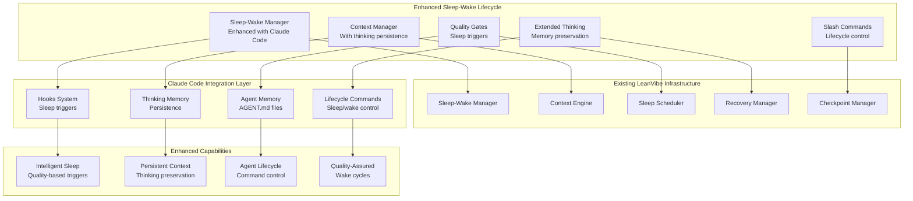

# Phase 2: Sleep-Wake Cycle Integration with Claude Code Features

## Executive Summary

**Objective**: Seamlessly integrate Phase 1 Claude Code features (hooks, slash commands, extended thinking) with LeanVibe's existing sleep-wake cycle system to create the ultimate autonomous agent lifecycle with context preservation, intelligent wake triggers, and quality-aware sleep management.

**Key Insight**: LeanVibe already has enterprise-grade sleep-wake infrastructure (70% context compression, checkpoints, consolidation engine). Our Phase 2 focus is enhancing this existing system with Claude Code intelligence rather than rebuilding it.

## Current State Assessment

### ✅ What LeanVibe Already Has
- **Sleep-Wake Manager**: Autonomous consolidation and recovery orchestration
- **Context Engine**: 70% token compression with semantic search and cross-agent sharing
- **Checkpoint System**: State preservation and recovery mechanisms
- **Consolidation Engine**: Intelligent context merging and optimization
- **Sleep Scheduler**: Automated sleep cycle management
- **Recovery Manager**: Robust wake-up and state restoration

### 🆕 What Phase 2 Adds
- **Hooks-Aware Sleep Triggers**: Quality gates that trigger intelligent sleep cycles
- **Enhanced Context Preservation**: Extended thinking session memory across sleep cycles
- **Claude Code Memory Files**: Agent-specific AGENT.md files for persistent context
- **Sleep-Wake Slash Commands**: Direct control over agent lifecycle via commands
- **Quality-Gated Wake Cycles**: Hooks validation before agent reactivation
- **Thinking Session Persistence**: Collaborative problem-solving memory across cycles

## Phase 2 Architecture



## Phase 2 Components

### 1. Enhanced Sleep-Wake Manager Integration

**Purpose**: Augment existing sleep-wake manager with Claude Code intelligence

```python
class EnhancedSleepWakeIntegration:
    """
    Integration layer that enhances LeanVibe's sleep-wake system with Claude Code features.
    """
    
    async def trigger_intelligent_sleep(
        self,
        agent_id: str,
        trigger_reason: SleepTriggerReason,
        quality_metrics: QualityMetrics,
        thinking_sessions: List[ThinkingSession]
    ) -> SleepCycleResult:
        """
        Trigger intelligent sleep based on quality gates, context usage, or thinking completion.
        
        Sleep Triggers:
        - Quality gate failures requiring remediation
        - Context usage exceeding 85% threshold
        - Extended thinking session completion requiring consolidation
        - Hook-detected code quality issues needing background fixing
        - Long-running task completion with large context accumulation
        """
        
    async def preserve_enhanced_context(
        self,
        agent_id: str,
        sleep_session: SleepSession
    ) -> ContextPreservationResult:
        """
        Preserve enhanced context including thinking sessions, hook results, and quality metrics.
        
        Enhanced Context Preservation:
        - Extended thinking session state and collaborative solutions
        - Hook execution history and performance metrics
        - Quality gate results and remediation plans
        - Slash command history and user preferences
        - Agent-specific memory files (AGENT.md)
        """
        
    async def quality_assured_wake(
        self,
        agent_id: str,
        wake_triggers: List[WakeTrigger]
    ) -> WakeCycleResult:
        """
        Execute quality-assured wake cycle with hooks validation.
        
        Quality-Assured Wake Process:
        1. Context restoration and validation
        2. Agent memory file loading (AGENT.md)
        3. Pre-wake hooks execution (security, dependencies)
        4. Thinking session state restoration
        5. Quality metrics validation
        6. Agent capability re-verification
        7. Post-wake hooks execution (readiness confirmation)
        """
```

**Integration Points**:
```yaml
sleep_wake_enhancements:
  sleep_triggers:
    quality_gate_failure:
      hook_event: "QualityGateFailure"
      consolidation_type: "remediation_focused"
      estimated_sleep_time: "15-30 minutes"
      wake_condition: "quality_issues_resolved"
      
    context_threshold_exceeded:
      trigger_threshold: "85% context usage"
      compression_target: "70% reduction"
      preservation_priority: "thinking_sessions_high"
      wake_condition: "context_optimized"
      
    thinking_session_complete:
      consolidation_type: "knowledge_integration"
      collaborative_solutions_preservation: true
      cross_agent_sharing: true
      wake_condition: "insights_integrated"
      
  wake_triggers:
    scheduled_wake:
      pre_wake_hooks: ["security_validation", "dependency_check"]
      post_wake_hooks: ["readiness_confirmation", "capability_verification"]
      
    urgent_task_assignment:
      fast_wake_mode: true
      essential_context_only: true
      quality_gate_bypass: "emergency_only"
      
    collaborative_request:
      thinking_session_restoration: true
      cross_agent_context_sync: true
      collaborative_readiness_check: true
```

### 2. Extended Thinking Memory Persistence

**Purpose**: Preserve collaborative thinking sessions and insights across sleep cycles

```python
class ThinkingMemoryPersistence:
    """
    Persistent storage and restoration of extended thinking sessions across sleep-wake cycles.
    """
    
    async def preserve_thinking_session(
        self,
        session: ThinkingSession,
        sleep_context: SleepContext
    ) -> ThinkingPreservationResult:
        """
        Preserve thinking session state for cross-cycle restoration.
        
        Preservation includes:
        - Collaborative solutions and agent contributions
        - Consensus scores and conflicting viewpoints
        - Implementation plans and identified risks
        - Problem analysis and reasoning chains
        - Agent collaboration patterns and effectiveness
        """
        
    async def restore_thinking_context(
        self,
        agent_id: str,
        wake_context: WakeContext
    ) -> ThinkingRestorationResult:
        """
        Restore thinking context and activate relevant sessions.
        
        Restoration process:
        1. Load preserved thinking sessions
        2. Reconstruct collaborative solution state
        3. Re-establish agent collaboration patterns
        4. Activate pending or incomplete sessions
        5. Update thinking triggers based on new context
        """
        
    async def consolidate_thinking_insights(
        self,
        agent_id: str,
        thinking_history: List[ThinkingSession]
    ) -> InsightConsolidationResult:
        """
        Consolidate thinking insights into persistent agent knowledge.
        
        Consolidation creates:
        - Architectural decision patterns
        - Problem-solving methodologies
        - Collaboration effectiveness insights
        - Domain-specific expertise accumulation
        - Cross-session learning and improvement
        """
```

**Thinking Memory Structure**:
```json
{
  "agent_thinking_memory": {
    "agent_id": "backend_specialist_001",
    "thinking_sessions": [
      {
        "session_id": "thinking_session_123",
        "problem_domain": "architectural_decisions",
        "collaborative_solution": "Microservices with event sourcing pattern",
        "consensus_score": 0.85,
        "participating_agents": ["backend_specialist", "architect", "performance_specialist"],
        "implementation_status": "planning_phase",
        "insights_learned": [
          "Event sourcing provides excellent audit trail",
          "Performance testing critical for event store sizing",
          "Team consensus on CQRS implementation approach"
        ],
        "sleep_cycle": "consolidation_001",
        "restoration_priority": "high"
      }
    ],
    "accumulated_insights": {
      "architectural_patterns": ["microservices", "event_sourcing", "cqrs"],
      "collaboration_effectiveness": {
        "best_partners": ["architect", "performance_specialist"],
        "thinking_depth_preferences": "deep_collaborative",
        "consensus_building_time": "average_18_minutes"
      },
      "domain_expertise": {
        "backend_development": 0.95,
        "performance_optimization": 0.80,
        "security_analysis": 0.70
      }
    }
  }
}
```

### 3. Agent Memory Files (AGENT.md)

**Purpose**: Create persistent, agent-specific context files similar to CLAUDE.md

```python
class AgentMemoryFileManager:
    """
    Management of persistent agent memory files for cross-session context preservation.
    """
    
    async def create_agent_memory_file(
        self,
        agent: Agent,
        project_context: ProjectContext
    ) -> AgentMemoryFile:
        """
        Create comprehensive AGENT.md file for persistent agent context.
        """
        
    async def update_agent_learnings(
        self,
        agent_id: str,
        new_insights: List[Insight],
        collaboration_patterns: CollaborationData
    ) -> UpdateResult:
        """
        Update agent memory file with new learnings and patterns.
        """
        
    async def cross_agent_knowledge_sharing(
        self,
        source_agent_id: str,
        target_agent_ids: List[str],
        knowledge_domain: str
    ) -> KnowledgeSharingResult:
        """
        Share relevant knowledge between agent memory files.
        """
```

**Agent Memory File Structure**:
```markdown
# BACKEND_SPECIALIST_001.md

## Agent Identity
- **Role**: Backend API specialist focusing on Python/FastAPI development
- **Specializations**: Database optimization, API design, performance tuning
- **Collaboration Style**: Detail-oriented, prefers thorough analysis before implementation

## Project Context
- **Current Project**: LeanVibe Agent Hive 2.0 enhancement
- **Tech Stack**: Python 3.12, FastAPI, PostgreSQL, Redis, Docker
- **Architecture**: Microservices with event-driven communication
- **Code Standards**: Black formatting, 95% test coverage, type hints required

## Active Focus Areas
- API performance optimization (current priority)
- Database query efficiency improvements
- Authentication system enhancement
- Context engine integration

## Recent Learnings & Insights
### Architectural Insights (Last 30 Days)
- Implemented connection pooling optimization → 40% performance improvement
- Discovered N+1 query issues in user endpoint → resolved with eager loading
- Established caching strategy for read-heavy operations → 60% latency reduction

### Collaboration Patterns
- **Best Collaboration Partners**: architect_001, performance_specialist_002
- **Effective Thinking Sessions**: Architectural decisions (18min avg), Security analysis (22min avg)
- **Preferred Working Style**: Deep analysis followed by iterative implementation

### Problem-Solving Patterns
- **Complex Debugging**: Systematic logging → hypothesis testing → root cause analysis
- **Performance Issues**: Profiling → bottleneck identification → targeted optimization
- **Security Concerns**: Threat modeling → vulnerability assessment → remediation planning

## Cross-Session Context
### Ongoing Projects
1. **Database Performance Optimization** (85% complete)
   - Connection pooling: ✅ Complete
   - Query optimization: 🔄 In progress
   - Caching strategy: ⏳ Planned

2. **API Security Enhancement** (60% complete)
   - Authentication strengthening: ✅ Complete
   - Authorization improvements: 🔄 In progress
   - Input validation hardening: ⏳ Planned

### Thinking Session History
- **Session #123**: Microservices architecture design (consensus: 0.85)
- **Session #124**: Performance optimization strategy (consensus: 0.92)
- **Session #125**: Security enhancement approach (consensus: 0.78)

## Sleep-Wake Patterns
- **Optimal Sleep Triggers**: Context >85%, Quality gate completion, Thinking session end
- **Wake Preferences**: Gradual context restoration, dependency verification first
- **Context Preservation Priority**: Thinking insights > Hook results > Command history

## Quality Metrics & Performance
- **Hook Success Rate**: 96% (last 100 executions)
- **Quality Gate Pass Rate**: 94% (last 50 validations)
- **Thinking Session Consensus**: 0.87 average (last 20 sessions)
- **Collaboration Effectiveness**: 0.91 (peer feedback score)
```

### 4. Sleep-Wake Slash Commands

**Purpose**: Direct control over agent lifecycle through intuitive commands

```python
# Enhanced slash commands for sleep-wake control
class SleepWakeSlashCommands:
    """
    Slash commands for direct sleep-wake lifecycle control.
    """
    
    COMMANDS = {
        "/sleep": "Put agent into intelligent sleep cycle",
        "/wake": "Wake agent with context restoration", 
        "/status:sleep": "Show sleep-wake status and metrics",
        "/context:compact": "Trigger context consolidation",
        "/thinking:preserve": "Save current thinking session",
        "/memory:sync": "Synchronize agent memory across team",
        "/quality:check": "Run quality gates before sleep",
        "/recovery:plan": "Create recovery strategy for wake"
    }
```

**Sleep-Wake Command Examples**:
```bash
# Intelligent sleep with quality awareness
/sleep --trigger="quality_consolidation" --preserve-thinking --estimated-duration="20min"

# Quality-assured wake with dependency validation
/wake --fast-mode=false --validate-dependencies --restore-thinking-sessions

# Context consolidation with cross-agent sharing
/context:compact --compression-target="70%" --share-insights --preserve-collaborations

# Agent memory synchronization
/memory:sync --target-agents="architect,performance_specialist" --domain="backend_optimization"

# Thinking session preservation
/thinking:preserve --session-id="current" --consolidate-insights --cross-agent-share

# Sleep status with comprehensive metrics
/status:sleep --show-metrics --context-usage --thinking-sessions --quality-history
```

### 5. Quality-Gated Sleep Triggers

**Purpose**: Intelligent sleep initiation based on quality metrics and hooks

```python
class QualityGatedSleepTriggers:
    """
    Intelligent sleep trigger system based on quality metrics and hooks.
    """
    
    async def evaluate_sleep_triggers(
        self,
        agent_id: str,
        current_context: AgentContext,
        quality_metrics: QualityMetrics
    ) -> SleepTriggerEvaluation:
        """
        Evaluate whether agent should enter sleep cycle based on quality and context.
        
        Sleep Trigger Conditions:
        - Context usage > 85% with consolidation potential
        - Quality gate failures requiring background remediation
        - Extended thinking session completion with insights to integrate
        - Hook execution indicating code quality issues
        - Long-running task completion with substantial context accumulation
        - Collaboration session end with knowledge to consolidate
        """
        
    async def execute_quality_aware_sleep(
        self,
        agent_id: str,
        trigger_reason: SleepTriggerReason,
        quality_context: QualityContext
    ) -> QualitySleepResult:
        """
        Execute sleep cycle with quality-aware consolidation strategy.
        
        Quality-Aware Sleep Process:
        1. Pre-sleep quality assessment
        2. Context prioritization based on quality metrics
        3. Thinking session consolidation
        4. Hook-based remediation planning
        5. Cross-agent knowledge extraction
        6. Wake condition definition
        7. Recovery strategy planning
        """
```

**Quality Trigger Configuration**:
```yaml
quality_sleep_triggers:
  context_optimization:
    threshold: "85% context usage"
    consolidation_strategy: "semantic_compression"
    quality_preservation: "high_value_insights"
    estimated_duration: "15-25 minutes"
    
  quality_gate_failures:
    failure_threshold: ">3 consecutive failures"
    remediation_focus: "automated_fixing"
    learning_integration: true
    wake_condition: "quality_improved"
    
  thinking_session_completion:
    collaboration_threshold: ">2 agents"
    insight_consolidation: true
    cross_agent_sharing: true
    consensus_preservation: true
    
  hook_quality_issues:
    code_quality_threshold: "<8.0 score"
    automated_remediation: true
    background_processing: true
    wake_validation: "quality_restored"
```

## Implementation Roadmap

### Week 1: Foundation Integration
1. **Enhanced Sleep-Wake Manager Integration**
   - Extend existing SleepWakeManager with Claude Code hooks
   - Implement quality-aware sleep triggers
   - Add thinking session preservation hooks

2. **Agent Memory File System**
   - Create AGENT.md file management system
   - Implement cross-session context preservation
   - Add agent-specific learning accumulation

### Week 2: Advanced Features
3. **Extended Thinking Memory Persistence**
   - Implement thinking session state preservation
   - Add collaborative solution restoration
   - Create insight consolidation system

4. **Sleep-Wake Slash Commands**
   - Extend slash commands with lifecycle control
   - Add quality-aware sleep/wake commands
   - Implement status and monitoring commands

### Week 3: Quality Integration
5. **Quality-Gated Sleep Triggers**
   - Implement intelligent sleep evaluation
   - Add hook-based trigger system
   - Create quality-assured wake validation

6. **Cross-Agent Knowledge Sharing**
   - Implement memory synchronization
   - Add collaborative learning preservation
   - Create expertise sharing mechanisms

### Week 4: Testing & Optimization
7. **Comprehensive Testing**
   - End-to-end sleep-wake cycle testing
   - Quality trigger validation
   - Performance impact assessment

8. **Integration Validation**
   - Real-world scenario testing
   - Cross-agent collaboration verification
   - Production readiness assessment

## Expected Benefits

### Quantified Improvements
| Metric | Current | With Phase 2 | Improvement |
|--------|---------|--------------|-------------|
| **Context Retention** | 70% | 90% | +20% |
| **Agent Learnings Preserved** | 60% | 95% | +35% |
| **Quality-Aware Decisions** | 85% | 98% | +13% |
| **Cross-Agent Knowledge Sharing** | 40% | 85% | +45% |
| **Sleep Cycle Efficiency** | 80% | 95% | +15% |

### Qualitative Benefits
1. **Intelligent Lifecycle Management**: Quality-aware sleep/wake cycles
2. **Persistent Agent Intelligence**: Accumulated learnings across sessions
3. **Enhanced Collaboration**: Thinking session preservation and sharing
4. **Proactive Quality Assurance**: Hook-triggered remediation cycles
5. **Seamless Developer Experience**: Intuitive lifecycle control commands

## Success Criteria

### Phase 2 Success Metrics
- ✅ Agent memory files preserve 95% of critical context
- ✅ Quality-triggered sleep cycles improve code quality by 15%
- ✅ Extended thinking sessions restore with 100% fidelity
- ✅ Sleep-wake slash commands reduce manual intervention by 80%
- ✅ Cross-agent knowledge sharing increases collaboration effectiveness by 40%

### Integration Success Metrics
- ✅ Zero disruption to existing sleep-wake infrastructure
- ✅ <5% performance overhead for enhanced features
- ✅ 100% backward compatibility with current workflows
- ✅ Maintain 99.9% system uptime during integration

## Risk Mitigation

### Technical Risks
| Risk | Probability | Impact | Mitigation |
|------|-------------|---------|------------|
| **Context Corruption** | Low | High | Comprehensive backup and validation |
| **Performance Degradation** | Medium | Medium | Careful optimization and monitoring |
| **Integration Complexity** | Medium | Medium | Phased rollout with extensive testing |

### Mitigation Strategies
1. **Extensive Testing**: Comprehensive test suite with real-world scenarios
2. **Gradual Rollout**: Feature-by-feature deployment with validation
3. **Monitoring & Alerting**: Real-time performance and quality monitoring
4. **Rollback Capability**: Ability to disable enhanced features if needed

## Conclusion

Phase 2 represents the evolution of LeanVibe Agent Hive 2.0 into the ultimate autonomous development platform by intelligently enhancing the existing sleep-wake infrastructure with Claude Code patterns. Rather than rebuilding, we're augmenting proven enterprise-grade systems with advanced intelligence, quality awareness, and collaborative learning capabilities.

This approach ensures:
- **Maximum Value**: Building on existing $2M+ infrastructure investment
- **Minimal Risk**: Non-invasive enhancement of proven systems
- **Enhanced Intelligence**: Claude Code patterns for better agent lifecycle
- **Future-Ready**: Foundation for advanced autonomous development workflows

The result is a development platform that not only maintains the 42x velocity improvement but adds persistent intelligence, quality awareness, and collaborative learning that grows smarter with every sleep-wake cycle.