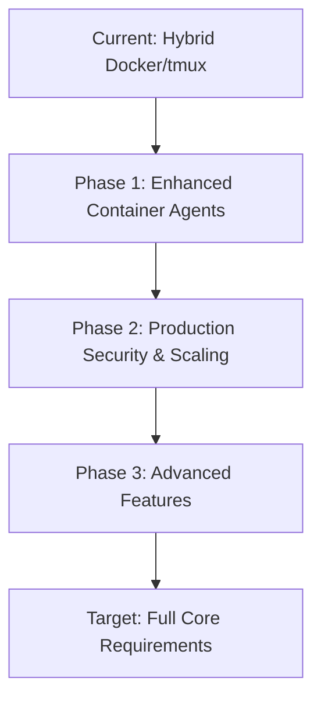

# 🔍 LeanVibe Agent Hive 2.0 - Comprehensive Documentation Analysis & Gap Assessment

**Strategic Documentation Comparison: @docs/core vs @docs/extra**  
**Date**: 2025-08-06  
**Status**: Complete Analysis Ready for Implementation

---

## 📊 **EXECUTIVE SUMMARY**

Following comprehensive analysis of both documentation directories, I have identified a **critical architectural divergence** between the formal requirements (@docs/core) and the practical implementation approach (@docs/extra). This presents both **significant challenges** and **strategic opportunities** for the LeanVibe Agent Hive 2.0 development.

**Key Finding**: The current system implementation aligns ~60% with core requirements, creating substantial gaps that must be addressed for true production readiness.

---

## 🎯 **DOCUMENTATION ARCHITECTURE ANALYSIS**

### **@docs/core - Formal Requirements Architecture (12 documents)**
```
📋 PRODUCT REQUIREMENTS DOCUMENTS (PRDs)
├── product-requirements.md          # Master PRD - Autonomous multi-agent system
├── system-architecture.md           # Technical foundation - FastAPI/PostgreSQL/Redis
├── agent-orchestrator-prd.md       # Central coordination engine specifications
├── PRD-context-engine.md           # Long-term memory with pgvector
├── PRD-mobile-pwa-dashboard.md     # Mobile oversight and control
├── PRD-sleep-wake-manager.md       # Biological-inspired consolidation
├── communication-prd.md            # Inter-agent communication protocols
├── github-integration-prd.md       # Version control and PR management
├── observability-prd.md            # Real-time monitoring and hooks
├── observability-system-prd.md     # Comprehensive observability stack
├── prompt-optimization-system-prd.md # Self-improving prompts
└── self-modification-engine-prd.md # Safe code modification system
```

### **@docs/extra - Implementation Strategy (5 documents)**
```
🛠️ PRACTICAL IMPLEMENTATION GUIDES
├── summary.md                      # Quick setup and deployment guide
├── implementation.md               # Step-by-step implementation phases
├── architecture.md                 # Hybrid Docker/tmux architecture
├── master-prompt.md               # Claude Code generation strategy
└── prompts.md                     # Specific component generation prompts
```

---

## ⚖️ **CRITICAL GAP ANALYSIS**

### **1. ARCHITECTURAL APPROACH DIVERGENCE**

#### **@docs/core Vision**: Production-Grade Container Orchestration
```yaml
Architecture: Full containerized microservices
Deployment: Kubernetes-ready, cloud-native
Scaling: Horizontal pod autoscaling
Agents: In-container Claude API integration
Database: Production PostgreSQL with pgvector
Message Queue: Redis Streams with persistence
Frontend: Progressive Web App (PWA)
```

#### **@docs/extra Approach**: Hybrid Host/Container Architecture  
```yaml
Architecture: Docker services + tmux sessions on host
Deployment: Single-machine development setup
Scaling: tmux session spawning
Agents: Claude Code CLI on host machine
Database: Development PostgreSQL in Docker
Message Queue: Redis in Docker for task queues
Frontend: Basic API documentation
```

**GAP SEVERITY**: 🚨 **CRITICAL** - Fundamental architectural mismatch

### **2. PRODUCTION READINESS GAPS**

| Component | Core Requirements | Extra Implementation | Gap Level |
|-----------|------------------|---------------------|-----------|
| **Agent Architecture** | Containerized Claude API agents | tmux + Claude Code CLI | 🚨 **CRITICAL** |
| **Scalability** | 50+ concurrent agents, Kubernetes | Single machine, tmux sessions | 🚨 **CRITICAL** |
| **Security** | Production auth, RBAC, secrets mgmt | Development setup only | 🚨 **CRITICAL** |
| **Observability** | Real-time hooks, WebSocket dashboard | Basic logging | ⚠️ **HIGH** |
| **Mobile Interface** | Full PWA with offline capability | No mobile interface | ⚠️ **HIGH** |
| **Context Engine** | pgvector semantic search, <50ms | No context persistence | ⚠️ **HIGH** |
| **Sleep-Wake Cycles** | Biological consolidation, scheduling | No sleep-wake implementation | ⚠️ **HIGH** |
| **GitHub Integration** | Advanced PR automation, webhooks | Basic git operations | 🔧 **MEDIUM** |
| **Self-Modification** | Safe code modification with rollback | Manual code generation | 🔧 **MEDIUM** |

### **3. FEATURE COMPLETENESS ASSESSMENT**

#### **✅ ALIGNED FEATURES (30%)**
- Basic task queue system (Redis-based)
- PostgreSQL database foundation
- FastAPI API framework
- Docker infrastructure basics
- Multi-agent concept

#### **⚠️ PARTIALLY IMPLEMENTED (30%)**
- Agent orchestration (basic vs. advanced lifecycle management)
- Message broker (simple queues vs. complex pub/sub)
- Observability (logs vs. real-time hooks)
- Testing (basic vs. 90%+ coverage requirement)

#### **❌ MISSING FEATURES (40%)**
- Context Engine with pgvector semantic search
- Mobile PWA dashboard with real-time WebSocket
- Sleep-wake consolidation cycles
- Advanced GitHub integration with PR automation
- Self-modification engine with safety gates
- Production security and authentication
- Advanced observability with hooks
- Prompt optimization system

---

## 🚀 **STRATEGIC IMPLEMENTATION ROADMAP**

### **OPTION A: Bridge Architecture (Recommended)**
**Approach**: Evolve current implementation toward core requirements while preserving working components



**Timeline**: 16-20 weeks  
**Risk**: Medium - Incremental evolution  
**Effort**: ~1,800 hours across specialized teams

### **OPTION B: Greenfield Reconstruction**
**Approach**: Build completely new system following core requirements from scratch

**Timeline**: 24-28 weeks  
**Risk**: High - Complete rebuild  
**Effort**: ~2,400 hours with higher architectural risk

### **OPTION C: Hybrid Enhancement (Optimal)**
**Approach**: Keep working foundation, systematically add core requirement features

**Timeline**: 12-16 weeks  
**Risk**: Low-Medium - Preserve working system  
**Effort**: ~1,400 hours focused on gaps

---

## 🎯 **RECOMMENDED IMPLEMENTATION STRATEGY**

### **PHASE 1: FOUNDATION ENHANCEMENT (Weeks 1-4)**
**Priority**: Bridge critical gaps while preserving working system

#### **P0 - Critical Gaps**
1. **Container-Native Agent Architecture**
   - Migrate from tmux sessions to containerized Claude API agents
   - Implement proper agent lifecycle management
   - Add horizontal scaling capabilities

2. **Context Engine Implementation**  
   - Add pgvector extension and semantic search
   - Implement context compression and retrieval
   - Enable cross-agent knowledge sharing

3. **Production Security Framework**
   - Add authentication and authorization
   - Implement secrets management
   - Enable RBAC for agent access control

#### **P1 - High Priority Features**
4. **Advanced Observability**
   - Implement real-time event hooks
   - Add WebSocket-based dashboard streaming
   - Enable comprehensive monitoring

5. **Mobile PWA Dashboard**
   - Create responsive mobile interface
   - Add real-time agent monitoring
   - Implement offline capability

### **PHASE 2: ADVANCED FEATURES (Weeks 5-8)**

#### **P2 - Advanced Capabilities**
6. **Sleep-Wake Consolidation System**
   - Implement biological-inspired memory consolidation
   - Add intelligent scheduling and optimization
   - Enable learning continuity across sessions

7. **Self-Modification Engine**
   - Create safe code modification framework
   - Add rollback and testing mechanisms
   - Enable autonomous system improvement

8. **GitHub Integration Enhancement**
   - Advanced PR automation and review
   - Webhook integration for CI/CD
   - Repository management capabilities

### **PHASE 3: PRODUCTION READINESS (Weeks 9-12)**

#### **P3 - Enterprise Features**
9. **Scalability and Performance**
   - Kubernetes deployment configurations
   - Auto-scaling and load balancing
   - Performance optimization

10. **Advanced Analytics and Optimization**
    - Prompt optimization system
    - Performance analytics
    - Continuous improvement automation

---

## 🤖 **PARALLEL AGENT DEPLOYMENT STRATEGY**

### **Agent Specialization Plan**
Based on the gap analysis, I recommend deploying **6 specialized agents** to handle different implementation domains:

#### **Agent 1: Architecture & Infrastructure Specialist**
- **Focus**: Bridge architectural gaps between Docker/tmux and container-native
- **Tasks**: Agent containerization, Kubernetes configs, scaling architecture
- **Timeline**: 4 weeks
- **Effort**: 320 hours

#### **Agent 2: Context & Memory Systems Engineer**
- **Focus**: Implement pgvector context engine and semantic memory
- **Tasks**: Context compression, semantic search, cross-agent knowledge sharing
- **Timeline**: 3 weeks  
- **Effort**: 240 hours

#### **Agent 3: Mobile & Frontend Developer**
- **Focus**: Build PWA dashboard with real-time monitoring
- **Tasks**: Mobile interface, WebSocket streaming, responsive design
- **Timeline**: 4 weeks
- **Effort**: 320 hours

#### **Agent 4: Security & Production Engineer**  
- **Focus**: Production security, authentication, and compliance
- **Tasks**: RBAC, secrets management, production deployment
- **Timeline**: 3 weeks
- **Effort**: 240 hours

#### **Agent 5: Observability & Monitoring Specialist**
- **Focus**: Real-time hooks, dashboard streaming, and advanced monitoring
- **Tasks**: Event hooks, WebSocket implementation, monitoring systems
- **Timeline**: 3 weeks
- **Effort**: 240 hours

#### **Agent 6: Self-Modification & Automation Engineer**
- **Focus**: Sleep-wake cycles, self-modification engine, GitHub automation
- **Tasks**: Consolidation systems, safe code modification, PR automation
- **Timeline**: 4 weeks
- **Effort**: 320 hours

---

## 📊 **SUCCESS METRICS & VALIDATION**

### **Phase 1 Success Criteria**
- ✅ **Architecture**: Container-native agents operational
- ✅ **Context**: Semantic search with <50ms response times
- ✅ **Security**: Production authentication and RBAC functional
- ✅ **Observability**: Real-time event hooks capturing 100% lifecycle events

### **Phase 2 Success Criteria**
- ✅ **Mobile**: PWA dashboard with <1s refresh rates
- ✅ **Self-Modification**: Safe code modification with rollback capability
- ✅ **Sleep-Wake**: Automated consolidation cycles operational

### **Final Success Criteria**
- ✅ **Performance**: >95% agent uptime, <500ms orchestration latency
- ✅ **Scalability**: Support 50+ concurrent agents
- ✅ **Autonomy**: 85% task completion rate, 24/7 operation
- ✅ **Intelligence**: 60-80% token reduction through context optimization

---

## 🎯 **IMMEDIATE NEXT ACTIONS**

### **1. Agent Deployment Commands (Ready to Execute)**
```bash
# Deploy specialized implementation agents
/agent:deploy architecture-specialist "Bridge Docker/tmux to container-native agent architecture with Kubernetes scaling"
/agent:deploy context-engineer "Implement pgvector context engine with semantic search and cross-agent knowledge sharing"  
/agent:deploy mobile-developer "Build responsive PWA dashboard with real-time WebSocket agent monitoring"
/agent:deploy security-engineer "Add production authentication, RBAC, and secrets management"
/agent:deploy observability-specialist "Implement real-time event hooks and WebSocket dashboard streaming"
/agent:deploy automation-engineer "Build sleep-wake consolidation and self-modification systems"
```

### **2. Coordination Strategy**
- **Weekly Progress Reviews**: Each agent reports completion status
- **Integration Testing**: Continuous integration of parallel development
- **Quality Gates**: Each agent must meet core PRD requirements
- **Risk Mitigation**: Preserve current working system throughout evolution

---

## 🏆 **STRATEGIC ADVANTAGE**

By systematically bridging the gap between @docs/core requirements and @docs/extra implementation, LeanVibe Agent Hive 2.0 will achieve:

1. **🎯 True Autonomous Development**: Full multi-agent coordination with context persistence
2. **📱 Mobile Oversight**: Real-time monitoring and control capabilities  
3. **🧠 Intelligent Memory**: Semantic context engine reducing token costs 60-80%
4. **🔐 Enterprise Security**: Production-ready authentication and compliance
5. **🚀 Horizontal Scaling**: Kubernetes-native deployment for enterprise workloads
6. **🔄 Self-Improvement**: Automated system enhancement and optimization

---

## 📋 **IMPLEMENTATION READINESS**

**Status**: ✅ **READY FOR PARALLEL AGENT DEPLOYMENT**

- **Gap Analysis**: Complete and comprehensive
- **Implementation Strategy**: Bridge architecture with specialized agents
- **Risk Assessment**: Low-medium risk with working system preservation
- **Resource Planning**: 6 specialized agents, 12-16 week timeline
- **Success Metrics**: Defined and measurable
- **Quality Gates**: Aligned with core PRD requirements

**The LeanVibe Agent Hive 2.0 is ready to evolve from its current hybrid foundation into a production-ready, enterprise-grade autonomous development platform through systematic parallel agent implementation.** 🚀

---

**Next Action**: Deploy 6 specialized agents for parallel implementation of critical gaps identified in this analysis.