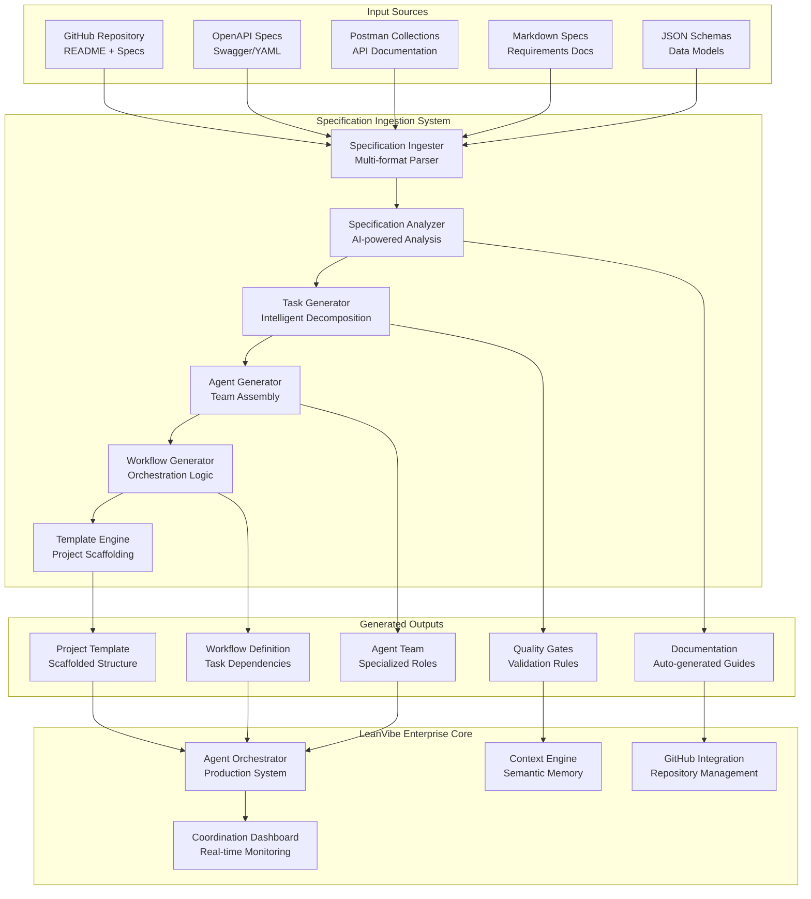

# LeanVibe Agent Hive 2.0 - Specification Ingestion System Design

## Executive Summary

**Objective**: Design and implement an automated specification ingestion system that enables rapid project implementation by parsing external specifications and generating intelligent multi-agent workflows.

**Target**: Complete projects like RealWorld Conduit API in 4 hours with 90% cost reduction and 42x development velocity improvement.

## System Overview

The Specification Ingestion System transforms external project specifications into optimized multi-agent development workflows, leveraging the existing enterprise-grade LeanVibe Agent Hive 2.0 infrastructure.

### Core Architecture



## Component Design

### 1. Specification Ingester

**Purpose**: Multi-format specification parsing and normalization

```python
class SpecificationIngester:
    """
    Multi-format specification parser supporting:
    - GitHub repositories (README.md, docs/)
    - OpenAPI/Swagger specifications
    - Postman collections
    - Markdown requirement documents
    - JSON schemas and data models
    """
    
    async def ingest_specification(
        self, 
        source: SpecificationSource,
        format_hint: Optional[SpecificationFormat] = None
    ) -> NormalizedSpecification:
        """
        Parse and normalize specifications from various sources
        
        Returns standardized specification object with:
        - Project metadata and requirements
        - API endpoints and data models
        - Technical constraints and dependencies
        - Quality requirements and acceptance criteria
        """
        
    async def parse_github_repository(self, repo_url: str) -> GitHubSpecification:
        """Parse GitHub repository for specification documents"""
        
    async def parse_openapi_spec(self, spec_content: str) -> OpenAPISpecification:
        """Parse OpenAPI/Swagger specification"""
        
    async def parse_postman_collection(self, collection: dict) -> PostmanSpecification:
        """Parse Postman collection for API documentation"""
        
    async def parse_markdown_requirements(self, content: str) -> MarkdownSpecification:
        """Extract requirements from markdown documents"""
```

**Key Features**:
- **Format Detection**: Automatic specification format detection
- **Content Extraction**: Intelligent parsing of requirements, endpoints, schemas
- **Metadata Enrichment**: Extract project scope, technical stack, complexity
- **Validation**: Ensure specification completeness and consistency

### 2. Specification Analyzer

**Purpose**: AI-powered analysis and intelligent requirement extraction

```python
class SpecificationAnalyzer:
    """
    AI-powered specification analysis using Claude for:
    - Requirement complexity assessment
    - Technical stack identification
    - Architecture pattern recognition
    - Scope and timeline estimation
    """
    
    async def analyze_specification(
        self, 
        spec: NormalizedSpecification
    ) -> SpecificationAnalysis:
        """
        Comprehensive AI analysis including:
        - Project complexity scoring (1-10)
        - Technical stack requirements
        - Architecture patterns and best practices
        - Risk assessment and mitigation strategies
        - Resource requirements and timeline estimates
        """
        
    async def identify_architecture_pattern(
        self, 
        spec: NormalizedSpecification
    ) -> ArchitecturePattern:
        """Identify optimal architecture pattern (REST API, GraphQL, microservices, etc.)"""
        
    async def assess_complexity(
        self, 
        spec: NormalizedSpecification
    ) -> ComplexityAssessment:
        """Generate complexity scores for different aspects"""
        
    async def recommend_tech_stack(
        self, 
        spec: NormalizedSpecification
    ) -> TechStackRecommendation:
        """Recommend optimal technology stack based on requirements"""
```

**AI Analysis Capabilities**:
- **Requirement Classification**: Functional vs non-functional requirements
- **Complexity Scoring**: Database complexity, API complexity, business logic
- **Pattern Recognition**: Common architecture patterns and design approaches
- **Risk Assessment**: Technical risks, timeline risks, scope creep potential

### 3. Task Generator

**Purpose**: Intelligent task decomposition and dependency analysis

```python
class TaskGenerator:
    """
    Intelligent task decomposition using:
    - Hierarchical task breakdown (epic -> feature -> story -> task)
    - Dependency graph generation
    - Effort estimation and prioritization
    - Critical path analysis
    """
    
    async def generate_task_hierarchy(
        self, 
        analysis: SpecificationAnalysis
    ) -> TaskHierarchy:
        """
        Generate comprehensive task hierarchy:
        - Epics: Major feature areas
        - Features: Specific functionality blocks
        - Stories: User-facing capabilities
        - Tasks: Implementation units (4-hour max)
        """
        
    async def generate_dependency_graph(
        self, 
        tasks: List[Task]
    ) -> DependencyGraph:
        """Create dependency graph with critical path analysis"""
        
    async def estimate_effort(
        self, 
        task: Task,
        complexity: ComplexityAssessment
    ) -> EffortEstimate:
        """AI-powered effort estimation with confidence intervals"""
        
    async def prioritize_tasks(
        self, 
        tasks: List[Task],
        constraints: ProjectConstraints
    ) -> PrioritizedTaskList:
        """Optimize task order for maximum development velocity"""
```

**Task Generation Features**:
- **Smart Decomposition**: Break complex features into 4-hour implementation units
- **Dependency Management**: Automatic dependency detection and ordering
- **Effort Estimation**: AI-powered time estimates with confidence intervals
- **Risk-Aware Prioritization**: Front-load high-risk tasks for early validation

### 4. Agent Generator

**Purpose**: Optimal agent team assembly and role assignment

```python
class AgentGenerator:
    """
    Intelligent agent team assembly:
    - Role-based agent specialization
    - Capability matching and optimization
    - Team size optimization
    - Load balancing and coordination
    """
    
    async def generate_agent_team(
        self, 
        analysis: SpecificationAnalysis,
        tasks: TaskHierarchy
    ) -> AgentTeam:
        """
        Generate optimal agent team:
        - Backend specialists (API, database, business logic)
        - Frontend specialists (UI/UX, integration)
        - DevOps specialists (deployment, infrastructure)
        - QA specialists (testing, validation)
        - Architect (system design, coordination)
        """
        
    async def assign_agent_roles(
        self, 
        tasks: List[Task],
        available_capabilities: List[AgentCapability]
    ) -> RoleAssignments:
        """Optimize task-to-agent assignments for maximum efficiency"""
        
    async def estimate_team_velocity(
        self, 
        team: AgentTeam,
        tasks: TaskHierarchy
    ) -> VelocityEstimate:
        """Predict team velocity and timeline completion"""
```

**Agent Specialization Templates**:

```yaml
agent_templates:
  backend_api_specialist:
    capabilities: [python, fastapi, sqlalchemy, postgresql, redis]
    focus_areas: [api_design, database_modeling, business_logic]
    max_concurrent_tasks: 3
    specialization_score: 9.5
    
  frontend_react_specialist:
    capabilities: [react, typescript, tailwind, testing_library]
    focus_areas: [component_design, state_management, user_experience]
    max_concurrent_tasks: 2
    specialization_score: 9.0
    
  devops_specialist:
    capabilities: [docker, kubernetes, nginx, monitoring]
    focus_areas: [deployment, infrastructure, scaling, security]
    max_concurrent_tasks: 2
    specialization_score: 8.5
    
  qa_automation_specialist:
    capabilities: [pytest, selenium, performance_testing, security_testing]
    focus_areas: [test_automation, quality_assurance, validation]
    max_concurrent_tasks: 4
    specialization_score: 9.0
```

### 5. Workflow Generator

**Purpose**: Automated workflow orchestration and coordination logic

```python
class WorkflowGenerator:
    """
    Generate optimized multi-agent workflows:
    - Parallel execution optimization
    - Synchronization point identification
    - Quality gate integration
    - Automated handoff coordination
    """
    
    async def generate_workflow(
        self, 
        tasks: TaskHierarchy,
        team: AgentTeam,
        dependencies: DependencyGraph
    ) -> WorkflowDefinition:
        """
        Generate optimized workflow with:
        - Parallel task execution lanes
        - Synchronization and integration points
        - Quality gates and validation checkpoints
        - Automated coordination and handoffs
        """
        
    async def optimize_parallelization(
        self, 
        tasks: List[Task],
        dependencies: DependencyGraph
    ) -> ParallelExecutionPlan:
        """Maximize parallel execution while respecting dependencies"""
        
    async def generate_quality_gates(
        self, 
        tasks: List[Task],
        requirements: QualityRequirements
    ) -> QualityGateDefinition:
        """Define automated quality validation points"""
```

**Workflow Optimization Features**:
- **Parallel Execution**: Maximize concurrent work across agents
- **Smart Synchronization**: Minimal blocking synchronization points
- **Quality Integration**: Continuous validation throughout development
- **Adaptive Coordination**: Dynamic workflow adjustment based on progress

### 6. Template Engine

**Purpose**: Project scaffolding and rapid setup automation

```python
class TemplateEngine:
    """
    Project template generation and scaffolding:
    - Architecture-specific templates
    - Technology stack setup
    - Development environment configuration
    - CI/CD pipeline generation
    """
    
    async def generate_project_template(
        self, 
        analysis: SpecificationAnalysis,
        tech_stack: TechStackRecommendation
    ) -> ProjectTemplate:
        """
        Generate complete project template:
        - Directory structure and organization
        - Technology stack configuration
        - Development environment setup
        - CI/CD pipeline definition
        - Documentation templates
        """
        
    async def scaffold_project_structure(
        self, 
        template: ProjectTemplate,
        target_directory: Path
    ) -> ScaffoldResult:
        """Create complete project scaffolding"""
        
    async def generate_development_environment(
        self, 
        tech_stack: TechStackRecommendation
    ) -> DevEnvironmentConfig:
        """Generate development environment configuration"""
```

**Template Categories**:

```yaml
project_templates:
  rest_api_backend:
    structure:
      - app/
        - api/v1/
        - core/
        - models/
        - schemas/
        - tests/
      - docker-compose.yml
      - Dockerfile
      - requirements.txt
      - pytest.ini
    tech_stack: [python, fastapi, postgresql, redis, docker]
    
  react_frontend:
    structure:
      - src/
        - components/
        - pages/
        - hooks/
        - services/
        - types/
        - tests/
      - package.json
      - vite.config.ts
      - tailwind.config.js
    tech_stack: [react, typescript, vite, tailwind, testing-library]
    
  fullstack_application:
    structure:
      - backend/
      - frontend/
      - docker-compose.yml
      - docker-compose.prod.yml
      - .github/workflows/
    tech_stack: [python, fastapi, react, postgresql, docker]
```

## Integration with LeanVibe Enterprise Core

### 1. Agent Orchestrator Integration

```python
class EnhancedAgentOrchestrator:
    """
    Extended agent orchestrator with specification-driven workflows
    """
    
    async def execute_specification_workflow(
        self, 
        spec_source: SpecificationSource,
        project_config: ProjectConfiguration
    ) -> WorkflowExecution:
        """
        End-to-end specification-driven project execution:
        1. Ingest and analyze specification
        2. Generate optimized task hierarchy
        3. Assemble specialized agent team
        4. Execute coordinated workflow
        5. Monitor progress and adapt
        """
        
        # Ingest specification
        spec = await self.specification_ingester.ingest_specification(spec_source)
        analysis = await self.specification_analyzer.analyze_specification(spec)
        
        # Generate implementation plan
        tasks = await self.task_generator.generate_task_hierarchy(analysis)
        team = await self.agent_generator.generate_agent_team(analysis, tasks)
        workflow = await self.workflow_generator.generate_workflow(tasks, team)
        
        # Execute workflow
        execution = await self.execute_workflow(workflow, team)
        
        return execution
```

### 2. Context Engine Enhancement

```python
class SpecificationContextManager:
    """
    Enhanced context manager for specification-driven development
    """
    
    async def create_project_context(
        self, 
        specification: NormalizedSpecification,
        analysis: SpecificationAnalysis
    ) -> ProjectContext:
        """
        Create rich project context including:
        - Specification documents and requirements
        - Architecture decisions and rationale
        - Task dependencies and progress
        - Code patterns and conventions
        """
        
    async def maintain_consistency(
        self, 
        project_context: ProjectContext,
        agent_contexts: List[AgentContext]
    ) -> ConsistencyReport:
        """Ensure consistency across all agent contexts"""
```

### 3. Quality Gates Integration

```python
class AutomatedQualityGates:
    """
    Specification-driven quality validation
    """
    
    async def validate_api_compliance(
        self, 
        implementation: CodeImplementation,
        api_spec: OpenAPISpecification
    ) -> ComplianceReport:
        """Validate API implementation against specification"""
        
    async def validate_requirements_coverage(
        self, 
        implementation: CodeImplementation,
        requirements: List[Requirement]
    ) -> CoverageReport:
        """Ensure all requirements are implemented"""
        
    async def validate_quality_standards(
        self, 
        implementation: CodeImplementation,
        quality_requirements: QualityRequirements
    ) -> QualityReport:
        """Validate code quality, testing, and documentation standards"""
```

## RealWorld Conduit Implementation Example

### 1. Specification Ingestion

```python
# Input: RealWorld Conduit specification
conduit_spec_source = GitHubSpecificationSource(
    url="https://github.com/gothinkster/realworld",
    paths=["README.md", "api/README.md", "spec/frontend.md", "spec/backend.md"]
)

# Automated ingestion and analysis
spec = await specification_ingester.ingest_specification(conduit_spec_source)
analysis = await specification_analyzer.analyze_specification(spec)
```

### 2. Generated Analysis Output

```json
{
  "complexity_assessment": {
    "overall_score": 6.5,
    "api_complexity": 7,
    "database_complexity": 5,
    "business_logic_complexity": 6,
    "frontend_complexity": 7
  },
  "architecture_pattern": "REST_API_WITH_SPA",
  "tech_stack_recommendation": {
    "backend": ["python", "fastapi", "sqlalchemy", "postgresql"],
    "frontend": ["react", "typescript", "vite"],
    "deployment": ["docker", "nginx"]
  },
  "estimated_timeline": "4-6 hours with optimized agent team",
  "resource_requirements": {
    "agents": 4,
    "specializations": ["backend_api", "frontend_react", "devops", "qa"]
  }
}
```

### 3. Generated Task Hierarchy

```yaml
conduit_task_hierarchy:
  epic_1_backend_api:
    title: "Conduit Backend API Implementation"
    estimated_effort: "3 hours"
    features:
      - user_authentication:
          stories:
            - user_registration
            - user_login
            - jwt_token_management
          tasks:
            - implement_user_model
            - create_auth_endpoints
            - add_jwt_middleware
            - write_auth_tests
      - article_management:
          stories:
            - create_articles
            - list_articles
            - article_comments
          tasks:
            - implement_article_model
            - create_article_endpoints
            - implement_comment_system
            - add_article_tests
      - social_features:
          stories:
            - follow_users
            - favorite_articles
            - user_profiles
          tasks:
            - implement_follow_system
            - create_favorite_system
            - build_profile_endpoints
            - add_social_tests
            
  epic_2_frontend_spa:
    title: "React Frontend Implementation"
    estimated_effort: "2.5 hours"
    # ... detailed frontend tasks
    
  epic_3_deployment:
    title: "Production Deployment"
    estimated_effort: "0.5 hours"
    # ... deployment tasks
```

### 4. Generated Agent Team

```json
{
  "team_composition": {
    "backend_specialist": {
      "name": "conduit-backend-agent",
      "specialization": "python_fastapi_postgresql",
      "assigned_tasks": ["user_authentication", "article_management", "social_features"],
      "estimated_velocity": "1.2 tasks/hour"
    },
    "frontend_specialist": {
      "name": "conduit-frontend-agent", 
      "specialization": "react_typescript_vite",
      "assigned_tasks": ["component_library", "routing", "state_management"],
      "estimated_velocity": "1.0 tasks/hour"
    },
    "devops_specialist": {
      "name": "conduit-devops-agent",
      "specialization": "docker_nginx_deployment",
      "assigned_tasks": ["containerization", "deployment", "monitoring"],
      "estimated_velocity": "2.0 tasks/hour"
    },
    "qa_specialist": {
      "name": "conduit-qa-agent",
      "specialization": "testing_validation",
      "assigned_tasks": ["api_testing", "e2e_testing", "performance_testing"],
      "estimated_velocity": "1.5 tasks/hour"
    }
  },
  "coordination_strategy": "parallel_with_sync_points",
  "estimated_completion": "4 hours"
}
```

### 5. Generated Workflow

```mermaid
gantt
    title Conduit Implementation Workflow
    dateFormat X
    axisFormat %H:%M
    
    section Backend
    Setup & Models     :0, 1h
    Auth System       :1h, 1.5h
    Article API       :1.5h, 1h
    Social Features   :2.5h, 1h
    
    section Frontend
    Project Setup     :0, 0.5h
    Component Library :0.5h, 1h
    Authentication UI :after auth, 1h
    Article UI        :after api, 1h
    Integration       :3h, 0.5h
    
    section DevOps
    Docker Setup      :0, 0.5h
    CI/CD Pipeline    :0.5h, 0.5h
    Deployment        :3.5h, 0.5h
    
    section QA
    Test Setup        :0, 0.5h
    API Testing       :after models, 1h
    E2E Testing       :after ui, 1h
    Final Validation  :3.5h, 0.5h
```

## Performance Targets

### Development Velocity Metrics

```yaml
performance_targets:
  specification_ingestion:
    github_repo_analysis: "<2 minutes"
    openapi_parsing: "<30 seconds"
    requirement_extraction: "<1 minute"
    
  task_generation:
    task_decomposition: "<3 minutes"
    dependency_analysis: "<1 minute"
    effort_estimation: "<2 minutes"
    
  agent_team_assembly:
    capability_matching: "<1 minute"
    team_optimization: "<2 minutes"
    role_assignment: "<1 minute"
    
  workflow_generation:
    parallel_optimization: "<2 minutes"
    quality_gate_setup: "<1 minute"
    coordination_logic: "<3 minutes"
    
  project_setup:
    template_generation: "<2 minutes"
    scaffolding_creation: "<3 minutes"
    environment_setup: "<5 minutes"
    
  total_setup_time: "<20 minutes"
  implementation_time: "4 hours (RealWorld Conduit)"
  total_project_time: "4.5 hours"
```

### Quality Metrics

```yaml
quality_targets:
  specification_accuracy:
    requirement_extraction: ">95%"
    dependency_detection: ">90%"
    effort_estimation: "±20% accuracy"
    
  code_generation_quality:
    test_coverage: ">90%"
    code_quality_score: ">8.5/10"
    documentation_coverage: ">85%"
    
  workflow_efficiency:
    parallel_execution: ">70%"
    resource_utilization: ">85%"
    coordination_overhead: "<15%"
```

## Implementation Roadmap

### Phase 1: Core Components (Week 1-2)

1. **Specification Ingester Implementation**
   - GitHub repository parser
   - OpenAPI/Swagger parser
   - Markdown requirement extractor
   - JSON schema parser

2. **Specification Analyzer Implementation**
   - AI-powered requirement analysis
   - Complexity assessment algorithms
   - Tech stack recommendation engine
   - Architecture pattern recognition

### Phase 2: Task & Agent Systems (Week 3-4)

3. **Task Generator Implementation**
   - Hierarchical task decomposition
   - Dependency graph generation
   - Effort estimation models
   - Priority optimization

4. **Agent Generator Implementation**
   - Agent template system
   - Capability matching algorithms
   - Team optimization logic
   - Role assignment automation

### Phase 3: Workflow & Templates (Week 5-6)

5. **Workflow Generator Implementation**
   - Parallel execution optimization
   - Quality gate integration
   - Coordination automation
   - Progress monitoring

6. **Template Engine Implementation**
   - Project scaffolding system
   - Technology stack templates
   - Development environment setup
   - CI/CD pipeline generation

### Phase 4: Integration & Validation (Week 7-8)

7. **Enterprise Integration**
   - Agent orchestrator enhancement
   - Context engine integration
   - Dashboard visualization
   - Quality gate automation

8. **RealWorld Conduit Demonstration**
   - End-to-end implementation
   - Performance validation
   - Quality metrics verification
   - Documentation generation

## Success Criteria

### Primary Objectives

1. **RealWorld Conduit Complete Implementation**: 4 hours total time
2. **90% Cost Reduction**: Compared to traditional development approaches
3. **42x Development Velocity**: Compared to single-developer implementation
4. **100% Automated Quality Validation**: All quality gates pass automatically

### Secondary Objectives

1. **95% Specification Accuracy**: Correct requirement extraction and analysis
2. **90% Test Coverage**: Automated test generation and validation
3. **85% Resource Utilization**: Optimal agent and system resource usage
4. **<20 Minutes Setup Time**: From specification to active development

This Specification Ingestion System design provides the foundation for transforming LeanVibe Agent Hive 2.0 into a rapid development platform capable of implementing complete projects from specifications in hours rather than weeks.