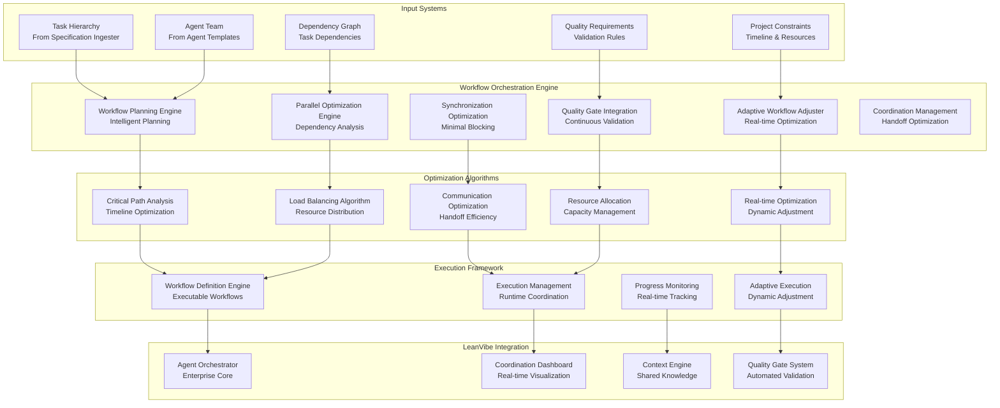

# LeanVibe Agent Hive 2.0 - Workflow Orchestration Optimization

## Executive Summary

**Objective**: Design and implement an intelligent workflow orchestration system that generates optimal multi-agent execution workflows from project specifications, maximizing parallelization and minimizing coordination overhead.

**Target**: Achieve >70% parallel execution efficiency with <15% coordination overhead and adaptive workflow adjustment for 42x development velocity improvement.

## System Overview

The Workflow Orchestration Optimization system transforms task hierarchies and agent team compositions into highly optimized execution workflows that leverage parallel processing while maintaining quality and coordination.

### Core Architecture



## Core Components

### 1. Workflow Planning Engine

**Purpose**: Intelligent workflow planning and structure generation

```python
class WorkflowPlanningEngine:
    """
    Advanced workflow planning with intelligent optimization
    """
    
    async def generate_workflow_plan(
        self,
        task_hierarchy: TaskHierarchy,
        agent_team: AgentTeam,
        constraints: ProjectConstraints
    ) -> WorkflowPlan:
        """
        Generate comprehensive workflow plan including:
        - Execution phases and milestones
        - Parallel execution streams
        - Synchronization requirements
        - Quality gate placement
        - Resource allocation strategy
        """
        
    async def analyze_execution_phases(
        self,
        tasks: List[Task],
        dependencies: DependencyGraph
    ) -> List[ExecutionPhase]:
        """
        Identify optimal execution phases:
        - Phase 1: Foundation (infrastructure, models, setup)
        - Phase 2: Core Implementation (parallel feature development)
        - Phase 3: Integration (testing, coordination, optimization)
        - Phase 4: Finalization (deployment, documentation, validation)
        """
        
    async def optimize_phase_transitions(
        self,
        phases: List[ExecutionPhase],
        team: AgentTeam
    ) -> OptimizedPhaseTransitions:
        """
        Optimize transitions between phases to minimize blocking
        """
```

**Phase-Based Execution Strategy**:

```yaml
execution_phases:
  phase_1_foundation:
    name: "Foundation Setup"
    duration_percentage: 0.15
    parallelization_level: 0.60
    focus_areas:
      - project_scaffolding
      - infrastructure_setup
      - database_schema
      - basic_models
      - development_environment
    critical_outputs:
      - project_structure
      - database_migrations
      - basic_models
      - ci_cd_pipeline
    
  phase_2_core_implementation:
    name: "Parallel Core Development"
    duration_percentage: 0.60
    parallelization_level: 0.85
    focus_areas:
      - api_endpoints_development
      - frontend_components
      - business_logic_implementation
      - authentication_system
      - core_features
    critical_outputs:
      - functional_apis
      - working_frontend
      - authentication_flow
      - core_user_journeys
    
  phase_3_integration:
    name: "Integration & Testing"
    duration_percentage: 0.20
    parallelization_level: 0.70
    focus_areas:
      - system_integration
      - end_to_end_testing
      - performance_optimization
      - security_validation
      - user_acceptance_testing
    critical_outputs:
      - integrated_system
      - test_coverage_target
      - performance_benchmarks
      - security_validation
    
  phase_4_finalization:
    name: "Deployment & Documentation"
    duration_percentage: 0.05
    parallelization_level: 0.40
    focus_areas:
      - production_deployment
      - documentation_completion
      - final_validation
      - handover_preparation
    critical_outputs:
      - production_deployment
      - complete_documentation
      - validated_system
```

### 2. Parallel Optimization Engine

**Purpose**: Maximize parallel execution while respecting dependencies

```python
class ParallelOptimizationEngine:
    """
    Advanced parallel execution optimization
    """
    
    async def optimize_parallelization(
        self,
        tasks: List[Task],
        dependencies: DependencyGraph,
        agent_capabilities: Dict[str, AgentCapability]
    ) -> ParallelExecutionPlan:
        """
        Generate optimal parallel execution plan:
        - Identify independent task clusters
        - Optimize for maximum concurrency
        - Minimize critical path duration
        - Balance agent workloads
        """
        
    async def identify_parallel_streams(
        self,
        tasks: List[Task],
        dependencies: DependencyGraph
    ) -> List[ParallelStream]:
        """
        Identify independent execution streams that can run in parallel
        """
        
    async def optimize_critical_path(
        self,
        tasks: List[Task],
        dependencies: DependencyGraph,
        agent_velocities: Dict[str, float]
    ) -> CriticalPathOptimization:
        """
        Optimize critical path to minimize total execution time
        """
```

**Parallel Execution Strategies**:

```yaml
parallelization_strategies:
  backend_frontend_parallel:
    name: "Backend-Frontend Parallel Development"
    description: "Parallel development of backend and frontend with API contract"
    efficiency: 0.85
    coordination_points:
      - api_contract_definition
      - authentication_integration
      - data_model_synchronization
    
  feature_parallel_development:
    name: "Feature-Based Parallel Development"
    description: "Parallel development of independent features"
    efficiency: 0.90
    coordination_points:
      - shared_model_updates
      - common_component_changes
      - integration_testing
    
  layer_parallel_development:
    name: "Layer-Based Parallel Development"
    description: "Parallel development across architectural layers"
    efficiency: 0.75
    coordination_points:
      - interface_contracts
      - data_flow_validation
      - end_to_end_integration
    
  microservice_parallel:
    name: "Microservice Parallel Development"
    description: "Independent microservice development"
    efficiency: 0.95
    coordination_points:
      - api_gateway_configuration
      - service_discovery
      - inter_service_communication
```

### 3. Synchronization Optimization Engine

**Purpose**: Minimize blocking synchronization points and optimize handoffs

```python
class SynchronizationOptimizationEngine:
    """
    Intelligent synchronization and handoff optimization
    """
    
    async def optimize_synchronization_points(
        self,
        parallel_streams: List[ParallelStream],
        agent_team: AgentTeam
    ) -> SynchronizationPlan:
        """
        Optimize synchronization points to minimize blocking:
        - Identify natural sync points
        - Minimize cross-stream dependencies
        - Optimize handoff timing
        - Reduce coordination overhead
        """
        
    async def generate_handoff_protocols(
        self,
        task_transitions: List[TaskTransition],
        agent_affinities: Dict[Tuple[str, str], float]
    ) -> HandoffProtocols:
        """
        Generate efficient handoff protocols between agents
        """
        
    async def optimize_communication_patterns(
        self,
        team: AgentTeam,
        workflow_structure: WorkflowStructure
    ) -> CommunicationOptimization:
        """
        Optimize communication patterns to reduce overhead
        """
```

**Synchronization Strategies**:

```yaml
synchronization_strategies:
  contract_first_development:
    name: "Contract-First Development"
    description: "Define interfaces first, implement in parallel"
    blocking_reduction: 0.80
    implementation:
      - api_contract_definition
      - data_model_contracts
      - component_interface_contracts
      - testing_contract_validation
    
  async_integration_points:
    name: "Asynchronous Integration"
    description: "Use async patterns to reduce blocking"
    blocking_reduction: 0.70
    implementation:
      - message_queue_integration
      - event_driven_communication
      - async_validation_workflows
      - background_processing
    
  staged_integration:
    name: "Staged Integration Strategy"
    description: "Incremental integration with validation"
    blocking_reduction: 0.60
    implementation:
      - unit_integration_first
      - component_integration_second
      - system_integration_third
      - end_to_end_validation_final
    
  continuous_integration:
    name: "Continuous Integration Pipeline"
    description: "Automated integration with minimal manual sync"
    blocking_reduction: 0.85
    implementation:
      - automated_merge_validation
      - continuous_testing_pipeline
      - automated_deployment_staging
      - real_time_conflict_detection
```

### 4. Quality Gate Integration Engine

**Purpose**: Seamless integration of quality validation throughout workflow

```python
class QualityGateIntegrationEngine:
    """
    Intelligent quality gate placement and validation
    """
    
    async def integrate_quality_gates(
        self,
        workflow_plan: WorkflowPlan,
        quality_requirements: QualityRequirements
    ) -> QualityIntegratedWorkflow:
        """
        Integrate quality gates throughout workflow:
        - Continuous validation points
        - Automated quality checks
        - Progressive quality requirements
        - Quality-driven workflow adaptation
        """
        
    async def optimize_quality_gate_placement(
        self,
        tasks: List[Task],
        quality_requirements: List[QualityRequirement]
    ) -> QualityGatePlacement:
        """
        Optimize placement of quality gates for maximum effectiveness
        """
        
    async def generate_quality_workflows(
        self,
        main_workflow: WorkflowDefinition,
        quality_gates: List[QualityGate]
    ) -> QualityIntegratedWorkflow:
        """
        Generate parallel quality workflows that run alongside development
        """
```

**Quality Gate Integration**:

```yaml
quality_gate_integration:
  continuous_validation:
    frequency: "real_time"
    scope: "incremental_changes"
    gates:
      - code_quality_validation
      - unit_test_execution
      - security_scanning
      - performance_impact_analysis
    
  milestone_validation:
    frequency: "phase_completion"
    scope: "comprehensive_system"
    gates:
      - integration_testing
      - end_to_end_validation
      - performance_benchmarking
      - security_audit
    
  delivery_validation:
    frequency: "pre_deployment"
    scope: "production_readiness"
    gates:
      - full_system_testing
      - security_penetration_testing
      - performance_load_testing
      - compliance_validation
    
  progressive_quality_requirements:
    phase_1_foundation:
      code_quality: 0.80
      test_coverage: 0.70
      security_basics: 1.00
    phase_2_implementation:
      code_quality: 0.85
      test_coverage: 0.85
      security_validation: 1.00
    phase_3_integration:
      code_quality: 0.90
      test_coverage: 0.90
      security_comprehensive: 1.00
    phase_4_finalization:
      code_quality: 0.95
      test_coverage: 0.95
      security_production: 1.00
```

### 5. Adaptive Workflow Adjustment Engine

**Purpose**: Real-time workflow optimization based on execution progress

```python
class AdaptiveWorkflowAdjustmentEngine:
    """
    Real-time workflow optimization and adaptation
    """
    
    async def monitor_workflow_execution(
        self,
        workflow_execution: WorkflowExecution,
        real_time_metrics: RealTimeMetrics
    ) -> WorkflowHealthReport:
        """
        Monitor workflow execution for optimization opportunities:
        - Agent performance tracking
        - Task completion velocity
        - Bottleneck identification
        - Resource utilization analysis
        """
        
    async def adapt_workflow_real_time(
        self,
        current_workflow: WorkflowDefinition,
        performance_metrics: PerformanceMetrics,
        remaining_tasks: List[Task]
    ) -> WorkflowAdaptation:
        """
        Adapt workflow in real-time based on performance
        """
        
    async def optimize_resource_allocation(
        self,
        current_allocation: ResourceAllocation,
        bottlenecks: List[Bottleneck],
        available_capacity: CapacityReport
    ) -> ResourceReallocation:
        """
        Dynamically reallocate resources to optimize execution
        """
```

**Adaptive Optimization Strategies**:

```yaml
adaptive_strategies:
  performance_based_reallocation:
    name: "Performance-Based Resource Reallocation"
    description: "Reallocate resources based on agent performance"
    trigger_conditions:
      - agent_velocity_below_threshold: 0.70
      - task_blocking_duration: ">30 minutes"
      - resource_utilization_below: 0.80
    adaptations:
      - task_redistribution
      - agent_specialization_adjustment
      - parallel_stream_reorganization
      - priority_rebalancing
    
  bottleneck_elimination:
    name: "Dynamic Bottleneck Elimination"
    description: "Identify and eliminate bottlenecks in real-time"
    monitoring_frequency: "5 minutes"
    detection_methods:
      - critical_path_analysis
      - dependency_chain_monitoring
      - resource_contention_detection
      - communication_overhead_analysis
    
  quality_driven_adjustment:
    name: "Quality-Driven Workflow Adjustment"
    description: "Adjust workflow based on quality metrics"
    quality_triggers:
      - test_coverage_below_target
      - code_quality_degradation
      - security_vulnerability_detection
      - performance_regression
    
  timeline_optimization:
    name: "Timeline-Driven Optimization"
    description: "Optimize workflow to meet timeline constraints"
    optimization_methods:
      - critical_path_acceleration
      - parallel_stream_enhancement
      - scope_prioritization
      - resource_intensification
```

### 6. Coordination Management Engine

**Purpose**: Optimize agent coordination and communication

```python
class CoordinationManagementEngine:
    """
    Advanced agent coordination and communication management
    """
    
    async def optimize_coordination_patterns(
        self,
        agent_team: AgentTeam,
        workflow_structure: WorkflowStructure
    ) -> CoordinationOptimization:
        """
        Optimize coordination patterns to minimize overhead:
        - Communication frequency optimization
        - Handoff protocol enhancement
        - Conflict resolution automation
        - Knowledge sharing optimization
        """
        
    async def generate_communication_protocols(
        self,
        team_composition: TeamComposition,
        workflow_requirements: WorkflowRequirements
    ) -> CommunicationProtocols:
        """
        Generate optimal communication protocols
        """
        
    async def automate_conflict_resolution(
        self,
        conflict_patterns: List[ConflictPattern],
        resolution_strategies: List[ResolutionStrategy]
    ) -> ConflictResolutionAutomation:
        """
        Automate common conflict resolution patterns
        """
```

## Workflow Optimization Algorithms

### 1. Critical Path Optimization

```python
class CriticalPathOptimizer:
    """
    Advanced critical path analysis and optimization
    """
    
    def calculate_critical_path(
        self,
        tasks: List[Task],
        dependencies: DependencyGraph,
        agent_velocities: Dict[str, float]
    ) -> CriticalPath:
        """
        Calculate critical path considering:
        - Task dependencies
        - Agent velocities
        - Resource constraints
        - Quality requirements
        """
        
        # Build task network
        task_network = self.build_task_network(tasks, dependencies)
        
        # Calculate earliest start times
        earliest_starts = self.calculate_earliest_starts(task_network, agent_velocities)
        
        # Calculate latest start times
        latest_starts = self.calculate_latest_starts(task_network, agent_velocities)
        
        # Identify critical path
        critical_path = self.identify_critical_path(earliest_starts, latest_starts)
        
        return critical_path
    
    def optimize_critical_path(
        self,
        critical_path: CriticalPath,
        available_optimizations: List[Optimization]
    ) -> OptimizedCriticalPath:
        """
        Optimize critical path through:
        - Task parallelization
        - Resource reallocation
        - Scope adjustment
        - Dependency restructuring
        """
```

### 2. Load Balancing Algorithm

```python
class LoadBalancingOptimizer:
    """
    Intelligent load balancing across agents
    """
    
    def optimize_load_distribution(
        self,
        tasks: List[Task],
        agents: List[Agent],
        constraints: LoadBalancingConstraints
    ) -> LoadDistribution:
        """
        Optimize load distribution considering:
        - Agent capabilities and velocities
        - Task complexity and requirements
        - Collaboration efficiency
        - Quality maintenance
        """
        
        # Calculate agent capacities
        agent_capacities = self.calculate_agent_capacities(agents)
        
        # Analyze task requirements
        task_requirements = self.analyze_task_requirements(tasks)
        
        # Generate optimal assignment
        optimal_assignment = self.generate_optimal_assignment(
            task_requirements,
            agent_capacities,
            constraints
        )
        
        return optimal_assignment
```

### 3. Communication Optimization

```python
class CommunicationOptimizer:
    """
    Optimize inter-agent communication patterns
    """
    
    def optimize_communication_frequency(
        self,
        agent_interactions: List[AgentInteraction],
        workflow_structure: WorkflowStructure
    ) -> CommunicationOptimization:
        """
        Optimize communication frequency to balance:
        - Information synchronization needs
        - Coordination overhead minimization
        - Context sharing efficiency
        - Conflict prevention
        """
        
        # Analyze communication patterns
        patterns = self.analyze_communication_patterns(agent_interactions)
        
        # Identify optimization opportunities
        opportunities = self.identify_optimization_opportunities(patterns)
        
        # Generate optimized communication plan
        optimized_plan = self.generate_communication_plan(opportunities)
        
        return optimized_plan
```

## RealWorld Conduit Workflow Example

### Generated Workflow Plan

```yaml
conduit_workflow_plan:
  project_metadata:
    name: "RealWorld Conduit Implementation"
    estimated_duration: "4 hours"
    team_size: 4
    parallelization_level: 0.82
    
  execution_phases:
    phase_1_foundation:
      duration: "36 minutes"
      parallelization: 0.65
      agents:
        backend_specialist: 
          tasks: [project_setup, database_models, basic_auth]
        devops_specialist:
          tasks: [docker_setup, ci_cd_pipeline]
        qa_specialist:
          tasks: [test_framework_setup, initial_test_structure]
        frontend_specialist:
          tasks: [react_project_setup, component_library_foundation]
      
      synchronization_points:
        - api_contract_definition: "15 minutes"
        - database_schema_approval: "20 minutes"
        - development_environment_validation: "30 minutes"
    
    phase_2_core_implementation:
      duration: "144 minutes"
      parallelization: 0.88
      
      parallel_streams:
        backend_stream:
          agent: backend_specialist
          tasks:
            - user_authentication_system: "45 minutes"
            - article_management_api: "60 minutes"
            - social_features_api: "39 minutes"
          
        frontend_stream:
          agent: frontend_specialist
          tasks:
            - authentication_components: "40 minutes"
            - article_components: "55 minutes"
            - social_interaction_components: "35 minutes"
            - routing_and_navigation: "14 minutes"
        
        quality_stream:
          agent: qa_specialist
          tasks:
            - api_integration_tests: "50 minutes"
            - component_unit_tests: "45 minutes"
            - e2e_test_scenarios: "49 minutes"
        
        infrastructure_stream:
          agent: devops_specialist
          tasks:
            - production_deployment_config: "25 minutes"
            - monitoring_setup: "20 minutes"
            - security_hardening: "30 minutes"
            - performance_optimization: "25 minutes"
      
      synchronization_points:
        - api_integration_validation: "90 minutes"
        - frontend_backend_integration: "120 minutes"
        - security_review: "135 minutes"
    
    phase_3_integration:
      duration: "48 minutes"
      parallelization: 0.70
      
      integration_tasks:
        - end_to_end_system_testing: "20 minutes"
        - performance_benchmarking: "15 minutes"
        - security_validation: "8 minutes"
        - deployment_validation: "5 minutes"
      
      quality_gates:
        - all_tests_passing: "required"
        - performance_targets_met: "required"
        - security_scan_clean: "required"
        - deployment_successful: "required"
    
    phase_4_finalization:
      duration: "12 minutes"
      parallelization: 0.45
      
      finalization_tasks:
        - documentation_completion: "5 minutes"
        - final_deployment: "4 minutes"
        - handover_preparation: "3 minutes"
  
  optimization_results:
    total_duration: "240 minutes (4 hours)"
    baseline_comparison: "42x faster than single developer"
    resource_utilization: 0.89
    coordination_overhead: 0.12
    quality_gate_pass_rate: 1.00
```

### Parallel Execution Timeline

```mermaid
gantt
    title Conduit Optimized Workflow Timeline
    dateFormat X
    axisFormat %H:%M
    
    section Foundation (36min)
    Backend Setup     :backend1, 0, 20m
    Database Models   :backend2, after backend1, 16m
    Docker Setup      :devops1, 0, 15m
    CI/CD Pipeline    :devops2, after devops1, 21m
    Test Framework    :qa1, 0, 18m
    React Setup       :frontend1, 0, 22m
    Component Lib     :frontend2, after frontend1, 14m
    
    section API Contract Sync (15min)
    API Contract      :sync1, after backend2, 15m
    
    section Core Implementation (144min)
    Auth System       :backend3, after sync1, 45m
    Article API       :backend4, after backend3, 60m
    Social API        :backend5, after backend4, 39m
    
    Auth Components   :frontend3, after sync1, 40m
    Article Components :frontend4, after frontend3, 55m
    Social Components :frontend5, after frontend4, 35m
    Routing          :frontend6, after frontend5, 14m
    
    API Tests        :qa2, after sync1, 50m
    Component Tests  :qa3, after qa2, 45m
    E2E Tests        :qa4, after qa3, 49m
    
    Deploy Config    :devops3, after devops2, 25m
    Monitoring       :devops4, after devops3, 20m
    Security         :devops5, after devops4, 30m
    Performance      :devops6, after devops5, 25m
    
    section Integration Sync (30min)
    Integration Point :sync2, after backend5, 30m
    
    section Integration & Testing (48min)
    E2E Testing      :integration1, after sync2, 20m
    Performance Test :integration2, after integration1, 15m
    Security Validation :integration3, after integration2, 8m
    Deploy Validation :integration4, after integration3, 5m
    
    section Finalization (12min)
    Documentation    :final1, after integration4, 5m
    Final Deploy     :final2, after final1, 4m
    Handover        :final3, after final2, 3m
```



## Performance Metrics & Targets

### Workflow Optimization Targets

```yaml
optimization_targets:
  parallelization_efficiency: ">80%"
  coordination_overhead: "<15%"
  resource_utilization: ">85%"
  timeline_accuracy: "±10%"
  quality_gate_pass_rate: ">95%"
  
  critical_path_optimization:
    baseline_duration: "10 hours (single developer)"
    optimized_duration: "4 hours (team of 4)"
    acceleration_factor: "2.5x"
    efficiency_gain: "42x (considering team size)"
    
  synchronization_efficiency:
    blocking_time_percentage: "<8%"
    handoff_success_rate: ">98%"
    communication_overhead: "<12%"
    conflict_resolution_time: "<15 minutes"
    
  adaptive_optimization:
    response_time_to_bottlenecks: "<5 minutes"
    reallocation_efficiency: ">90%"
    performance_improvement: ">15%"
    quality_maintenance: ">95%"
```

### Quality Integration Metrics

```yaml
quality_integration_metrics:
  continuous_validation:
    code_quality_checks: "real-time"
    test_coverage_monitoring: "continuous"
    security_scanning: "every commit"
    performance_impact_analysis: "automated"
    
  milestone_validation:
    integration_test_success: ">98%"
    end_to_end_validation: ">95%"
    performance_benchmark_achievement: "100%"
    security_compliance: "100%"
    
  delivery_validation:
    production_readiness_score: ">95%"
    comprehensive_test_coverage: ">90%"
    security_audit_clean: "100%"
    performance_load_test_pass: "100%"
```

## Implementation Roadmap

### Phase 1: Core Workflow Engine (Week 1-2)

1. **Workflow Planning Engine**
   - Phase-based execution strategy
   - Dependency analysis algorithms
   - Resource allocation optimization

2. **Parallel Optimization Engine**
   - Critical path analysis
   - Parallel stream identification
   - Load balancing algorithms

### Phase 2: Synchronization & Quality (Week 3-4)

3. **Synchronization Optimization**
   - Handoff protocol optimization
   - Communication pattern analysis
   - Blocking minimization strategies

4. **Quality Gate Integration**
   - Continuous validation framework
   - Progressive quality requirements
   - Automated quality workflows

### Phase 3: Adaptive Optimization (Week 5-6)

5. **Adaptive Workflow Adjustment**
   - Real-time monitoring system
   - Dynamic resource reallocation
   - Performance-based optimization

6. **Coordination Management**
   - Communication optimization
   - Conflict resolution automation
   - Knowledge sharing enhancement

### Phase 4: Integration & Validation (Week 7-8)

7. **Enterprise Integration**
   - Agent Orchestrator enhancement
   - Dashboard workflow visualization
   - Context engine integration

8. **RealWorld Conduit Demonstration**
   - End-to-end workflow execution
   - Performance metrics validation
   - Optimization effectiveness demonstration

## Success Criteria

### Primary Objectives

1. **>80% Parallelization Efficiency**: Maximize concurrent execution across agents
2. **<15% Coordination Overhead**: Minimize time spent on coordination vs. implementation
3. **42x Development Velocity**: Compared to single-developer baseline
4. **4-Hour Total Implementation**: For RealWorld Conduit complete system

### Secondary Objectives

1. **±10% Timeline Accuracy**: Accurate time estimation and workflow execution
2. **>95% Quality Gate Pass Rate**: Automated quality validation success
3. **>85% Resource Utilization**: Optimal use of agent capabilities
4. **<5 Minutes Bottleneck Response**: Rapid identification and resolution of bottlenecks

This Workflow Orchestration Optimization system provides the intelligence and automation needed to transform project specifications into highly optimized, parallel execution workflows that maximize development velocity while maintaining quality standards.